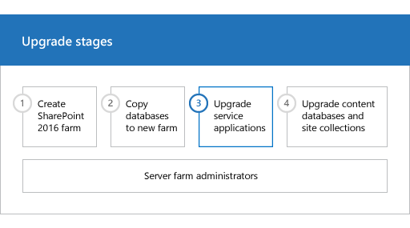

# Upgrade service applications to SharePoint Server 2016

 
  
When you upgrade from SharePoint Server 2013 with Service Pack 1 (SP1) to SharePoint Server 2016, you must use a database attach upgrade, which means that you upgrade only the content for your environment and not the configuration settings. After you have configured the SharePoint Server 2016 environment, and copied the content and service application databases, you can upgrade the service applications to SharePoint Server 2016. This article contains the steps that you take to upgrade the service applications.
  
**Phase 3 of the upgrade process: Upgrade service applications**


  
|||
|:-----|:-----|
|| This is the third phase in the process to upgrade SharePoint Server 2013 with Service Pack 1 (SP1) data and sites to SharePoint Server 2016. The process includes the following phases that must be completed in order:  <br/> [Create the SharePoint Server 2016 farm for a database attach upgrade](create-the-sharepoint-server-2016-farm-for-a-database-attach-upgrade.md) <br/> [Copy databases to the new farm for upgrade to SharePoint Server 2016](copy-databases-to-the-new-farm-for-upgrade-to-sharepoint-server-2016.md) <br/> [Upgrade service applications to SharePoint Server 2016](upgrade-service-applications-to-sharepoint-server-2016.md) (this phase)  <br/> [Upgrade content databases to SharePoint Server 2016](upgrade-content-databases.md) <br/>  For an overview of the whole process, see [Overview of the upgrade process to SharePoint Server 2016](overview-of-the-upgrade-process.md).  <br/> |
   
## Before you begin
<a name="begin"> </a>

Before you upgrade the service applications, review the following information and take any recommended actions.
  
- Make sure that the account that you use to perform the steps in this article is a member of the Farm administrators group in Central Administration.
    
- Decide which service application pool to use for the upgraded service applications. The procedures below use the default application pool for service applications which is "SharePoint Web Services Default". You can view a list of available service application pools by using the **Get-SPServiceApplicationPool** cmdlet in PowerShell. Or you can create a service application pool by using the **New-SPServiceApplicationPool** cmdlet. For more information, see [Get-SPServiceApplicationPool](/powershell/module/sharepoint-server/get-spserviceapplicationpool?view=sharepoint-ps) and [New-SPServiceApplicationPool](/powershell/module/sharepoint-server/new-spserviceapplicationpool?view=sharepoint-ps).
    
> [!TIP]
> Throughout this article, variables (such as $applicationPool, $sss, $upa, and so on) are used in the PowerShell cmdlets to save time and effort. You do not have to use these variables if you would prefer not to. However, if you do not use these variables, you must use IDs for the service applications and service application proxies when you specify the **identity** parameters. Each procedure has information about the variables used, or the alternate cmdlets to use to look up any IDs that are required. > Also, many procedures in this article include a step to set the $applicationPool variable. If you are performing all of these procedures in the same session of PowerShell, and you want to use the same application pool for all service applications, you do not have to repeat this step in each procedure. Instead, you can set this variable once at the beginning and use it throughout the procedures in this article. 
  
> [!NOTE]
> For any **SPWebURL** Managed Property in their SharePoint 2013 Schema they should rename it before they start the procedure (that is, SPWebURL to SPWebURL1). After you upgrade to SharePoint Server 2016, they SPWebURL1 managed property name can changed back to the original name (that is, SPWebURL). 
  
## About upgrading the service application databases
<a name="UpgradeServicesDBs"> </a>

To upgrade a service application database, you create a new service application and provide the name of the existing database to use for the new service application. As the service application is created, the database is upgraded. This process has several steps.
  
> [!NOTE]
> Word Automation Services and Machine Translation Services can't be upgraded. A new service instance will need to be created. 
  
> [!IMPORTANT]
> The following steps outlining starting service instances only apply to the Custom server role type. For more information on server role types, see [Planning for a MinRole server deployment in SharePoint Server 2016](../install/planning-for-a-minrole-server-deployment-in-sharepoint-server.md). 
  
1. Start the service instances
    
    The first step is to start service instances for the five service applications that you can upgrade: the Business Data Connectivity service, Managed Metadata Web Service, PerformancePoint Services service, Secure Store service, and Search service. Most of these service instances can be started from Central Administration. However the SharePoint Server Search service instance must be started by using PowerShell.
    
2. Create the service applications and upgrade the databases
    
    After you have started the service instances, the next step is to create the service applications and upgrade the databases. You must use PowerShell to restore the service application databases.
    
3. Create proxies for the service applications
    
    After you have upgraded the service application databases, you create the proxies for the service applications and add them to the default proxy group. You must create proxies for the following service applications:
    
  - Managed Metadata service application
    
  - Search service application
    
  - Secure Store service application
    
  - PerformancePoint Services service application
    
    The Business Data Connectivity service application automatically creates a proxy and assigns it to the default proxy group when you create the service application.
    
4. Verify that the proxies are in the default group
    
The following sections provide procedures to complete these steps.
  
## Start the service instances
<a name="StartServiceInstances"> </a>

The following procedures start the service instances.
  
 **To start service application instances from Central Administration**
  
1. Start SharePoint 2016 Central Administration.
    
  - For Windows Server 2012 R2:
    
  - On the **Start** screen, click **SharePoint 2016 Central Administration**.
    
    If **SharePoint 2016 Central Administration** is not on the **Start** screen: 
    
  - Right-click **Computer**, click **All apps**, and then click **SharePoint 2016 Central Administration**.
    
    For more information about how to interact with Windows Server 2012 R2, see [Common Management Tasks and Navigation in Windows Server 2012](https://go.microsoft.com/fwlink/p/?LinkId=478553).
    
2. In SharePoint 2016 Central Administration, on the **Application Management** page, in the **Service Applications** section, click **Manage Services on Server**.
    
3. Next to the **Business Data Connectivity service**, click **Start**.
    
4. Next to the **Managed Metadata Web Service**, click **Start**.
    
5. Next to the **PerformancePoint Services service**, click **Start**.
    
6. Next to the **Secure Store Service**, click **Start**.
    
The Search service instance must be started by using PowerShell because you cannot start it from Central Administration unless a Search Service application already exists.
  
 **To start the Search service instance by using PowerShell**
  
1. Verify that you have the following memberships:
    
  - **securityadmin** fixed server role on the SQL Server instance. 
    
  - **db_owner** fixed database role on all databases that are to be updated. 
    
  - Administrators group on the server on which you are running the PowerShell cmdlets.
    
    An administrator can use the **Add-SPShellAdmin** cmdlet to grant permissions to use SharePoint Server 2016 cmdlets. 
    
    > [!NOTE]
    > If you do not have permissions, contact your Setup administrator or SQL Server administrator to request permissions. For additional information about PowerShell permissions, see [Add-SPShellAdmin](/powershell/module/sharepoint-server/add-spshelladmin?view=sharepoint-ps). 
  
2. Start the SharePoint 2016 Management Shell.
    
  - For Windows Server 2012 R2:
    
  - On the **Start** screen, click **SharePoint 2016 Management Shell**.
    
    If **SharePoint 2016 Management Shell** is not on the **Start** screen: 
    
  - Right-click **Computer**, click **All apps**, and then click **SharePoint 2016 Management Shell**.
    
    For more information about how to interact with Windows Server 2012 R2, see [Common Management Tasks and Navigation in Windows Server 2012](https://go.microsoft.com/fwlink/p/?LinkId=478553).
    
3. To start the Search service instance, at the Microsoft PowerShell command prompt, type the following commands and press **ENTER** after each one: 
    
  ```
  $SearchInst = Get-SPEnterpriseSearchServiceInstance
  # Stores the identity for the Search service instance on this server as a variable 
  ```

  ```
  Start-SPServiceInstance $SearchInst
  # Starts the service instance
  ```

For more information, see [Get-SPEnterpriseSearchServiceInstance](/powershell/module/sharepoint-server/get-spenterprisesearchserviceinstance) and [Start-SPServiceInstance](/powershell/module/sharepoint-server/start-spserviceinstance).
  
## Upgrade the Secure Store service application
<a name="UpgradeSecureStore"> </a>

To upgrade the Secure Store service application, you create the new service application and upgrade the database, create a proxy and add it to the default proxy group, and then restore the passphrase from the previous environment.
  
 **To upgrade the Secure Store service application by using PowerShell**
  
1. Verify that you have the following memberships:
    
  - **securityadmin** fixed server role on the SQL Server instance. 
    
  - **db_owner** fixed database role on all databases that are to be updated. 
    
  - Administrators group on the server on which you are running the PowerShell cmdlets.
    
    An administrator can use the **Add-SPShellAdmin** cmdlet to grant permissions to use SharePoint Server 2016 cmdlets. 
    
    > [!NOTE]
    > If you do not have permissions, contact your Setup administrator or SQL Server administrator to request permissions. For additional information about PowerShell permissions, see [Add-SPShellAdmin](/powershell/module/sharepoint-server/add-spshelladmin?view=sharepoint-ps). 
  
2. Start the SharePoint 2016 Management Shell.
    
  - For Windows Server 2012 R2:
    
  - On the **Start** screen, click **SharePoint 2016 Management Shell**.
    
    If **SharePoint 2016 Management Shell** is not on the **Start** screen: 
    
  - Right-click **Computer**, click **All apps**, and then click **SharePoint 2016 Management Shell**.
    
    For more information about how to interact with Windows Server 2012 R2Windows Server 2012, see [Common Management Tasks and Navigation in Windows Server 2012](https://go.microsoft.com/fwlink/p/?LinkId=478553).
    
3. To store the application pool that you want to use as a variable for this service application, at the Microsoft PowerShell command prompt, type the following command:
    
  ```
  $applicationPool = Get-SPServiceApplicationPool -Identity 'SharePoint Web Services default'
  ```

Where:
    
  -  _SharePoint Web Services default_ is the name of the service application pool that will contain the new service applications. This is the default service application pool. You can specify a different service application pool. 
    
This cmdlet sets the service application pool as a variable that you can use again in the cmdlets that follow. If you have multiple application pools and have to use a different application pool for a particular service application, repeat this step in the procedure to create each service application to use the appropriate application pool.
    
4. To upgrade the Secure Store service application, at the Microsoft PowerShell command prompt, type the following command:
    
  ```
  $sss = New-SPSecureStoreServiceApplication -Name 'Secure Store' -ApplicationPool $applicationPool -DatabaseName 'SecureStore_Upgrade_DB' -AuditingEnabled
  ```

Where:
    
  -  _SecureStore_ is the name that you want to give the new Secure Store service application. 
    
  - $applicationpool is the variable that you set earlier to identify the service application pool to use.
    
    > [!TIP]
    > If you do not use the variable $applicationPool, then you must specify the name of an existing service application pool in the format ' _Application Pool Name_'. To view a list of service application pools, you can run the **Get-SPServiceApplicationPool** cmdlet. 
  
  -  _SecureStore_Upgrade_DB_ is the name of the service application database that you want to upgrade. 
    
This command sets a variable, $sss, that you use when you create the proxy later.
    
For more information, see [New-SPSecureStoreApplication](/powershell/module/sharepoint-server/new-spsecurestoreapplication?view=sharepoint-ps).
    
5. Type the following command to create a proxy for the Secure Store service application:
    
  ```
  $sssp = New-SPSecureStoreServiceApplicationProxy -Name ProxyName -ServiceApplication $sss -DefaultProxyGroup
  ```

Where:
    
  -  _ProxyName_ is the proxy name that you want to use. 
    
  - $sss is the variable that you set earlier to identify the new Secure Store service application.
    
    > [!TIP]
    > If you do not use the variable $sss, then you must use an ID to identify the Secure Store service application instead of a name. To find the ID, you can run the **Get-SPServiceApplication** cmdlet to return a list of all service application IDs. 
  
  -  _DefaultProxyGroup_ adds the Secure Store service application proxy to the default proxy group for the local farm. 
    
This command sets a variable, $sssp, for the service application proxy that you use when you restore the passphrase.
    
For more information, see [New-SPSecureStoreServiceApplicationProxy](/powershell/module/sharepoint-server/new-spsecurestoreserviceapplicationproxy?view=sharepoint-ps).
    
After you create the Secure Store service application and the proxy, you have to refresh the encryption key. For information about how to refresh the encryption key, see [Refresh the Secure Store encryption key](../administration/configure-the-secure-store-service.md#refresh).
    
6. Type the following command to restore the passphrase for the Secure Store service application:
    
  ```
  Update-SPSecureStoreApplicationServerKey -Passphrase <Passphrase> -ServiceApplicationProxy $sssp
  ```

Where:
    
  -  _\<Passphrase\>_ is the Passphrase for the Secure Store service application from your previous environment. 
    
  - $sssp is a variable that you set earlier to identify the new Secure Store service application proxy.
    
    > [!TIP]
    > If you do not use the variable $sssp, then you must use an ID to identify the Secure Store service application proxy instead of a name. To find the ID, you can run the **Get-SPServiceApplicationProxy** cmdlet to return a list of all service application proxy IDs. 
  
For more information, see [Update-SPSecureStoreApplicationServerKey](/powershell/module/sharepoint-server/update-spsecurestoreapplicationserverkey?view=sharepoint-ps).
    
## Upgrade the Business Data Connectivity service application
<a name="UpgradeBDC"> </a>

To upgrade the Business Data Connectivity service application, you create the new service application and upgrade the database. You do not have to create a proxy for the Business Data Connectivity service application. The Business Data Connectivity service application automatically creates a proxy and assigns it to the default proxy group when you create the service application.
  
 **To upgrade the Business Data Connectivity service application by using PowerShell**
  
1. Verify that you have the following memberships:
    
  - **securityadmin** fixed server role on the SQL Server instance. 
    
  - **db_owner** fixed database role on all databases that are to be updated. 
    
  - Administrators group on the server on which you are running the PowerShell cmdlets.
    
    An administrator can use the **Add-SPShellAdmin** cmdlet to grant permissions to use SharePoint Server 2016 cmdlets. 
    
    > [!NOTE]
    > If you do not have permissions, contact your Setup administrator or SQL Server administrator to request permissions. For additional information about PowerShell permissions, see [Add-SPShellAdmin](/powershell/module/sharepoint-server/add-spshelladmin?view=sharepoint-ps). 
  
2. Start the SharePoint 2016 Management Shell.
    
  - For Windows Server 2012 R2:
    
  - On the **Start** screen, click **SharePoint 2016 Management Shell**.
    
    If **SharePoint 2016 Management Shell** is not on the **Start** screen: 
    
  - Right-click **Computer**, click **All apps**, and then click **SharePoint 2016 Management Shell**.
    
    For more information about how to interact with Windows Server 2012 R2, see [Common Management Tasks and Navigation in Windows Server 2012](https://go.microsoft.com/fwlink/p/?LinkId=478553).
    
3. To store the application pool that you want to use as a variable for this service application, at the Microsoft PowerShell command prompt, type the following command:
    
  ```
  $applicationPool = Get-SPServiceApplicationPool -Identity 'SharePoint Web Services default'
  ```

Where:
    
  -  _SharePoint Web Services default_ is the name of the service application pool that will contain the new service applications. 
    
This cmdlet sets the service application pool as a variable that you can use again in the cmdlets that follow. If you have multiple application pools and have to use a different application pool for a particular service application, repeat this step in the procedure to create each service application to use the appropriate application pool.
    
4. To upgrade the Business Data Connectivity service application, at the Microsoft PowerShell command prompt, type the following command:
    
  ```
  New-SPBusinessDataCatalogServiceApplication -Name 'BDC Service' -ApplicationPool $applicationPool -DatabaseName 'BDC_Service_DB'
  ```

    Where:
    
  -  _BDC Service_ is the name that you want to give the new Business Data Connectivity service application. 
    
  - $applicationpool is the variable that you set earlier to identify the service application pool to use.
    
    > [!TIP]
    > If you do not use the variable $applicationPool, then you must specify the name of an existing service application pool in the format ' _Application Pool Name_'. To view a list of service application pools, you can run the **Get-SPServiceApplicationPool** cmdlet. 
  
  -  _BDC_Service_DB_ is name of the service application database that you want to upgrade. 
    
For more information, see [New-SPBusinessDataCatalogServiceApplication](/powershell/module/sharepoint-server/new-spbusinessdatacatalogserviceapplication?view=sharepoint-ps).
    
## Upgrade the Managed Metadata service application
<a name="UpgradeMetadata"> </a>

To upgrade the Managed Metadata service application, you create the new service application and upgrade the database, and then create a proxy and add it to the default proxy group.
  
 **To upgrade the Managed Metadata service application by using PowerShell**
  
1. Verify that you have the following memberships:
    
  - **securityadmin** fixed server role on the SQL Server instance. 
    
  - **db_owner** fixed database role on all databases that are to be updated. 
    
  - Administrators group on the server on which you are running the PowerShell cmdlets.
    
    An administrator can use the **Add-SPShellAdmin** cmdlet to grant permissions to use SharePoint Server 2016 cmdlets. 
    
    > [!NOTE]
    > If you do not have permissions, contact your Setup administrator or SQL Server administrator to request permissions. For additional information about PowerShell permissions, see [Add-SPShellAdmin](/powershell/module/sharepoint-server/add-spshelladmin?view=sharepoint-ps). 
  
2. Start the SharePoint 2016 Management Shell.
    
  - For Windows Server 2012 R2:
    
  - On the **Start** screen, click **SharePoint 2016 Management Shell**.
    
    If **SharePoint 2016 Management Shell** is not on the **Start** screen: 
    
  - Right-click **Computer**, click **All apps**, and then click **SharePoint 2016 Management Shell**.
    
    For more information about how to interact with Windows Server 2012 R2, see [Common Management Tasks and Navigation in Windows Server 2012](https://go.microsoft.com/fwlink/p/?LinkId=478553).
    
3. To store the application pool that you want to use as a variable for this service application, at the Microsoft PowerShell command prompt, type the following command:
    
  ```
  $applicationPool = Get-SPServiceApplicationPool -Identity 'SharePoint Web Services default'
  ```

Where:
    
  -  _SharePoint Web Services default_ is the name of the service application pool that will contain the new service applications. 
    
    This cmdlet sets the service application pool as a variable that you can use again in the cmdlets that follow. If you have multiple application pools and have to use a different application pool for a particular service application, repeat this step in the procedure to create each service application to use the appropriate application pool.
    
4. To upgrade the Managed Metadata service application, at the Microsoft PowerShell command prompt, type the following command:
    
  ```
  $mms = New-SPMetadataServiceApplication -Name 'Managed Metadata Service Application' -ApplicationPool $applicationPool -DatabaseName 'Managed Metadata Service_DB'
  ```

Where:
    
  -  _Managed Metadata Service Application_ is the name that you want to give the new Managed Metadata service application. 
    
  - $applicationpool is the variable that you set earlier to identify the service application pool to use.
    
    > [!TIP]
    > If you do not use the variable $applicationPool, then you must specify the name of an existing service application pool in the format ' _Application Pool Name_'. To view a list of service application pools, you can run the **Get-SPServiceApplicationPool** cmdlet. 
  
  -  _Managed Metadata Service_DB_ is name of the service application database that you want to upgrade. 
    
This command sets a variable, $mms, that you use when you create the proxy later.
    
For more information, see [New-SPMetadataServiceApplication](/powershell/module/sharepoint-server/new-spmetadataserviceapplication?view=sharepoint-ps).
    
5. At the Microsoft PowerShell command prompt, type the following command to create a proxy for the Managed Metadata service application:
    
  ```
  New-SPMetadataServiceApplicationProxy -Name ProxyName -ServiceApplication $mms -DefaultProxyGroup
  ```

Where:
    
  -  _ProxyName_ is the proxy name that you want to use. 
    
  - $mms is the variable that you set earlier to identify the new Managed Metadata service application.
    
    > [!TIP]
    > If you do not use the variable $mms, then you must use an ID to identify the Managed Metadata service application proxy instead of a name. To find the ID, you can run the **Get-SPServiceApplication** cmdlet to return a list of all service application IDs. 
  
  -  _DefaultProxyGroup_ adds the Managed Metadata service application proxy to the default proxy group for the local farm. 
    
For more information, see [New-SPMetadataServiceApplicationProxy](/powershell/module/sharepoint-server/new-spmetadataserviceapplicationproxy?view=sharepoint-ps).
    
## Upgrade the PerformancePoint Services service application
<a name="UpgradePPS"> </a>

To upgrade the PerformancePoint Services service application, you create the new service application and upgrade the database, and then create a proxy and add it to the default proxy group.
  
 **To upgrade the PerformancePoint Services service application by using PowerShell**
  
1. Verify that you have the following memberships:
    
  - **securityadmin** fixed server role on the SQL Server instance. 
    
  - **db_owner** fixed database role on all databases that are to be updated. 
    
  - Administrators group on the server on which you are running the PowerShell cmdlets.
    
    An administrator can use the **Add-SPShellAdmin** cmdlet to grant permissions to use SharePoint Server 2016 cmdlets. 
    
    > [!NOTE]
    > If you do not have permissions, contact your Setup administrator or SQL Server administrator to request permissions. For additional information about PowerShell permissions, see [Add-SPShellAdmin](/powershell/module/sharepoint-server/add-spshelladmin?view=sharepoint-ps). 
  
2. Start the SharePoint 2016 Management Shell.
    
  - For Windows Server 2012 R2:
    
  - On the **Start** screen, click **SharePoint 2016 Management Shell**.
    
    If **SharePoint 2016 Management Shell** is not on the **Start** screen: 
    
  - Right-click **Computer**, click **All apps**, and then click **SharePoint 2016 Management Shell**.
    
    For more information about how to interact with Windows Server 2012 R2, see [Common Management Tasks and Navigation in Windows Server 2012](https://go.microsoft.com/fwlink/p/?LinkId=478553).
    
3. To store the application pool that you want to use as a variable for this service application, at the Microsoft PowerShell command prompt, type the following command:
    
  ```
  $applicationPool = Get-SPServiceApplicationPool -Identity 'SharePoint Web Services default'
  ```

Where:
    
  -  _SharePoint Web Services default_ is the name of the service application pool that will contain the new service applications. 
    
    This cmdlet sets the service application pool as a variable that you can use again in the cmdlets that follow. If you have multiple application pools and have to use a different application pool for a particular service application, repeat this step in the procedure to create each service application to use the appropriate application pool.
    
4. To upgrade the PerformancePoint Services service application, at the Microsoft PowerShell command prompt, type the following command:
    
  ```
  $pps = New-SPPerformancePointServiceApplication -Name 'PerformancePoint Service' -ApplicationPool $applicationPool -DatabaseName 'PerformancePoint Service Application_DB'
  ```

Where:
    
  -  _PerformancePoint Service_ is the name that you want to give the new PerformancePoint Services service application. 
    
  - $applicationpool is the variable that you set earlier to identify the service application pool to use.
    
    > [!TIP]
    > If you do not use the variable $applicationPool, then you must specify the name of an existing service application pool in the format ' _Application Pool Name_'. To view a list of service application pools, you can run the **Get-SPServiceApplicationPool** cmdlet. 
  
  -  _PerformancePoint Service Application_DB_ is name of the PerformancePoint Services service application database that you want to upgrade. 
    
This command sets a variable, $pps, that you use when you create the proxy later.
    
For more information, see [New-SPPerformancePointServiceApplication](/powershell/module/sharepoint-server/new-spperformancepointserviceapplication?view=sharepoint-ps).
    
5. Type the following command to create a proxy for the PerformancePoint Services service application:
    
  ```
  New-SPPerformancePointServiceApplicationProxy -Name ProxyName -ServiceApplication $pps -Default
  ```

Where:
    
  -  _ProxyName_ is the proxy name that you want to use. 
    
  - $pps is the variable that you set earlier to identify the new PerformancePoint Services service application.
    
    > [!TIP]
    > If you do not use the variable $pps, then you must use an ID to identify the PerformancePoint Services service application instead of a name. To find the ID, you can run the **Get-SPServiceApplication** cmdlet to return a list of all service application IDs. 
  
  -  _Default_ adds the PerformancePoint Services service application proxy to the default proxy group for the local farm. 
    
For more information, see [New-SPPerformancePointServiceApplicationProxy](/powershell/module/sharepoint-server/new-spperformancepointserviceapplicationproxy?view=sharepoint-ps).

## Upgrade the User Profile service application
<a name="UpgradeUserProfile"> </a>

Upgrade the Managed Metadata service application before you upgrade the User Profile service application.
  
To upgrade the User Profile service application, you copy the Profile and Social databases in your SharePoint Server 2013 with Service Pack 1 (SP1) farm to your SharePoint Server 2016 farm and create a new User Profile service application from your SharePoint Server 2013 with Service Pack 1 (SP1) farm in your SharePoint Server 2016 farm. The restore triggers SharePoint Server 2016 to create a new User Profile service application in the SharePoint Server 2016 farm and point it to the copied User Profile databases. To complete the upgrade of the User Profile service application, you create a proxy and add it to the default proxy group.

> [!NOTE]
> As SharePoint Server 2016 does not have the User Profile Synchronization Service, you do not copy the Synchronization database. Instead, a new database will be created with an empty schema.
  
 **To upgrade the User Profile service application by using PowerShell**
  
1. Copy the Profile and Social databases in the SharePoint Server 2013 with Service Pack 1 (SP1) farm to the SharePoint Server 2016 farm by following these steps:
 
    > [!IMPORTANT]
    > Perform these steps in the SharePoint Server 2013 with Service Pack 1 (SP1) environment.
    
  
    - Verify that you have the following memberships:
        
      - **securityadmin** fixed server role on the SQL Server instance. 
        
      - **db_owner** fixed database role on all databases that are to be updated. 
        
      - Administrators group on the server on which you are running the PowerShell cmdlets.
        
        An administrator can use the **Add-SPShellAdmin** cmdlet to grant permissions to use SharePoint Server 2016 cmdlets. 
        
        > [!NOTE]
        > If you do not have permissions, contact your Setup administrator or SQL Server administrator to request permissions. For additional information about PowerShell permissions, see [Add-SPShellAdmin](/powershell/module/sharepoint-server/add-spshelladmin?view=sharepoint-ps). 
  
    - Start the SharePoint Management Shell.
        
        For Windows Server 2012 R2: On the **Start** screen, click **SharePoint Management Shell**.
            
        If **SharePoint Management Shell** is not on the **Start** screen, right-click **Computer**, click **All apps**, and then click **SharePoint Management Shell**.
           
        For more information about how to interact with Windows Server 2012 R2, see [Common Management Tasks and Navigation in Windows Server 2012](https://go.microsoft.com/fwlink/p/?LinkId=478553).
    
    - Set the User Profile databases to read-only. In the second phase of the process to upgrade SharePoint Server 2013 with Service Pack 1 (SP1) data and sites to SharePoint Server 2016, you set all the other databases to read-only.   
    
    - Copy the Profile and Social databases in the SharePoint Server 2013 with Service Pack 1 (SP1) farm to the SharePoint Server 2016 farm, follow the procedures in [Copy databases to the new farm for upgrade to SharePoint Server 2016](copy-databases-to-the-new-farm-for-upgrade-to-sharepoint-server-2016.md) for the search administration database only. 
        
        > [!IMPORTANT]
        > Perform the next steps in the SharePoint Server 2016 environment. 
  
2. Verify that you have the following memberships:
    
      - **securityadmin** fixed server role on the SQL Server instance. 
        
      - **db_owner** fixed database role on all databases that are to be updated. 
        
      - Administrators group on the server on which you are running the PowerShell cmdlets.
    
    An administrator can use the **Add-SPShellAdmin** cmdlet to grant permissions to use SharePoint Server 2016 cmdlets. 
    
    > [!NOTE]
    > If you do not have permissions, contact your Setup administrator or SQL Server administrator to request permissions. For additional information about PowerShell permissions, see [Add-SPShellAdmin](/powershell/module/sharepoint-server/add-spshelladmin?view=sharepoint-ps). 
  
3. Start the SharePoint 2016 Management Shell.
    
     For Windows Server 2012 R2: On the **Start** screen, click **SharePoint Management Shell**.
            
     If **SharePoint Management Shell** is not on the **Start** screen, right-click **Computer**, click **All apps**, and then click **SharePoint Management Shell**.
          
     For more information about how to interact with Windows Server 2012 R2, see [Common Management Tasks and Navigation in Windows Server 2012](https://go.microsoft.com/fwlink/p/?LinkId=478553).
    
4. To store the application pool that you want to use as a variable for this service application, at the Microsoft PowerShell command prompt, type the following command:
    
      ```
      $applicationPool = Get-SPServiceApplicationPool -Identity 'SharePoint Web Services default'
      ```

      Where:
    
      -  _SharePoint Web Services default_ is the name of the service application pool that will contain the new service applications. 
    
This cmdlet sets the service application pool as a variable that you can use again in the cmdlets that follow. If you have multiple application pools and have to use a different application pool for a particular service application, repeat this step in the procedure to create each service application to use the appropriate application pool.
    
5. To restore the User Profile service application and upgrade the Profile and Social databases, at the Microsoft PowerShell command prompt, type the following command:
    
      ```
      New-SPProfileServiceApplication -Name '<UserProfileApplicationName>' -ApplicationPool $applicationPool -ProfileDBName '<ProfileDBName>' -SocialDBName '<SocialDBName>' -ProfileSyncDBName '<SyncDBName>'
      ```

    Where:
    
      -  _UserProfileApplicationName_ is the name of the User Profile service application. 
        
      - $applicationpool is the variable that you set to identify the service application pool to use.
        
    > [!TIP]
    > If you do not use the variable $applicationPool, then you must specify the name of an existing service application pool in the format ' _Application Pool Name_'. To view a list of service application pools, you can run the **Get-SPServiceApplicationPool** cmdlet. 
        
      -  _ProfileDBName_ is the name of the Profile database that you want to upgrade.
        
      -  _SocialDBName_ is the name of the Social database that you want to upgrade.

      -  _SyncDBName_ is the name of the new Synchronization database that you want to upgrade.
    
6. Create the User Profile service application proxy and add it to the default proxy group by completing these actions:
    
    - Type the following command to get the ID for the User Profile service application and store it as a variable:
    
      ```
      $sa = Get-SPServiceApplication | ?{$_.TypeName -eq 'User Profile Service Application'}
      ```

      For more information, see [Get-SPServiceApplication](/powershell/module/sharepoint-server/get-spserviceapplication?view=sharepoint-ps).        
    
    - Type the following command to create a proxy for the User Profile service application:
    
      ```
      New-SPProfileServiceApplicationProxy -Name ProxyName -ServiceApplication $sa
      ```

        Where:
    
      -  _ProxyName_ is the proxy name that you want to use. 
        
      - $sa is the variable that you set earlier to identify the new User Profile service application.
        
        **Tip**: If you do not use the variable $sa, then you must use an ID to identify the User Profile service application instead of a name. To find the ID, you can run the **Get-SPServiceApplication** cmdlet to return a list of all service application IDs. 
    
       For more information, see [New-SPProfileServiceApplicationProxy](/powershell/module/sharepoint-server/new-spprofileserviceapplicationproxy?view=sharepoint-ps).
    
    - Type the following command to get the Search service application proxy ID for the proxy you just created and set it as the variable $ssap:
    
      ```
      $proxy = Get-SPServiceApplicationProxy | ?{$_.TypeName -eq 'User Profile Service Application Proxy'}
      ```

        For more information, see [Get-SPServiceApplicationProxy](/powershell/module/sharepoint-server/get-spserviceapplicationproxy?view=sharepoint-ps).
    
    - Type the following command to add the User Profile service application proxy to the default proxy group:    
    
        ```
        Add-SPServiceApplicationProxyGroupMember -member $proxy -identity ""
        ```

       Where:
    
        - $proxy is the variable that you set earlier to identify the ID for the proxy you just created for the User Profile service application.
          
          **Tip**: If you do not use the variable $proxy, then you must use an ID to identify the User Profile service application proxy instead of a name. To find the ID, you can run the **Get-SPServiceApplicationProxy** cmdlet to return a list of all service application proxy IDs. 
          
        - You use an empty **Identity** parameter ("") to add it to the default group. 
          
       For more information, see [Add-SPServiceApplicationProxyGroupMember](/powershell/module/sharepoint-server/add-spserviceapplicationproxygroupmember?view=sharepoint-ps).
   
## Upgrade the Search service application
<a name="UpgradeSearch"> </a>

Upgrade the User Profile service application and the Managed Metadata service application before you upgrade the Search service application.
  
To upgrade the Search service application, you copy the search administration database in your SharePoint Server 2013 with Service Pack 1 (SP1) farm to your SharePoint Server 2016 farm and restore the Search service application from your SharePoint Server 2013 with Service Pack 1 (SP1) farm in your SharePoint Server 2016 farm. The restore triggers SharePoint Server 2016 to create a new Search service application in the SharePoint Server 2016 farm and point it to the copied search administration database. To complete the upgrade of the Search service application you create a proxy and add it to the default proxy group and you ensure that the new Links Database and the new search topology is configured the same way as in the SharePoint Server 2013 with Service Pack 1 (SP1) farm.
  
SharePoint Server 2016 normally creates a new search topology with all the search components and databases when it creates a the new Search service application. During a **restore** of a Search service application, SharePoint Server 2016 creates a new search topology, but upgrades the restored Search Administration database instead of creating a new Search Administration database. The upgraded Search Administration database retains any additions or modifications made to the search schema, result sources and query rules from the SharePoint Server 2013 with Service Pack 1 (SP1) farm. 
  
> [!NOTE]
> During this upgrade, search doesn't crawl content in your SharePoint Server 2013 with Service Pack 1 (SP1). If freshness of search results is important, save time by familiarizing yourself with these steps before starting the upgrade. 
  
> [!IMPORTANT]
> Because the search topology in the SharePoint Server 2016 farm is new, the index is empty. You have to perform a full crawl of the entire indexed corpus after you have [upgraded all content sources](/SharePoint/upgrade-and-update/upgrade-content-databases) (the fourth phase in the process to upgrade SharePoint Server 2013 with Service Pack 1 (SP1) data and sites to SharePoint Server 2016). 
  
 **To upgrade the Search service application by using PowerShell**
  
1. Copy the search administration database in the SharePoint Server 2013 with Service Pack 1 (SP1) farm to the SharePoint Server 2016 farm by following these steps:

    > [!NOTE]
    > You copied all other content and service databases in your SharePoint Server 2013 with Service Pack 1 (SP1) environment in an earlier step of the process for upgrading to SharePoint Server 2016. We recommend copying the Search Administration database at this later stage because you have to pause the Search service application in your SharePoint Server 2013 with Service Pack 1 (SP1) environment while copying the Search Administration database.

 
    > [!IMPORTANT]
    > Perform these steps in the SharePoint Server 2013 with Service Pack 1 (SP1) environment.
    
  
    - Verify that you have the following memberships:
        
      - **securityadmin** fixed server role on the SQL Server instance. 
        
      - **db_owner** fixed database role on all databases that are to be updated. 
        
      - Administrators group on the server on which you are running the PowerShell cmdlets.
        
        An administrator can use the **Add-SPShellAdmin** cmdlet to grant permissions to use SharePoint Server 2016 cmdlets. 
        
        > [!NOTE]
        > If you do not have permissions, contact your Setup administrator or SQL Server administrator to request permissions. For additional information about PowerShell permissions, see [Add-SPShellAdmin](/powershell/module/sharepoint-server/add-spshelladmin?view=sharepoint-ps). 
  
    - Start the SharePoint Management Shell.
        
        For Windows Server 2012 R2: On the **Start** screen, click **SharePoint Management Shell**.
            
        If **SharePoint Management Shell** is not on the **Start** screen, right-click **Computer**, click **All apps**, and then click **SharePoint Management Shell**.
          
       
        For more information about how to interact with Windows Server 2012 R2, see [Common Management Tasks and Navigation in Windows Server 2012](https://go.microsoft.com/fwlink/p/?LinkId=478553).
    
    - Set the Search Administration database to read-only. In the second phase of the process to upgrade SharePoint Server 2013 with Service Pack 1 (SP1) data and sites to SharePoint Server 2016, you set all the other databases to read-only. Follow [the same instructions](/SharePoint/upgrade-and-update/copy-databases-to-the-new-farm-for-upgrade-to-sharepoint-server-2016) now for the Search Administration database.         
    
    - Pause the Search service application. At the Windows PowerShell command prompt, type the following command:

        ```
          $ssa = Get-SPEnterpriseSearchServiceApplication <SearchServiceApplicationName>
          Suspend-SPEnterpriseSearchServiceApplication -Identity $ssa
      ```

        Where: 

      -  _SearchServiceApplicationName_ is the name of the Search service application you want to pause.
    
        > [!NOTE]
        > While the Search service application is paused, the index in the SharePoint Server 2013 with Service Pack 1 (SP1) environment isn't updated. This means that during the upgrade to SharePoint Server 2016, search results might be less fresh. 
  
    - Copy the search administration database in the SharePoint Server 2013 with Service Pack 1 (SP1) farm to the SharePoint Server 2016 farm, follow the procedures in [Copy databases to the new farm for upgrade to SharePoint Server 2016](copy-databases-to-the-new-farm-for-upgrade-to-sharepoint-server-2016.md) for the search administration database only. 
        
        > [!IMPORTANT]
        > Perform the next steps in the SharePoint Server 2016 environment. 
  
2. Verify that you have the following memberships:
    
      - **securityadmin** fixed server role on the SQL Server instance. 
        
      - **db_owner** fixed database role on all databases that are to be updated. 
        
      - Administrators group on the server on which you are running the PowerShell cmdlets.
    
    An administrator can use the **Add-SPShellAdmin** cmdlet to grant permissions to use SharePoint Server 2016 cmdlets. 
    
    > [!NOTE]
    > If you do not have permissions, contact your Setup administrator or SQL Server administrator to request permissions. For additional information about PowerShell permissions, see [Add-SPShellAdmin](/powershell/module/sharepoint-server/add-spshelladmin?view=sharepoint-ps). 
  
3. Start the SharePoint 2016 Management Shell.
    
     For Windows Server 2012 R2: On the **Start** screen, click **SharePoint Management Shell**.
            
     If **SharePoint Management Shell** is not on the **Start** screen, right-click **Computer**, click **All apps**, and then click **SharePoint Management Shell**.
          
       
     For more information about how to interact with Windows Server 2012 R2, see [Common Management Tasks and Navigation in Windows Server 2012](https://go.microsoft.com/fwlink/p/?LinkId=478553).
    
4. To store the application pool that you want to use as a variable for this service application, at the Microsoft PowerShell command prompt, type the following command:
    
      ```
      $applicationPool = Get-SPServiceApplicationPool -Identity 'SharePoint Web Services default'
      ```

    Where:
    
     - _SharePoint Web Services default_ is the name of the service application pool that will contain the new service applications. 
    
    This cmdlet sets the service application pool as a variable that you can use again in the cmdlets that follow. If you have multiple application pools and have to use a different application pool for a particular service application, repeat this step in the procedure to create each service application to use the appropriate application pool.
    
5. To restore the Search service application and upgrade the Search Administration database, at the Microsoft PowerShell command prompt, type the following command:
    
      ```
      $searchInst = Get-SPEnterpriseSearchServiceInstance -local
      # Gets the Search service instance and sets a variable to use in the next command
      Restore-SPEnterpriseSearchServiceApplication -Name '<SearchServiceApplicationName>' -applicationpool $applicationPool -databasename '<SearchServiceApplicationDBName>' -databaseserver <ServerName> -AdminSearchServiceInstance $searchInst 
      ```

    Where:
    
      -  _SearchServiceApplicationName_ is the name of the Search service application. 
        
      - $applicationpool is the variable that you set to identify the service application pool to use.
        
    > [!TIP]
    > If you do not use the variable $applicationPool, then you must specify the name of an existing service application pool in the format ' _Application Pool Name_'. To view a list of service application pools, you can run the **Get-SPServiceApplicationPool** cmdlet. 
        
      -  _SearchServiceApplicationDBName_ is the name of the search administration database that you want to upgrade, and that this Search service application shall use. 
        
      - $searchInst is the variable that you set to identify the new Search Service application instance.
    
    **Note**: A Search service application upgrade might fail, for example due to network or SQL Server latency. If an error message appears during the upgrade, do the following: 
    
    - Delete the Search Administration database that you were trying to upgrade.
        
    - Using the backup copy that you made of the Search Administration database, repeat the following procedures in this article for the Search service application only:
        
        - [Restore a backup copy of the database](copy-databases-to-the-new-farm-for-upgrade-to-sharepoint-server-2016.md#restore)
            
        - [Set the databases to read-write](copy-databases-to-the-new-farm-for-upgrade-to-sharepoint-server-2016.md#ReadWrite)
        
    - Type the command to upgrade the Search service application again at the Microsoft PowerShell command prompt.
        
      For more information, see [Restore-SPEnterpriseSearchServiceApplication](/powershell/module/sharepoint-server/restore-spenterprisesearchserviceapplication?view=sharepoint-ps).
    
6. Create the Search service application proxy and add it to the default proxy group by completing these actions:
    
    - Type the following command to get the ID for the Search service application and store it as a variable:
    
      ```
      $ssa = Get-SPEnterpriseSearchServiceApplication
      ```

      For more information, see [Get-SPEnterpriseSearchServiceApplication](/powershell/module/sharepoint-server/get-spenterprisesearchserviceapplication?view=sharepoint-ps).        
    
    - Type the following command to create a proxy for the Search service application:
    
      ```
      New-SPEnterpriseSearchServiceApplicationProxy -Name ProxyName -SearchApplication $ssa 
      ```

        Where:
    
      -  _ProxyName_ is the proxy name that you want to use. 
        
      - $ssa is the variable that you set earlier to identify the new Search service application.
        
        **Tip**: If you do not use the variable $ssa, then you must use an ID to identify the Search service application instead of a name. To find the ID, you can run the **Get-SPServiceApplication** cmdlet to return a list of all service application IDs. 
    
       For more information, see [New-SPEnterpriseSearchServiceApplicationProxy](/powershell/module/sharepoint-server/new-spenterprisesearchserviceapplicationproxy?view=sharepoint-ps).
    
    - Type the following command to get the Search service application proxy ID for the proxy you just created and set it as the variable $ssap:
    
      ```
      $ssap = Get-SPEnterpriseSearchServiceApplicationProxy 
      ```

        For more information, see [Get-SPEnterpriseSearchServiceApplicationProxy](/powershell/module/sharepoint-server/get-spenterprisesearchserviceapplicationproxy?view=sharepoint-ps).
    
    - Type the following command to add the Search service application proxy to the default proxy group:    
    
        ```
        Add-SPServiceApplicationProxyGroupMember -member $ssap -identity ""
        ```

       Where:
    
        - $ssap is the variable that you set earlier to identify the ID for the proxy you just created for the Search service application.
          
          **Tip**: If you do not use the variable $ssap, then you must use an ID to identify the Search service application proxy instead of a name. To find the ID, you can run the **Get-SPServiceApplicationProxy** cmdlet to return a list of all service application proxy IDs. 
          
        - You use an empty **Identity** parameter ("") to add it to the default group. 
          
       For more information, see [Add-SPServiceApplicationProxyGroupMember](/powershell/module/sharepoint-server/add-spserviceapplicationproxygroupmember?view=sharepoint-ps).
    
7. If the SharePoint Server 2013 with Service Pack 1 (SP1) farm uses a Links Database that is partitioned, partition the Links Database in the SharePoint Server 2016 farm the same way. Learn how in [Move-SPEnterpriseSearchLinksDatabases](/powershell/module/sharepoint-server/Move-SPEnterpriseSearchLinksDatabases?view=sharepoint-ps).
    
8. (Optional) Preserve search relevance settings from the SharePoint Server 2013 with Service Pack 1 (SP1) farm. Because the upgraded Search service application has a new, empty index, search analytics data from the SharePoint Server 2013 with Service Pack 1 (SP1) farm cannot be fully retained. Copy the Analytics Reporting database from the SharePoint Server 2013 with Service Pack 1 (SP1) farm and attach it to the new Search service application in the SharePoint Server 2016 farm:
    
      - In the SharePoint Server 2013 with Service Pack 1 (SP1) farm, [backup](/SharePoint/administration/move-or-rename-service-application-databases#steps-to-move-or-rename-the-search-service-application-databases) the Analytics Reporting database. 
        
      - In the SharePoint Server 2016 farm, [restore the backed up database](/SharePoint/administration/move-or-rename-service-application-databases#steps-to-move-or-rename-the-search-service-application-databases) to the new database server. 
        
      - In the SharePoint Server 2016 farm, [attach the restored database](/SharePoint/administration/move-or-rename-service-application-databases#PS) to the new Search service application. 
    
9. Verify that the search topology on the new SharePoint Server 2016 farm is alike that of the SharePoint Server 2013 with Service Pack 1 (SP1) farm. If your requirements for search have changed, now is a good time to scale out the search topology of the new SharePoint Server 2016 farm.
    
10. Resume the Search service application in the SharePoint Server 2013 with Service Pack 1 (SP1) environment.
    
    At the PowerShell command prompt, type the following command:
    
      ```
      $ssa = Get-SPEnterpriseSearchServiceApplication <SearchServiceApplicationName>
      $ssa.Resume()
      ```

    Where:
    
      -  _SearchServiceApplicationName_ is the name of the Search service application you want to resume. 
    
## Verify that all of the new proxies are in the default proxy group
<a name="VerifyProxies"> </a>

Use the following procedure to verify that the steps to create the proxies and add them to the default proxy group worked.
  
 **To verify that all of the new proxies are in the default proxy group by using PowerShell**
  
1. Verify that you have the following memberships:
    
      - **securityadmin** fixed server role on the SQL Server instance. 
        
      - **db_owner** fixed database role on all databases that are to be updated. 
        
      - Administrators group on the server on which you are running the PowerShell cmdlets.
        
        An administrator can use the **Add-SPShellAdmin** cmdlet to grant permissions to use SharePoint Server 2016 cmdlets. 
    
    **Note**: If you do not have permissions, contact your Setup administrator or SQL Server administrator to request permissions. For additional information about PowerShell permissions, see [Add-SPShellAdmin](/powershell/module/sharepoint-server/add-spshelladmin?view=sharepoint-ps).
    
2. Start the SharePoint 2016 Management Shell.
    
    For Windows Server 2012 R2:
    
    On the **Start** screen, click **SharePoint 2016 Management Shell**.
    
    If **SharePoint 2016 Management Shell** is not on the **Start** screen, right-click **Computer**, click **All apps**, and then click **SharePoint 2016 Management Shell**.
    
    For more information about how to interact with Windows Server 2012 R2, see [Common Management Tasks and Navigation in Windows Server 2012](https://go.microsoft.com/fwlink/p/?LinkId=478553).
    
3. At the PowerShell command prompt, type the following commands:
    
      ```
      $pg = Get-SPServiceApplicationProxyGroup -Identity ""
      $pg.Proxies
      ```

    Where:
    
      - $pg is a variable you set to represent the default proxy group.
        
      - You use an empty **Identity** parameter ("") to specify the default proxy group. 
        
        This returns a list of all proxies in the default proxy group, their display names, type names, and IDs.
    
    For more information, see [Get-SPServiceApplicationProxyGroup](/powershell/module/sharepoint-server/get-spserviceapplicationproxygroup).
  
Now that the service applications are upgraded, you can start the process to upgrade the content databases. The first step in that process is to create the web applications that are needed for each content database.
  

<a name="VerifyProxies"> </a>

|||
|:-----|:-----|
||This is the third phase in the process to upgrade SharePoint Server 2013 with Service Pack 1 (SP1) data and sites to SharePoint Server 2016.  <br/> For an overview of the whole process, see [Overview of the upgrade process to SharePoint Server 2016](overview-of-the-upgrade-process.md).  <br/> |
   
Next phase: [Upgrade content databases to SharePoint Server 2016](upgrade-content-databases.md)
  
## See also
<a name="VerifyProxies"> </a>

#### Concepts

[Create the SharePoint Server 2016 farm for a database attach upgrade](create-the-sharepoint-server-2016-farm-for-a-database-attach-upgrade.md)
  
[Copy databases to the new farm for upgrade to SharePoint Server 2016](copy-databases-to-the-new-farm-for-upgrade-to-sharepoint-server-2016.md)
  
[Upgrade content databases to SharePoint Server 2016](upgrade-content-databases.md)
  
[Services upgrade overview for SharePoint Server 2016](overview-of-the-services-upgrade-process.md)
#### Other Resources

[Checklist for database-attach upgrade (SharePoint 2013)](/sharepoint/upgrade-and-update/checklist-for-database-attach-upgrade-sharepoint-2013)
