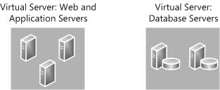
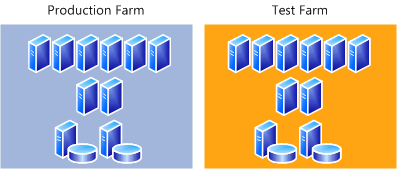

# Use a trial upgrade to SharePoint 2013 to find potential issues

[!INCLUDE[appliesto-2013-xxx-xxx-xxx-md](../includes/appliesto-2013-xxx-xxx-xxx-md.md)] 
  
Before you start an upgrade from SharePoint 2010 Products to SharePoint 2013, you should test the upgrade process to make sure that you know exactly what you have to do to have a successful upgrade. A trial upgrade to test the process can reveal the following issues:
  
- Whether an upgrade plan will work or if you must make adjustments.
    
- The customizations that are in your environment so that you can plan to deal with them during upgrade.
    
- Whether you should upgrade your hardware to make an upgrade run more efficiently and more quickly.
    
- The timing for upgrade, or how long upgrade will take for your environment.
    
- What you must plan for, operationally — for example, resources to have available.
    
In addition, you can use the trial upgrade to become familiar with the upgrade tools and the process itself so that you know what to expect when you perform the actual process. Through testing, you can discover the following issues:
  
- What does the upgrade user interface look like? How do you know when you have finished one phase and are moving through another?
    
- Where are the log files, and how do you read them? What information do they provide?
    
- Whether you must adjust any scripts or commands that are used during the upgrade process, especially if you are relying on any scripts that were used in upgrading to SharePoint 2010 Products.
    
- Whether you have the right plan to address any outages.
    
This article describes basic steps for testing upgrade, and it gives recommendations for reviewing the results and adjusting an upgrade plan based on what you learn during the tests.
  
In addition, the following resources can be helpful when you test the upgrade process:
  
- SharePoint 2013 - Test Your Upgrade Process model
    
    Download the [SharePoint 2013 Products Preview - Test Your Upgrade Process model](https://go.microsoft.com/fwlink/?LinkId=252098) poster to see a visual display of information about how to test the upgrade process. 
    
- See best practices for testing the upgrade process in [Best practices for upgrading from SharePoint 2010 to SharePoint 2013](best-practices-for-upgrading-from-sharepoint-2010-to-sharepoint-2013.md). 
    
## Set up a test environment

You can use either virtual or physical hardware to test the upgrade process. Every environment is unique. Therefore, there are no general guidelines for how long upgrade will take or how difficult a particular customization will be to upgrade. The best way to gauge how upgrade will go is to perform a series of trial upgrades.
  
Here are some things to consider when you create your test environment:
  
- Make your test farm as similar as possible to your real farm — for example, hardware, software, and available space.
    
- Use the same URLs in your test farm as in your real farm. Otherwise, you will waste time diagnosing issues that relate to the URLs that will not occur in the real upgrade. You can do this by using the same URLs and testing only from computers that have host file changes. 
    
- Use the different computer names for your web and application servers.
    
    This will prevent Active Directory Domain Services (AD DS) conflicts.
    
- Use separate servers that run SQL Server for your test farm
    
    If you are using the same servers that run SQL Server for your test and production farm, you can affect the performance of your production farm while you run your tests. We recommend that you use different SQL Server computers (not just instances) for your production and test farms.
    
- Use the same database names in your test environment.
    
    That way, you can validate any scripts that you use to manage your environment. Again, make sure that you use separate servers that are running SQL Server or you risk affecting your production environment.
    
- Be sure that you transfer all the settings and customizations to the test environment. The section [Identify and install customizations](#Customizations) provides information about collecting this information. 
    
Make sure that actions that you take in the test environment do not affect the live environment. Be cautious with the following:
  
- External data connections
    
    Even though you are working with a copy of the environment, the link to the data source is real. Changes that you make to the data in the test environment affect the production environment.
    
- Running commands against a live database still in production
    
    Make sure that you use copies of your databases for testing, not a live version in your production environment. For example, if you run **Test-SPContentDatabase** against a live database, instead of a copy, you might affect performance on your production environment. 
    
### Using a virtual test environment

When you test by using a virtualized environment, you do not have to have lots of hardware. You can replicate your environment by using just two servers that are running Hyper-V. One server has images for the front-end web servers and application servers, and the other server has images for the database servers.
  
However, virtual environments might not have the same performance metrics as physical environments. If your production environment is physical, you must consider this difference when you calculate the time that is required to upgrade your production environment. Generally, you can get better performance estimates if you use a physical server for SQL Server. Make sure that it has similar performance specifications to your server that runs SQL Server in your production environment.
  
**Distribution of servers in a virtual test environment**

  
### Using a physical test environment

When you test by using a physical environment, you must replicate your proposed production server farm environment as closely as possible. If you simplify the number of front-end web servers, application servers, or database servers too much, you will not have an accurate estimate of how long the upgrade process will take. You may not account for complications that arise from interactions between servers in the same role (such as SQL Server transactions). If you have multiple servers in a role in your proposed production farm, use at least two servers for that role in the test farm to test for such issues.
  
**Distribution of servers in a physical test environment**

  
## Identify and install customizations

To have an accurate test process, you must find all the customizations in your current environment and copy them to the test environment. For more information about the types of customizations that you have to identify, see [Create a plan for current customizations during upgrade to SharePoint 2013](/previous-versions/office/sharepoint-server-2010/cc263203(v=office.14)). 
  
- Use the **Stsadm -o enumallwebs** operation on all content databases in your SharePoint 2010 Products environment to identify specific customizations in subsites. This operation lists an ID for each site collection and subsite in your environment and the templates that the site relies on. For more information, see [Enumallwebs: Stsadm operation](https://go.microsoft.com/fwlink/?LinkId=403887).
    
- Use a tool such as WinDiff (a tool that is provided with most Microsoft operating systems) to compare your production environment servers with your test farm servers. You can use this tool to see which files exist on your servers and the differences between them.
    
- Check the web.config files for any changes, and look in the SafeControls element to find any custom controls.
    
- Create a list of all customizations that you find. Identify the source of the customizations, if it is possible. For example, are there third-party add-ins or templates that were customized in-house? After you identify the source, you can then check for updated or upgraded versions of the customizations. 
    
> [!TIP]
>  Whom do you contact about customizations that you did not create? >  Contact Microsoft if you have problems with a template that you downloaded from the Microsoft website. >  Contact your third-party solution vendor if you have problems with a template or component that they supplied you for the earlier version. An upgraded version may be available. 
  
After you identify all the customizations, copy them to the appropriate servers in your test farm. Ensure that the following customizations are deployed:
  
- Solutions - by default legacy solutions are deployed to the /14 directories. Use the **CompatibilityLevel** parameter when you install the solutions to deploy them to the /15 directories. For more information, see [Install-SPSolution](/powershell/module/sharepoint-server/install-spsolution?view=sharepoint-ps).
    
- Custom Master Pages
    
- Custom JavaScript
    
- Custom CSS files (including those for themes)
    
- Custom workflow actions (must be included in actions file)
    
- Confirm large list query throttling settings to make sure that large lists are displayed as expected.
    
When you test customizations, use the following guidance:
  
- Check for visual changes.
    
- Check for behavioral changes.
    
- Test in both 2010 and 2013 mode site collections.
    
- Look for any language or resource loading issues.
    
    This is an issue that can occur when customizations exist in 2010 mode and new customizations replace them in 2013 mode. Because there is only one global directory for language resources, there can be an issue loading the correct file. Make sure that replacement 2013 customizations include the 2010 resources so that the customizations can continue to work correctly in both modes.
    
- Validate that upgrade did not affect customizations. Ensure that customizations do not block site collection upgrade.
    
You can use the **Test-SPContentDatabase** Microsoft PowerShell cmdlet before you attach a database to SharePoint 2013 to determine whether any customizations are missing from the environment. Run this command for each database after you restore the databases to your database server but before you run the upgrade. Note that this cmdlet runs silently — it will not return any output unless there is an issue found. 
  
## Copy real data to the test environment and upgrade databases

You cannot achieve your testing goals unless you use your actual data. Use the Microsoft SQL Server backup and restore tools to create a copy of your content and services databases. 
  
There is no better way to tell what may occur during upgrade than to perform the test on a copy of all the data. However, this might not always be a realistic option for initial testing. You can test in phases by testing one database at a time (if the databases are large) so that you can make sure that you test whatever is unique about that dataset. Or, you can assemble a subset of data from representative sites in your environment. If you want to first test by using a subset of your data, be sure that the subset has the following characteristics:
  
- The data subset contains sites that are typical of the sites that you support in your environment.
    
- The size and complexity of the data subset closely resembles the actual size and complexity of your environment.
    
> [!IMPORTANT]
> Testing a subset of your data does not produce a valid benchmark for how long it will take to process the whole volume of data for your environment. 
  
After you copy the data, take a first pass through the upgrade process to see what happens. This is just the preliminary round. Follow the steps in [Upgrade content databases from SharePoint 2010 to SharePoint 2013](upgrade-content-databases-from-sharepoint-2010-to-sharepoint-2013.md) to try the database attach upgrade process. 
  
When you test the upgrade process, make sure that you test services that are shared across farms. Consider all states, such as the following:
  
- A SharePoint Server 2010 farm connected to a SharePoint 2013 services farm.
    
- A SharePoint 2013 farm connected to a SharePoint 2013 services farm.
    
- Different version farms for different services.
    
Use the test environment to find any security, configuration, compatibility, and performance issues for service applications.
  
## Review results after you upgrade databases

After your test upgrade has finished, you can review the results and revisit your plans. Look at the log files, look at the upgraded sites, and review your customizations. How did upgrade work for your environment? What did you discover? What do you have to rethink about the upgrade plan?
  
### Review the log files

Review the upgrade log file and the upgrade error log file (generated when you run the upgrade). The upgrade log file (.log) and the upgrade error log file (.err) are located at %COMMONPROGRAMFILES%\Microsoft Shared\Web server extensions\15\LOGS. The log files are named in the following format: Upgrade- _YYYYMMDD-HHMMSS-SSS_.log, where  _YYYYMMDD_ is the date and  _HHMMSS-SSS_ is the time (hours in 24-hour clock format, minutes, seconds, and milliseconds). 
  
The format of the log files complies with the Unified Logging System (ULS) conventions. To review the log files to find and troubleshoot issues, start at the top of the files. Errors or warnings may be repeated if they occur for several site collections in the environment, or if they block the upgrade process completely. For example, if you cannot connect to the configuration database, the upgrade process will try (and fail) several times and these tries will be listed in the log file.
  
### Review sites in 2010 mode

Verify that the site collections that were not upgraded work as expected in 2010 mode. Sites should look and behave as they did in SharePoint 2010 Products. Some changes are expected. For example, Office Online and the web analytics features have changed in SharePoint 2013 and sites that used these features will be affected. For information about specific things to look for, see [Overview of the upgrade process from SharePoint 2010 to SharePoint 2013](overview-of-the-upgrade-process-from-sharepoint-2010-to-sharepoint-2013.md).
  
### Run upgrade again, if it is necessary

If you have to, you can restart the upgrade process for a database by using the **Upgrade-SPContentDatabase** Microsoft PowerShell cmdlet. For more information about this cmdlet, see [Upgrade-SPContentDatabase](/powershell/module/sharepoint-server/Upgrade-SPContentDatabase?view=sharepoint-ps). For more information, see [Restart a database-attach upgrade or a site collection upgrade to SharePoint 2013](/previous-versions/office/sharepoint-server-2010/ff382638(v=office.14)).
  
## Upgrade site collections and My Sites

After you have tested and validated upgrade for the content and services databases, you can test the upgrade process for site collections. Follow the steps in [Upgrade a site collection to SharePoint 2013](upgrade-a-site-collection-to-sharepoint-2013.md) to test the site collection upgrade process. If you have My Sites in your environment, see [Overview of the upgrade process from SharePoint 2010 to SharePoint 2013](overview-of-the-upgrade-process-from-sharepoint-2010-to-sharepoint-2013.md) for more information about the process of upgrading them. 
  
> [!NOTE]
> Content about My Sites applies only to SharePoint 2013. 
  
## Review results after you upgrade site collections

Review upgraded sites visually to identify any issues that have to be addressed before you run the upgrade process on your production environment. For more information about specific things to look for, see [Overview of the upgrade process from SharePoint 2010 to SharePoint 2013](overview-of-the-upgrade-process-from-sharepoint-2010-to-sharepoint-2013.md).
  
Review the site collection upgrade log files to check for any issues, starting from the top down. Check the summary section near the end of the log file to see a count of issues and the actual upgrade status (if there is no status, that means that the upgrade process failed and site upgrade must be retried). The site collection log files are stored both in the site collection itself (in the _catalogs/Upgrade document library), and on the file system. The file system log file has more information if you want details about issues. The file system version of the site upgrade log file is located at %COMMONPROGRAMFILES%\Microsoft Shared\Web server extensions\15\LOGS. The log files are named in the following format: SiteUpgrade- _YYYYMMDD-HHMMSS-SSS_.log, where  _YYYYMMDD_ is the date and  _HHMMSS-SSS_ is the time (hours in 24-hour clock format, minutes, seconds, and milliseconds). 
  
## Adjust your plans and test again

Repeat the testing process until you are sure that you have found all the issues that you may face and that you know how to deal with them. Your goal is to know what your plan is if it is 4:00 P.M. on Sunday, you have to be back online Monday morning, and it is not going well. Is there a point of no return? Test your fallback plan and make sure that it works before you begin your real upgrade.
  
## See also

#### Other Resources

[Best practices for upgrading from SharePoint 2010 to SharePoint 2013](best-practices-for-upgrading-from-sharepoint-2010-to-sharepoint-2013.md)
  
[Plan for performance during upgrade to SharePoint 2013](/previous-versions/office/sharepoint-server-2010/cc262891(v=office.14))
  
[Upgrade databases from SharePoint 2010 to SharePoint 2013](upgrade-databases-0.md)
  
[Upgrade a site collection to SharePoint 2013](upgrade-a-site-collection-to-sharepoint-2013.md)
  
[Test and troubleshoot an upgrade to SharePoint 2013](test-and-troubleshoot-an-upgrade-0.md)

