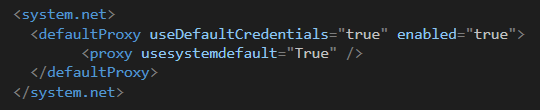

# SharePoint Migration Tool Settings

The following table details the settings available in SPMT. Advanced settings should managed by your IT professional.

## General
 
| Setting | Description |
|:-----|:-----|
|Only perform scanning|If you wish to scan the files as a preassessment to migration, set to **On**.|
|Start migration automatically if no scan issue found |If set to **On**, migration starts automatically if no scan issues are found. |
|Preserve SharePoint permissions|If set to **On**, permissions on your source SharePoint files, folders, and items are migrated. |
|Preserve permissions inheritance|Preserve permissions inheritance.|
|Preserve file share permissions.|Preserve permissions on the files migrated.|

## Users

| Setting | Description |
|:-----|:-----|
|Microsoft Entra lookup |By default, this is set to **On**. If no user mapping file is provided by the user, then Microsoft Entra ID is used as the default for user mapping.|
|Automatic user mapping|User mapping is done automatically.|
|User mapping file|By default,  *Microsoft Entra lookup* is used to map users when submitting migration jobs. If you want to use your own mapping file, select the file to be used by selecting **Choose file**. If you choose to use a custom user mapping file and want to preserve user permissions, turn off *Microsoft Entra lookup*. By doing so, if a user isn't found in the mapping file, the tool won't look it up in Microsoft Entra ID.|

## Filters

| Setting | Description |
|:-----|:-----|
|Migrate file version history |If set to **Off**, only the most recent version of the file is migrated. If set to **On**, you can choose whether to keep all versions, or limit it to a specific number.|
|Keep all versions|If set to **On**, all file versions are migrated.|
|Number of versions to migrate|Enter a number to limit the number of file versions migrated.|
|Include hidden files|If set to **Off**, hidden system files will **not** be migrated. |
|Migrate files created after|Only migrate files created after the selected date. This setting can be used to limit the number of files migrated or to adhere to overall company governance policy regarding file retention.|
|Migrate files modified after|Only migrate files modified after the selected date. This setting can be used to limit the number of files migrated or to adhere to overall company governance policy regarding file retention. |
|Don't migrate files with these extensions|Enter a list of file extensions of file types you don't want to migrate. Separate each extension entered with a colon. Don't include the dot.  For example, **.txt** is entered as **txt**.   **Note** For files with multiple file extensions, for example *.ext1.ext2, add only the last extension, *.ext2*, to the exclusion list.|
|Migrate OneNote folder as OneNote notebook |By default, this setting is set to **Off**. When set to **Off**, OneNote folders migrate over as a regular folder with files, and not as a OneNote Notebook.  If set to **On**, they'll migrate as OneNote Notebooks.  At this time, the ability to migrate notebooks on SharePoint on-premises is disabled.  **NOTE** *This setting has been deprecated starting in Version 3.4.121.2.*  |
|Replace invalid filename characters|If set to **On**, any invalid character found in a filename will be replaced with the single valid character you have provided in the box. Invalid characters include *"<>:/\'. For a complete list, see: [Invalid file names and file types in OneDrive and SharePoint](https://support.microsoft.com/en-us/office/invalid-file-names-and-file-types-in-onedrive-and-sharepoint-64883a5d-228e-48f5-b3d2-eb39e07630fa).   If set to **Off**, the tool skips files whose name includes invalid characters. While having this set to off can improve performance when the source potentially contains a high number of files containing invalid characters, it also has drawbacks. To prevent malicious activities, source packages that generate more than 100 errors to the destination server will be blocked. As a result, all valid files in that package would also be blocked.  |
|Filter subsites|Enter any subsite names you want to exclude from migration.|
|Filter lists and libraries|Enter the names of the lists and libraries you want to exclude from migration.|
|Filter content type|Enter the content types you want to exclude from migration, separated by a semicolon (;), for example, Document; My Document.|

## SharePoint

| Setting | Description |
|:-----|:-----|
|Migrate site settings|This setting is available only when the source selected is *all lists, libraries, pages, and web parts*. Four options are available:  **Preserve all settings**:  Migrate all site level settings supported, including title, logo, features, audit settings, and others.   **Skip title and logo:**  Title and logo are skipped, but all other site settings are migrated.   **Only title and logo:**  Only the title and logo migrate.   **Skip all settings:**  No site level settings are migrated.|
|Skip list with audience targeting enabled|Choose if you want to migrate SharePoint Server lists with audience targeted enabled. |
|Migrate all site fields and content types|Choose if you want to migrate sites fields even if they aren't required for migration.|
|Migrate managed metadata|Choose if you want to migrate all managed metadata terms that are in use on the site.|
|Migration of web parts and pages|Choose how to handle migration if the pages and web parts already exist in the destination.  Select one: *Overwrite duplicate*, *Rename duplicate*, *Skip duplicate*, or *Don't migrate*.|
|Temporarily allow migration of scripts|This setting will automatically allow the migration of scripted web parts.|
|Migrate site navigation|Migrate the navigation links of a site or page in SharePoint.|
|Migrate lists with lookup columns|This setting controls the behavior of migrating all lists referenced in lookup columns.  Options include:  *Migrate all lists referenced in lookup columns*, *Ignore lookup columns in migrated lists*, and *Only report error for any list with a lookup column. Don't migrate.*   This setting is only available if the source selected in a task is a list.  If you're doing a site migration, SPMT will automatically migrate all referred lists, so this setting won't appear to the user.

## Workflow migration

| Setting | Description |
|:-----|:-----|
|Power Automate flow owner|The user name who is the default owner of the Power Automate flow.|

## Advanced

| Setting | Description |
|:-----|:-----|
|Migration auto rerun|Choose if you want to automatically rerun a migration task to look for changes or additions. Select either *Run once*, or *Run up to 5 successive times*.|
|SharePoint Migration Tool working folder  |Choose if you want to create your own working folder.  By default, a temp folder is created.   **Note:** By default, the working folder is `%appdata%\Microsoft\MigrationTool`. Make sure that your working folder has a minimum of 150 GB of free space. It may need more depending on the size of the data you plan to migrate.|

## Custom Azure Storage

> [!Important]
> **Cost:** 
> If you choose to use your Azure Storage, be aware that you could incur bandwidth charges. Those will be billed depending on your Azure offer type and migration size. For general prices, see [Bandwidth pricing](https://azure.microsoft.com/pricing/details/bandwidth/).

| Setting | Description |
|:-----|:-----|
|Use custom Azure Storage|If you wish to use your own Azure Storage, set this value to **On**. Enter your account and key. Select if you want to enable encryption, and if you want temporary working files to be deleted when migration is complete.|

> [!Note]
> This feature is supported only for *General Purpose storage accounts* as General Purpose accounts support Azure blobs and queues. This feature is not available for Blob Storage accounts.

## Government cloud support

If you are on a government cloud, you must first take these steps:

1. Open %localappdata%\Apps\SharePointMigrationTool\SPMT\microsoft.sharepoint.migration.common.dll.config.

2. Change the value of **SPOEnvironmentType** to:

    - **4** if you're GCC
    - **3** if you're DoD
    - **2** if you're GCC high
    - **0** if you use the Worldwide consumer cloud

3.  Double-click "microsoft.sharepoint.migrationtool.advancedapp.exe" to start SPMT.

## Allow or prevent a Custom Script (NoScript)

In Microsoft 365, tenants can control if users can run a custom script on personal sites and self-service created sites.

During migration, some web parts require this setting be set to **allow**. Otherwise, the web part won't be migrated.

At least 24 hours before you start migration, do the following:

1. Go to **[Settings](https://go.microsoft.com/fwlink/?linkid=2185072)**[ in the SharePoint admin center](https://go.microsoft.com/fwlink/?linkid=2185072), and sign in with an account that has [admin permissions](/sharepoint/sharepoint-admin-role) for your organization.

1. At the bottom of the page, select **classic settings page**.

1. Under **Custom Script**, select:

   **Allow users to run custom script on personal sites** 
   
   **Allow users to run customer script on self-service created sites**
   
   Leave these settings in place during your migration.
   
For more info, see, [Allow or prevent custom script](/sharepoint/allow-or-prevent-custom-script).

## Proxy connections

Proxy connections aren't supported for either SharePoint or file share migrations. By default, SPMT doesn't use system proxy credentials and web requests fail if a proxy server is configured. Examples of errors you may see include "SharePoint sign in fail" or "can't load document library". However, you can modify the SPMT app config file to follow your system proxy settings.

**Update proxy**

Download the latest version of SPMT. Start SPMT.

If SPMT doesn't connect to Microsoft 365, go to **%localappdata%\Apps\SharePointMigrationTool\SPMT**.

Open the **microsoft.sharepoint.migrationtool.advancedapp.exe.config** file.

1. Uncomment the default proxy setting shown here:

1. Restart SPMT.

## Related articles

[SharePoint Migration Tool Feedback and Support Forum](https://social.technet.microsoft.com/Forums/en-US/home?forum=SharePointMigrationTool)

