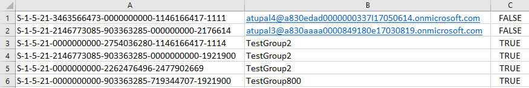

# Create a user mapping file for data content migration

This article describes how to create a user mapping file for data content migration while using the SharePoint Online Migration Tool.
  
The SharePoint Migration Tool (SPMT) lets you migrate your files from SharePoint on-premises document libraries or your on-premises file shares and easily move them to either SharePoint or OneDrive in Microsoft 365. It is available to Microsoft 365 users.
  
> [!NOTE]
>  Currently the **SharePoint Migration Tool** is not available for users of Microsoft 365 operated by 21Vianet in China. 
  
## Create a user mapping file for data content migration

When migrating your data from either a local file share or an on-premises SharePoint Server document library using the SharePoint Online Migration tool, a default user mapping file is used. You can also create your own using the following guidelines. Use any text editor, or an application like Excel, to create the CSV file.
  
 **CSV file format**
  
Here's an example of the format for the CSV file.
  

  
> [!IMPORTANT]
> Do not include a header row in your CSV file. 
  
 **To create a User Mapping file for data migration**
  
The following example uses Excel to create the CSV file.
  
1. Start Excel.
    
2. Enter the values for your user mapping.
    
  - **Column A:** From the source location, enter the **log in name of the user**.  *Required.* 
    
  - **Column B:** On the target site, enter the **principal username**.  *Required.* 
    
  - **Column C:** If the principal username on the target site is a group, enter **TRUE**. If it is not a group, enter **FALSE**.  *Required.* 
    
3. Close and save as a comma-delimited (\*.csv) file.
    
 **Upload your User Mapping file to SharePoint Migration Tool**
  
After you create your own user mapping file, upload it to the SharePoint Online Migration tool.
  
1. Start SPMT. Enter your Microsoft 365 username and password, and then select **Sign in**.

2. Select **Start your first Migration**.

3. Select your migration type.

4. Enter your source information, and then select **Next**.

5. Enter your destination information, and then select **Next**.

6. Review your migration details, and then select **Next**.

7. On the **Choose your settings** page, expand **View all settings**.

8. Under **Users** section in the **User mapping** box, select **Choose file**, and select your user mapping file.

9. Select **Save**.
    
