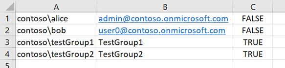
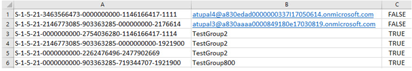

# Create a user-mapping file for data content migration

This article shows how to create a user-mapping file to use with the SharePoint Migration Tool (SPMT).

SPMT lets you migrate your files from SharePoint on-premises document libraries or on-premises file shares and move them to Microsoft 365. It's free to Microsoft 365 users.

> [!NOTE]
> Currently the **SharePoint Migration Tool** is not available for users of Office 365 operated by 21Vianet in China.

## Create a user-mapping file for data content migration

A default user-mapping file is used when migrating your data from a local file share or an on-premises SharePoint Server document library. You can also create your own using the following guidelines. Use any text editor, or an application like Excel, to create the CSV file.

**CSV file format**

> [!IMPORTANT]
> For **SharePoint Server 2010** migrations, only the log in name is supported in column A.
>
> For **SharePoint Server 2013 and higher**, you may use either the log in name or the SID in column A.

For all SharePoint Server versions:

Only SharePoint Server 2013 & 2016 may use this format, in addition to using a log in name.

> [!IMPORTANT]
> Do not include a header row in your CSV file.

**To create a user-mapping file for data migration**

The following example uses Excel to create the CSV file.

1. Start Excel.

2. Enter the values for your user-mapping.
    
  - **Column A:** From the source location, enter the **log in name of the user**.  *Required.* 
    
  - **Column B:** On the target site, enter the **user principal name (UPN)**.  *Required.* 
    
  - **Column C:** If the user principal name (UPN) on the target site is an Active Directory (AD) group, enter **TRUE**. If it's not an AD group, enter **FALSE**.  *Required.* 
    
3. Close and save as a comma-delimited (\*.csv) file.

**Upload your user-mapping file to SharePoint Migration Tool**

After you create your own user-mapping file, upload it to the SharePoint Migration tool.

1. Start SPMT. Enter your Microsoft 365 username and password, and then select **Sign in**.

2. Select **Start your first Migration**.

3. Select your migration type.

4. Enter your source information, and then select **Next**.

5. Enter your destination information, and then select **Next**.

6. Review your migration details, and then select **Next**.

7. On the **Choose your settings** page, expand **View all settings**.

8. Under **Users** section in the **User mapping** box, select **Choose file**, and select your user-mapping file.

9. Select **Save**.

> [!NOTE]
> It is not possible to map an AD group to a SharePoint group in the target site.  Currently it is also not possible to map a SharePoint group to a SharePoint group in SPMT.
