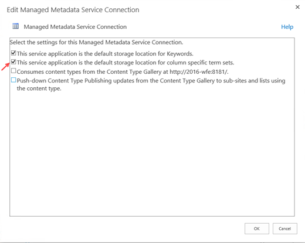

# Migrating Managed Metadata to SharePoint Online Using the SPMT

The SharePoint Migration Tool (SPMT) lets you migrate managed metadata from SharePoint Server 2013 to SharePoint in Office 365.

## What is supported

The SharePoint Migration Tool supports having only **one** Managed Metadata Service (MMS) term store *set as the default* for the site collection.

> [!NOTE]
> If more than one site collection term store is marked as the default, the SharePoint Migration Tool (SPMT) will not be able to determine which term store to migrate. This can result in breaking managed metadata columns which refer to the term store content.

## Troubleshooting

**Symptom:**  Your Managed Metadata Service (MMS) term store and its content (term groups/terms sets/terms) fails to migrate.  

**Likely cause:** More than one term store is set as the default.

**Action:**  
- If you want to migrate a Managed Metadata Service (MMS) term store, set it as the default. 
- If you have more than one MMS term store, decide on the one you want to migrate and set it as the default. Remove the default setting from all others.

### To configure a managed metadata service connection

1. In SharePoint Server 2013 Central Administration, under Application Management, click **Manage service applications**.
2. Find the managed metadata service connection for the service application that you want to configure. (Look for Managed Metadata Service Connection in the Type column.)
3. Highlight that row, and then click Properties.
4. Set the default site collection term store by selecting **This is the default storage location for column specific term sets**. 
  
 

To learn more:  
 [Configure the SharePoint Server Managed Metadata service](https://docs.microsoft.com/en-us/SharePoint/governance/configure-the-managed-metadata-service).
 
[SharePoint Migration Tool:  Overview and download](https://docs.microsoft.com/en-us/sharepointmigration/introducing-the-sharepoint-migration-tool)

