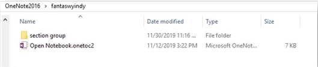
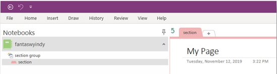
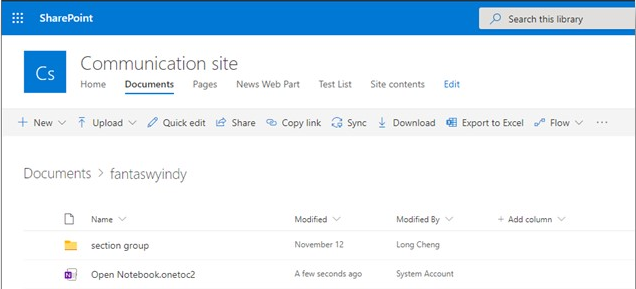
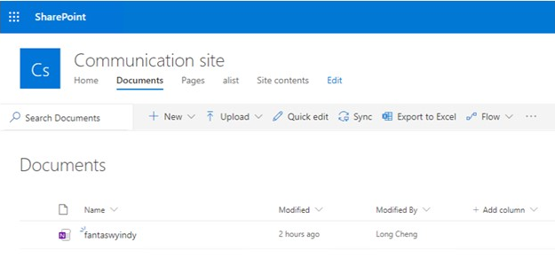

# How to migrate OneNote folders using SPMT

The SharePoint Migration Tool (SPMT) gives you the option on how to migrate your OneNote folders.  

Before migrating your OneNote folders, it is important to understand a little about their file structure.  

On a user’s computer, a OneNote Notebook is presented as a normal folder. For each Notebook, there is a *.onetoc2* file created under the root folder of the Notebook folder. You can have as many Notebooks as you want.

  

If you create section groups in your Notebook, those are also presented as a folder. Under each section group, you can create multiple sections, and each one of those sections will be presented as *.one* file in file system. 

You can create multiple pages within a section, but the content of those pages will be contained in the same *.one* file as the section to which they belong.

  

When you open the OneNote application, they appear like this:

  

**Recommended setting**

We recommend that you migrate with this setting set to **On**. The files will migrate as a OneNote notebook.  You can open the notebooks with the OneNote application or via Microsoft Teams by manually adding a tab to Teams.

>[Important]
>If set to **Off**, you will likely receive errors when attempting to open the .one and .onetoc2 files. This is because the files that were migrated are for the desktop client version of OneNote which differs from the OneNote in SPO.

## Selecting the OneNote settings in SPMT

Before you migrate your files, decide how you want your OneNote folders to appear. In **Settings**, go to **Migrate OneNote folders as OneNote notebook**.  The default setting is **Off**.

If you choose to migrate with the setting set to **Off**, your OneNote folders will migrate as a normal folder with files that you can navigate just as you can any other folder.  It will appear in SPO like this:

  

If it is set to **On**, the folders are migrated to SPO as **OneNote Notebook** content rather than a normal folder with files.   It will appear in SPO like this:

