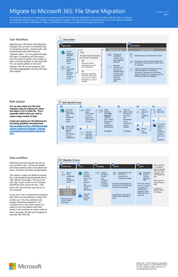
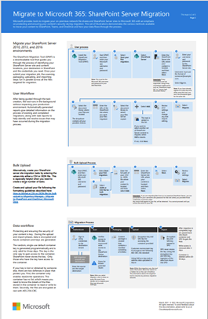

# Migration Manager and SharePoint Migration Tool solutions posters

Microsoft provides tools to migrate your on-premises network file shares and SharePoint Servers sites to Microsoft 365 with an emphasis on protecting and enxuring your content's security during migration.  This set of illustrations demonstratiosn the various meethods available to move your content to SharePoint, Teams, and OneDrive and how your data flows through the process.

## File share migration 

Migrating your file shares with Migration Manager lets you have a centralized way of connecting servers, creating tasks, and automatically load balancing your migration tasks. 

 [PDF](https://download.microsoft.com/download/0/5/b/05b7fb7c-1557-4ebb-9036-c5fc3a4cd94c/m365-migration-posters-mm-spmt.pdf) | [Visio](https://download.microsoft.com/download/0/5/b/05b7fb7c-1557-4ebb-9036-c5fc3a4cd94c/m-365-migration-posters-mm-spmt.vsdx)

## SharePoint Server migration

The SharePoint Migration Tool (SPMT) is a downloadable tool that guides you through the process of identifying your SharePoint Server site and content locations, and your destinations in SharePoint, Teams, and OneDrive.

 [PDF](https://download.microsoft.com/download/0/5/b/05b7fb7c-1557-4ebb-9036-c5fc3a4cd94c/m365-migration-posters-mm-spmt.pdf) | [Visio](https://download.microsoft.com/download/0/5/b/05b7fb7c-1557-4ebb-9036-c5fc3a4cd94c/m-365-migration-posters-mm-spmt.vsdx)