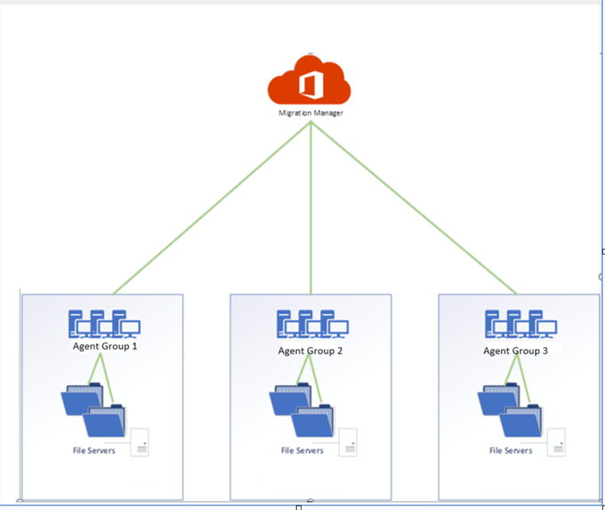

#  Agent Groups in Migration Manager

 When you created an Agent in Migration Manager, it is in a default group, an agent is not assigned to any group. Migration Manager lets you have the ability to create "agent groups" and assign agents to them.

## Who would choose to create an Agent group?

-	Multi-geo agent isolation
-   Ability to optimize for customer network scenarios
- 	Ability to isolate migration jobs/traffic
- 	Ability to segment migration jobs to provide prioritization where needed
- 	Dedicate agents to scan vs migrate

