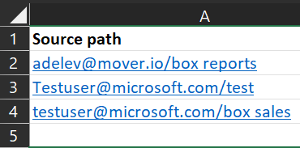

# Bulk upload Box source paths into Migration Manager using a CSV file 

Migration Manager lets you bulk upload your Box source paths using a a comma-separated (CSV) file. Use any text editor, or an application like Excel, to create the CSV file.  JSON files are not supported.

- The number of sources listed in a single file must be less than 10,000.
- Up to 50 scans are performed simultaneously on the uploaded values.
- The file contains a single column, and the column heading is optional.

Source paths are entered as: [username]@[domainname]/[folder name] 

1. Start Excel. 
2. Enter the . Enter one source per row.      
3. Close and save as a Comma delimited (\*.csv) file. The encoding of the CSV file must be UTF-8.

 

    