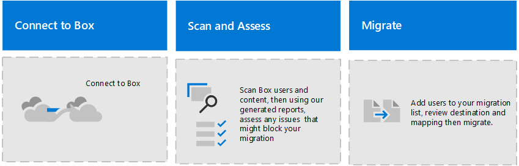

# Migrate Box to Microsoft 365 with Migration Manager

Collaborate all in one place by migrating your Box documents, data, and users to OneDrive, SharePoint, and Teams in Microsoft 365. 

## How does it work?

- **Step 1: Connect to Box.**   Sign in to your Box account and add the Microsoft 365 migration app to your Box account custom apps. 

- **Step 2:  Scan and assess.** We'll automatically scan for Box users for you the first time or you can do it manually. Once the scans are complete, download the generated reports and logs to investigate any possible issues that might block your migration.

- **Step 3: Copy to Migations list.** After a Box user has been scanned and determined ready, add them to your migration list.

- **Step 4: Review destination paths.**  We automatically map source paths to any exactly matching destination paths.  Ensure content is being copied to the right place by reviewing and mofiying as needed for each destination path.
- 
- **Step 5: Map identities.**  Map your groups and users in Box to those in Mmicrosoft 365 to migrate your Box sharing settings.

- **Step 6: Migrate and Monitor.**  After reviewing your mgiration setup, migrate your Box accounts and monitor the progress.

## How do I get started?

To get started:

Go to the [Migration Manager page of the new SharePoint admin center](https://aka.ms/ODSP-MM-FS), and sign in with an account that has [admin permissions](/sharepoint/sharepoint-admin-role) for your organization.

Make sure that you have:

- **Access to the destination**: You must either be a global admin or OneDrive/SharePoint admin to the Microsoft 365 tenant where you want to migrate your content. 

- **Access to the source**: Have Box account credentials that have read access to any Box user account you plan to migrate.

- **Prerequisites installed:** Make sure you have the necessary prerequisites installed.

