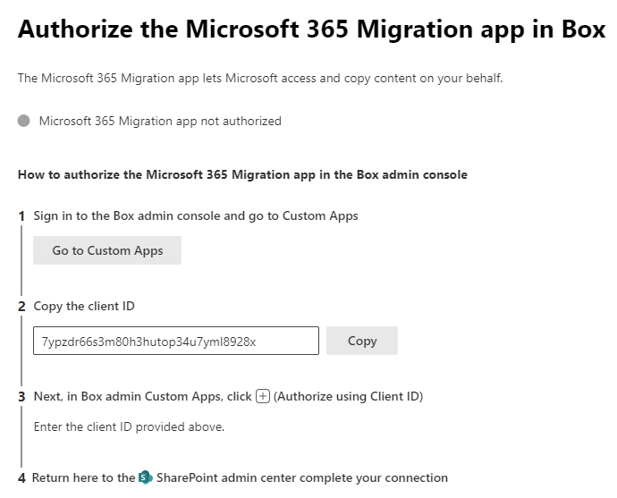

# Step 1:  Connect your Box account to Microsoft 365

Sign in to your Box account and add the Microsoft 365 migration app to your Box account custom apps. 

1. From <a href="https://aka.ms/odsp-mm-box" target="_blank">Migration Manager</a> in the SharePoint admin center, under **Box**, select **Get started**.
2. Select **Connect to Box**. 
3. Select **Authenticate account**. 
4. Sign in to grant access to Box. Enter your Box email and password, then select **Authorize**.
5. Select **Grant Access to Box**. You are returned to the SharePoint Admin center. Select **Next**.
6. Select **Go to custom apps**. Sign in to the Box admin console.
7. Return to SharePoint, select **Copy the client ID**.

8. In the Box admin Custom apps, select **+** to authorize. Paste in the client ID.
9.  You're now connected to Box. Select **Finish** to close the window.

>[!Important]
>For security reasons, you have 10 minutes to complete the steps to connect to Box. After 10 minutes of inactivity, the session will expire.

[**Step 2: Scan and assess**](mm-box-step2-scan-assess.md)

>[!NOTE]
>Migration Manager Box isn't available for users of Office 365 operated by 21Vianet in China.
>
> This feature is also not supported for users of the Government Cloud, including GCC, Consumer, GCC High, or DoD.