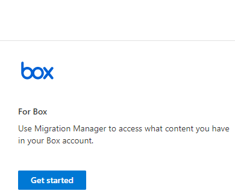

# Step 1:  Connect your Box account to Microsoft 365

1. From the [Migration page in the new SharePoint admin center](https://admin.microsoft.com/sharepoint?page=migrationCenter&modern), under **Box**, select **Get started**.

1. Select **Connect to Box**. 
2. Select **Authorize Mover**. This step uses your Microsoft credentials to connect Mover to your co-admin Box account.  Click **Next**.

1. Sign in with an account that has [admin permissions](/sharepoint/sharepoint-admin-role) for your organization.  
2. Sign in to Box with your co-admin account. This step connects your Box account to Microsoft 365.
3. Sign in to grant access to Box. Select **Authorize.**
4. Install the Microsoft Box app in your Box account settings. Installing the app will authorize content to be copied from your Box account to Microsoft 365.  
5. Copy the app client ID.  
6. Select copy.
7. Use that copied client ID to add the Microsoft app.  Go you your Box account settings to authorize a new app in your Box account settings and enter the client ID when prompted.
8. On the Box screen, select "Authorize new app".
9. Paste the client ID you copied from the earlier screen. Enter the client ID for application for which you would like to grant access.
10. An App Authorization page appears and lists the authorization details of the request.  Select "Authorize."
11. You're now connected to Box. Click **Finish** to close the window.

