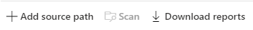

# Step 2: Scan and assess Box users

> [!NOTE]
> "Step 2: Scan and access Box users" can now be skipped to alleviate Box throttling. Once the users (tasks) are added to the Scan list, they can be copied to the Migrations tab instantly for migration operations. Please note that Migration Manager will not discover any possible errors and warnings before migration if the scan process is skipped.

After you connect, scan and assess your Box user accounts.
1. Select **Add users** from the menu bar to choose how to add users:  - **All new users** to auto-discover all new users in Box - **Single user** for only one account,  or  - **Multiple specific users** to bulk upload users by entering them into a CSV file to upload.
2. Choose to **Automatically start scanning now** or choose to scan later.
3. Select **Add**.
4. Highlight any or all of the accounts and then select **Scan** if you chose not to auto scan earlier.

>[!Important]
> The total number cannot exceed 50,000 tasks.

5. Once the scan is complete, a table summary displays to give you an at-a-glance overview of your users. The summary includes User item counts, migration readiness, and any issues that need attention. 
4. Review the scanned users. Search for specific text, or select a filter to review the list more easily.

## Download reports

Summary and detailed scan reports are available to assist you in troubleshooting. Download the generated reports and logs to investigate any possible issues that might block your migration.

1. Once the scan is complete, select **Download reports** from the menu bar for *summary* reports.

   
   
2. Highlight a selected Box user, and select **Download scan log**  to download a *detailed* scan report of that user account.  

## Managing users who own large amounts of data

Upon completing your scan, download the Scan reports and review/address any large source data owners.

The more users simultaneously being transferred, the higher our throughput for your migration. Users with large data sets should be broken into smaller Service Accounts to facilitate faster transfers.

> [!IMPORTANT]
> To maximize throughput, **users should not own greater than 100,000 items or 1 TB of data**. The more users you have, and the smaller the amounts of data they own, the faster your migration proceeds.

**Examples**:

|Size|Action|
|---|---|
|If a user owns more than 400,000 items|Divide the items between four users each with 100,000 items.|
|If a user owns more than 5 TB of data|Divide between five users so that each user owns 1 TB. |

To create Service Accounts, you can work with your Box Admin to carry out the following steps:

1. Once you've identified a large user, determine how many Service Accounts will be required (see example above).
2. Create the Service Accounts in Box and assign them a license.
3. From the original large user, identify the folder(s) you would like to assign to the Service Account.
4. Change the ownership of said folder(s) to the new Service Account. This may require that the original owner first share it with the new owner, where the new owner would have to accept, then the original owner will then have the option to select them as owner. The original owner becomes co-owner of the folder and the permissions will reflect that new status in the Source account. The folder will no longer appear in their *My Files* folder but will now appear in *Shared with me*.
5. When it comes to migrating the Service Account, create a corresponding OneDrive user/SharePoint site to migrate the new Service Account content to.
6. Before making any changes, you should reach out to your tenant administrator, investigate any source custom solutions or integrations that you might be using, and determine if these ownership changes will have any impact.

When mapping, ensure that each Service Account has its own unique matching Destination account to optimize performance.

|Source Path |Destination Path |
|---|---|
|originaluser@contoso.com| originaluser@contoso.com/[upload folder]\* |
|serviceaccount1@contoso.com|serviceaccount1@contoso.com/[upload folder]\* |
|serviceaccount2@contoso.com |serviceaccount2@contoso.com/[upload folder]\* |
|serviceaccount3@contoso.com |serviceaccount3@contoso.com/[upload folder]\* |

Asterisk (\*) = optional folder

## [**Step 3: Copy to migrations**](mm-box-step3-copy-to-migrations.md)

