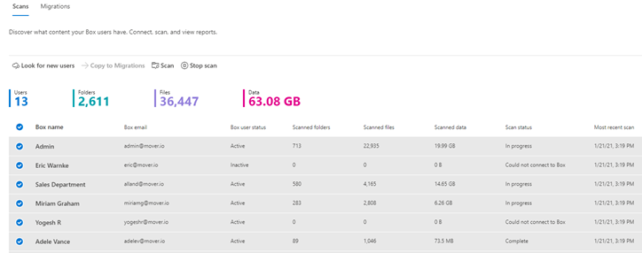
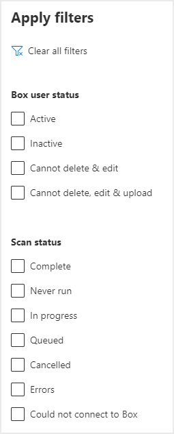

# Preview - Step 2:  Scan and assess Box users

>[!Important]
> This feature is currently in private preview and subject to change without notice.

Box users are scanned automatically for you. Once the scans are complete, download the generated reports and logs to investigate any possible issues that might block your migration.

A table summary appears at the top to give you an at-a-glance overview of your users and content size.

1.  Review the scanned users. Select **Look for new users** if you want to manually search for additional users.

2. You can search for specific names, or select a filter to review the list more easily.

 

3. Once the scan is complete, select **Download scan log** from the menu bar, to troubleshoot any issues.

4.

