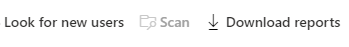
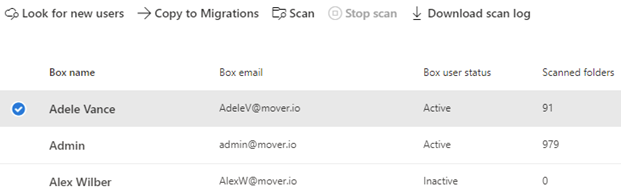

# Step 2: Scan and assess Box users

After you connect, Box users are automatically scanned. Once the scans are complete, download the generated reports and logs to investigate any possible issues that might block your migration.

A table summary appears at the top to give you an at-a-glance overview of your users. The summary includes content size, migration readiness, and any issues that need attention.

   

1. Review the scanned users. Search for specific text, or select a filter to review the list more easily
2. Select **Look for new users** to manually search for more users.

    

## Download reports

Summary and detailed scan reports are available to troubleshoot any issues.

1. Once the scan is complete, select **Download reports** from the menu bar for summary reports.

    

2. Highlight a selected Box user, and select **Download scan log**  to download a detailed scan report of that user account.  

    

[ **Step 3: Copy to migrations**](mm-box-step3-copy-to-migrations.md)

>[!NOTE]
>Migration Manager Box isn't available for users of Office 365 operated by 21Vianet in China. It's also not available for users of Microsoft 365 with the German cloud that use the data trustee *German Telekom*. It is supported for users in Germany whose data location isn't in the German datacenter.
>
> This feature is also not supported for users of the Government Cloud, including GCC, Consumer, GCC High, or DoD.