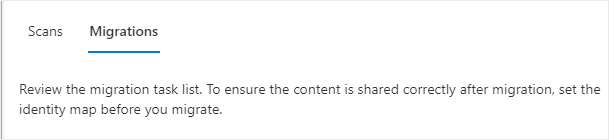

# Preview - Step 3: Copy to migrations 

>[!Important]
> This feature is currently in private preview and subject to change without notice.

After a Box user has been scanned and determined ready, add them to your migration list.  

1. Click the **Migrations** tab. The table will list all users that have been copied to migration.

2.  

