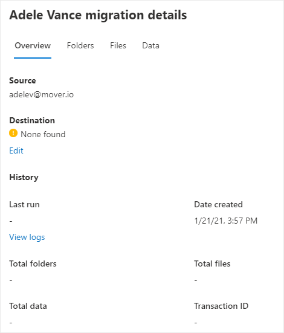
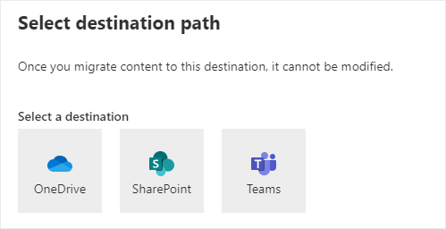

# Step 3: Copy to migrations 

After a Box user has been scanned and determined ready, add them to your migration list.  

1. Click the Migrations tab. The table will show all users that have been copied to migration.

 

2. If the destination is missing, highlight the row.  A panel will appear. Under Destination, click **Edit.**

3. You can select either OneDrive, SharePoint, or Teams as a destination.

4. Depending on whether you select OneDrive, SharePoint, or Teams, you will be prompted to enter the account and then folder, site and then folder, or Teams team and then the channel. 
5. Click **Save path**.

If you have many destinations to edit, you can choose to upload a bulk destinations CSV file. See [Bulk upload destinations for Box migration](mm-box-bulk-upload-destinations.md).

