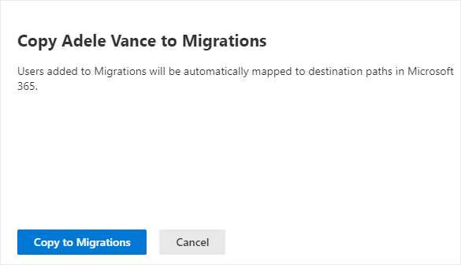
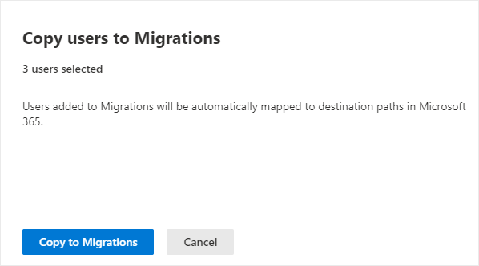

# Step 3: Copy to migrations (preview)

>[!Note]
> Features described in this topic are part of a publicpreview release. The content and the functionality may change and are not subject to the standard SLAs for support.
>
>This preview release currently supports the migration of up to approximately 1500 Box accounts in a single migration. For larger migrations, we recommend you use the [Mover migration tool](https://Mover.io).

 After a Box user has been scanned and determined ready, add them to your migration list.  

1. Select the **Migrations** tab. The table will list all users that have been copied to migration.

2. Select the users that are ready to be added to the migrations list.
3. Select **Copy to migrations**

 You can also select multiple users.

5. Select the **Migrations** tab, and proceed to the next step.

[**Step 4: Review destinations**](mm-box-step4-review-destinations.md)

>[!NOTE]
>Migration Manager Box preview isn't available for users of Office 365 operated by 21Vianet in China. It's also not available for users of Microsoft 365 with the German cloud that use the data trustee *German Telekom*. It is supported for users in Germany whose data location isn't in the German datacenter.
>
> This feature is also not supported for users of the Government Cloud, including GCC, Consumer, GCC High, or DoD.