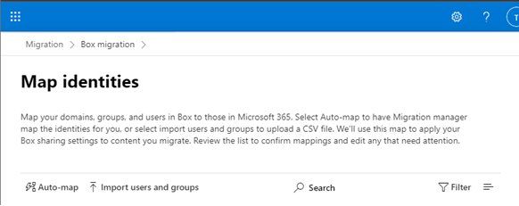
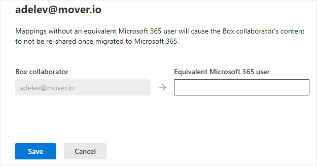

1. Select the Migrations tab.
2. Click Map identities on the menu bar.

3.  Select **Auto-map** to have Migration Manager map the identities for you or select **Import users and groups** to upload the values in an CSV file.

 

4. To edit a single mapping, highlight the row.  A panel will appear where you can enter the Microsoft 365 user account that your Box user will map to.  Click **Save**.

