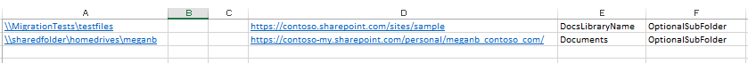

# How to format a CSV or JSON file for bulk upload in Migration Manager


  
## Using a comma-separated value (CSV) file for data content migration

Migration Manager lets you use a comma-separated (CSV) file to bulk migrate your data. Use any text editor, or an application like Excel, to create the CSV file.
  
 **CSV file format**
  
There are six columns needed in your CSV file -- the first three are your source values, each providing detail about where your data is currently located. The remaining three columns indicate the site, document library and optional sub-folder to where you are migrating your data. All six columns must be accounted for in the file, even if you are not needing a value for a given field.
  
Here's an example of the format for the CSV file. The rows show files that are being migrated from local file shares.
  

  
This example shows how it would appear in a .txt file.
  
```console
\\MigrationTests\testfiles,,,https://contoso.sharepoint.com/sites/sitecollection,Documents,SubFolderName
\\MigrationTests\testfiles,,,https://contoso-my.sharepoint.com/personal/user_contoso_onmicrosoft_com,Documents,
```

> [!IMPORTANT]
>  *Do not*  include a header row in your CSV file. Remember to account for all six columns in the file, even if you are not needing a value for a given field. 

  
 **To create a CSV file for data migration**
  
The following example uses Excel to create the CSV file.
  
1. Start Excel.
    
2. Enter the values for your migration jobs. Enter one migration source and destination per row. See the reference table below for further explanation of columns.
    
   - **Column A:** Enter a file share path.  *Required.* 
    
   - **Column B:** Leave this column **blank**. This column does not apply to file share migration. 
    
   - **Column C:** Leave this column **blank**. This column does not apply to file share migration. 
    
   - **Column D:** Enter the SharePoint site URL where the files are to be migrated.  *Required.* 
    
   - **Column E:** Enter the name of the document library in the SharePoint site where the files are to be migrated.  *Required.* 
    
   - **Column F:** Enter the name of the subfolder in the document library. If this column is left empty then the files will be moved to the root level.  *Optional.* 
    
3. Close and save as a Comma delimited (\*.csv) file.
    

## Using a JSON file for data content migration


The following example shows the JSON format used in migrating your data.

The minimum required values are SourcePath, TargetPath and TargetList.  

```json

{

  "Tasks": [

    {
      "SourcePath": "\\\\contoso\\fileshare\\dept1",
      "TargetPath": "https://a830edad9050849387E18042320.sharepoint.com",
      "TargetList": "Documents",
      "TargetListRelativePath": "dept1",

      "Settings": {

        "MigrateHiddenItems": true,
        "MigrateItemsCreatedAfter": "2016-05-22",
        "MigrateItemsModifiedAfter": "2016-05-22",
        "SkipFilesWithExtensions": "txt:mp3",
        "MigrateOneNoteNotebook": false,
        "FilterOutPathSpecialCharacters": false,
        "MigrateOneNoteNotebook": true
      }
    },

    {

      "SourcePath": "\\\\contoso\\fileshare\\dept2",
      "TargetPath": "https://a830edad9050849387E18042320.sharepoint.com",
      "TargetList": "Documents",
      "TargetListRelativePath": "dept2",

      "Settings": {

        "MigrateHiddenItems": true,
        "MigrateItemsCreatedAfter": "2016-05-22",
        "MigrateItemsModifiedAfter": "2016-05-22",
        "SkipFilesWithExtensions": "txt:mp3",
        "MigrateOneNoteNotebook": false,
        "FilterOutPathSpecialCharacters": false,
        "MigrateOneNoteNotebook": true

      }

    }
  ]
}
 
```
