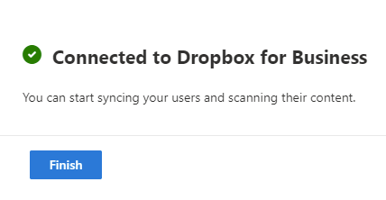

# Step 1:  Connect to Dropbox

Sign in to your Dropbox for Business administrator account to connect to your Microsoft 365 migration.

1. In the new SharePoint admin center, select <a href="https://go.microsoft.com/fwlink/?linkid=2185075" target="_blank">**Migration center**</a>. 
2. Under **Dropbox**, select **Get started**.
3. Select **Connect to Dropbox**. 
4. Select **Sign in to Dropbox**.
5. Sign in to your Dropbox administrator account to link with your Microsoft 365 migration.
6. Select **Allow**, letting Microsoft have the listed individual and team permissions. 

  

## [**Step 2: Scan and assess**](mm-Dropbox-step2-scan-assess.md)

  

