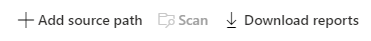

# Bulk upload Egnyte folders into Migration Manager using a CSV file 

Migration Manager lets you bulk upload your Egnyte folders using a comma-separated (CSV) file. Use any text editor, or an application like Excel, to create the CSV file.  JSON files are not supported.

## Before you begin

- The number of sources listed in a single file must be less than 10,000.
- Up to 50 scans are done simultaneously on the uploaded values.
- The file contains a single column, and the column heading is optional.
- Source paths can be entered either as [username]@[domainname]/[folder name]  or as [username]@[domainname].

## Formatting your CSV file

1. Start Excel. 
2. Enter one source per row.  The column heading is optional. Enter your source in one of the following ways: 

 - *[username]@[domainname]/[folder name]*  **or**

- *[username]@[domainname]*

3. Close and save as a comma delimited (*.csv) file. The encoding of the CSV file must be UTF-8.

## Uploading your file

1. [Connect to Egnyte](mm-google-step1-connect.md).
2. On the menu bar, select **Add source**.

  

3. Select **Upload a CSV file**.  Browse to your file and then select **Add**.
4. Assess your files, and then continue to the next step, [Copy to migrations](mm-box-step3-copy-to-migrations.md).