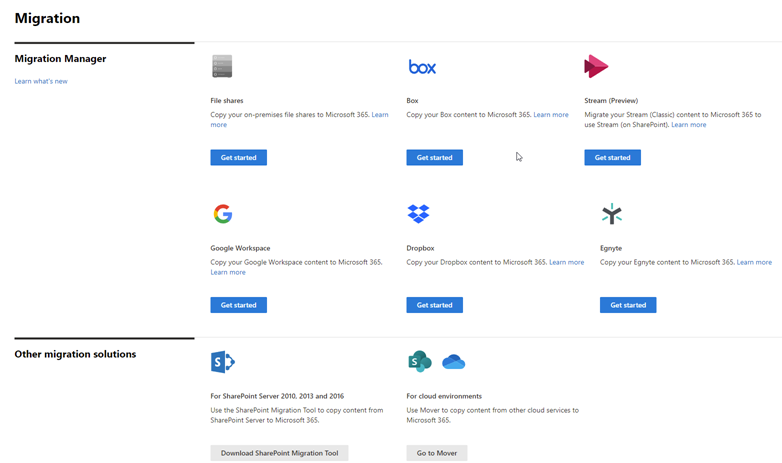

# Overview: Migrate Egnyte using Migration Manager

Collaborate all in one place by migrating your Egnyte documents, data, and users to OneDrive, SharePoint, and Teams in Microsoft 365. 

## How does it work?

- **Step 1:** [Connect to Egnyte](mm-egnyte-step1-connect.md) Sign in to your Egnyte account and add the Microsoft 365 migration app to your Egnyte app. 
- **Step 2:** [Scan and assess](mm-egnyte-step2-scan-assess.md) Egnyte accounts are scanned automatically for you. Once the scans are complete, download the generated reports and logs to investigate any possible issues that might block your migration.
- **Step 3:** [Copy to Migrations list](mm-egnyte-step3-copy-to-migrations.md) After an Egnyte account has been scanned and determined ready, add them to your migration list.
- **Step 4:** [Review destination paths](mm-egnyte-step4-review-destinations.md)  We automatically map source paths to any exactly matching destination paths. Ensure content is being copied to the right place by reviewing and modifying as needed for each destination path.
- **Step 5:** [Map identities](mm-egnyte-step5-map-identities.md)  Map your groups and users in Egnyte to an account in Microsoft 365 to migrate your Egnyte sharing settings.
- **Step 6:** [Migrate and Monitor](mm-egnyte-step6-migrate-monitor.md) After reviewing your migration setup, migrate your Egnyte accounts and monitor the progress

## Get started

To get started:

Go to the <a href="https://go.microsoft.com/fwlink/?linkid=2185075" target="_blank">Migration center</a> in the SharePoint admin center, and sign in with an account that has [admin permissions](/sharepoint/sharepoint-admin-role) for your organization.

Make sure that you have:

- **Access to the destination**: You must either be a global admin or OneDrive/SharePoint admin to the Microsoft 365 tenant where you want to migrate your content. 

- **Access to the source**: Have Egnyte account credentials that have read access to any Egnyte user account you plan to migrate.

- **Prerequisites installed:** Make sure you have the necessary prerequisites installed.

- **Request a rate increase from Egynte**.  Your new Egnyte application lets you connect to your Egnyte account. However, it will likely not let you migrate content to Microsoft 365 due to the limits Egnyte imposes on new applications. Sign into your Egynte developer account to determine your existing rate limit. Then contact Egynte support to submit your request. 

**Sample request email:**

   **Subject:**  Egnyte connection 
   **Text:**     I would like the user rate limits increased for my application [*enter application name*] to [*x calls*] per second and [*y calls*] per day.

## File size migration limit

We support files up to 15 GB in size for Egnyte to Microsoft 365 migrations.

>[!NOTE]
>Migration Manager Egnyte isn't available for users of Office 365 operated by 21Vianet in China.
>
> This feature is also not supported for users of the Government Cloud, including GCC, Consumer, GCC High, or DoD.

