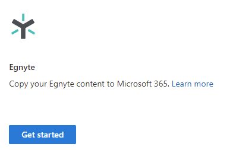

# Step 1:  Connect to Egynte

## Prerequisites

|Required|Description|
|:-----|:-----|
|Egnyte developers account| You must have an Egnyte developers account to register a new Egnyte Connect API application that is required you to connect to Migration Manager.   If you don't already have an account, see: [Create an Egnyte developers account]( https://developers.egnyte.com/member/register)

## Create your Egnyte app

Create an Egnyte Connect API application. Creating an application will generate a pair of keys that you will use to connect to Migration Manager.

1. Sign in to your Egnyte developer account. 
2. From the developers page, select **Get API Key** > **Create a new application**.
3. Enter the required details for your new application. In the table below, we show suggested entries to quickly get an approval for your app. **Note:** This does not include all the required fields.

|Field|Suggested entry|
|:-----|:----|
|Name of your application |My migration app|
|Type|Internal application |
|Current user base|New app|
|Platform |Web App|
|Egnyte domain that you will use for testing | enter your organizations Egnyte domain|

Under **Select which Web APIs you will use**, select:

- Issue a new key for Egnyte Connect API 
- Issue a new key for Egnyte protect

The keys are automatically generated by Egnyte.  You will need these keys to connect Migration Manager.

>[!Tip]
> If you need assistance creating your application, contact [Egnyte support](https://developers.egnyte.com/contact)

## Connect to Egnyte

After you have created your new app in Egnyte:

1. In the new SharePoint admin center, select [Migration Manager](https://admin.microsoft.com/sharepoint?page=migrationCenter&modern). 
2. Under **Egnyte**, select **Get started**.

3. Select **Connect to Egnyte**. 
4. Enter your **Egnyte domain**, **application key**, and **application secret** that were automatically generated by Egnyte and provided to you.
5 Select **Connect to Egnyte**. 

## Request rate limit increase

Your new Egnyte application lets you connect to your Egnyte account.  However, it will likely not let you migrate content to Microsoft 365 due to the limits Egnyte imposes on new applications.  You need to contact Egnyte support a request a rate limit increase for your application.

Sample email:

Subject:  Egnyte connection
Text:     I would like the user rate limties increase for my application [enter application name] to x calls per second and y calls per day.

