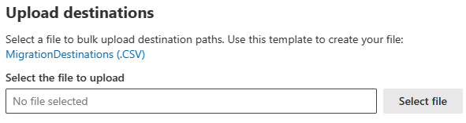

# Step 4: Review destination paths in Migration Manager Egnyte

In this step, review the destination paths of the accounts you have moved to the migrations list, making sure they are correct. An account cannot be migrated without a destination indicated. Once you start migrating content to a destination, it cannot be modified.

## Single destination edit

If a destination is missing on a single user, highlight the row and update the value. 

1. Highlight the row, a panel will display. Under **Destination**, select **Edit.**
2. You have the choice of selecting a OneDrive, SharePoint, or Teams path as a destination. Depending on your selection:

    - For OneDrive, enter the OneDrive URL or email address and the location/folder name
    - For SharePoint, enter site URL and location
    - For Teams, select the team and the channel

3. Select **Save path**.

## Upload destinations using a CSV file

If you have many destinations to edit, you can choose to upload a bulk destinations CSV file.  Download the *MigrationDestinations.csv* file template to your computer and enter your destinations. The template lists all migration tasks that have never been run, and you can add to or modify the last column “Destination path”. Then save your file as a .csv file using any name you wish. 

1. From the Migrations tab, select **Upload destinations** from the menu bar.
2. Select the file to upload with your destinations.
3. The destinations will be validated upon uploading.  
- The validation process may take a while and can be skipped, but we strongly recommend you complete the validation.
- A validation report is generated if issues are found. Download the report to fix the issues based on the error message provided. Then re-upload the fixed destinations to pass the validation.

4. Select **Save**.  

>[!Important]
>Rows with vacant a “destination path” will be skipped in the validation process.  

## Go to [**Step 5: Map identities**](mm-google-step5-map-identities.md)

## [**Step 5: Map identities**](mm-egnyte-step5-map-identities.md)

>[!NOTE]
>Migration Manager Egnyte isn't available for users of Office 365 operated by 21Vianet in China.
>
> This feature is also not supported for users of the Government Cloud, including GCC, Consumer, GCC High, or DoD.
