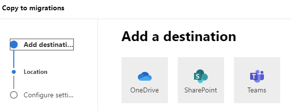
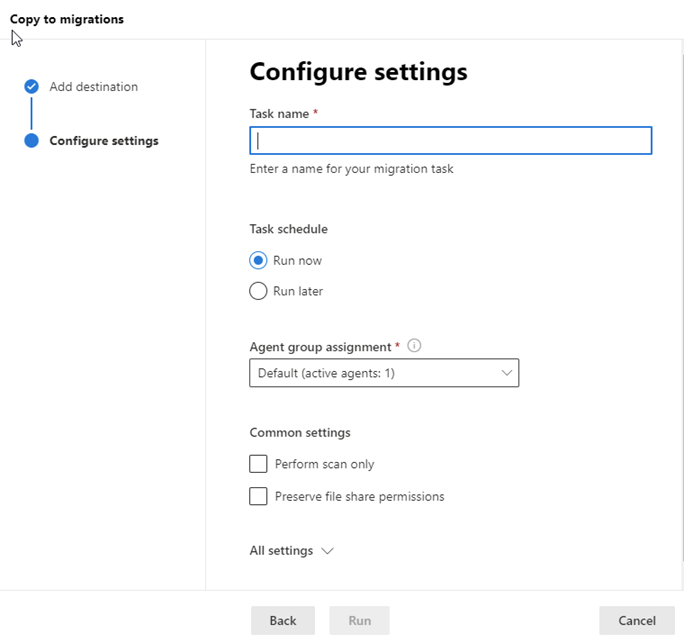

# Step 3: Copy to migrations

After a file share has been scanned and determined ready, add it to your migration list.  

1. Highlight one or rows from the scanned list. From the menu bar, select **Copy to migrations**.   

    
 

2. Add a destination -- OneDrive, SharePoint or Teams. Select **Next**.
3.  Select a SharePoint site destination.  Enter the site path and the location within the site from the dropdown list. Select **Next**.

   

4. Depending on the destination you selected: 
    - For OneDrive, enter a OneDrive URL or email address and the location/folder name
    - For SharePoint, enter site URL and location
    - For Teams, select the team and the channel

4. Under configure settings, enter a friendly name for your migration. 
5. Select an agent group and then review and edit your settings as needed.
6. If you choose **Run later**, select a date and time, and then select **Schedule.**
7. If you choose **Run now**, select **Run**.

## Incremental migration

After a migration task has completed, you can rerun it at a later date, allowing you to copy only those new or updated files in the source location. 

An incremental check of your SharePoint destination environment is performed. Files are evaluated as follows:
  
|**Status**|**Result**|
|:-----|:-----|
|Modified time of the source file is earlier than the modified time of the target file.    |File will not be migrated.    |
|A file is removed from the source location.    |Already migrated files will remain in the target location.    |
|Files or lists exist in the SharePoint target location.    |Migration will skip those existing objects during scan.    |
|Time stamp on files or object in the source location is newer in the source.   |The newer files are migrated.    |
|Source is a file share.    |Validation for migration will be based on the file/folder path.    |
|Source is an on-premises SharePoint Server/    |Validation for migration will be based on list item GUID. Use the folder path as a fallback.    |

>[!NOTE]
>Migration Manager for file shares isn't available for users of Office 365 operated by 21Vianet in China. It's also not available for users of Microsoft 365 with the German cloud that use the data trustee *German Telekom*. 
>
>It is supported for users in Germany whose data location isn't in the German datacenter.
>
> This feature is not supported for users of the Government Cloud, including GCC, Consumer, GCC High, or DoD.
