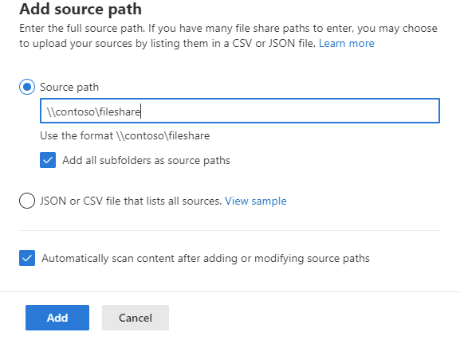
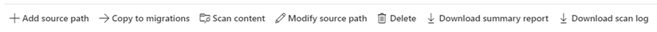

# Step 2: Scan and assess file shares

File shares are scanned automatically once you add a source. Once the scans are complete, download the generated reports and logs to investigate any possible issues that might block your migration.

A table summary appears at the top to give you an at-a-glance overview of your users and content size.

## Reviewing the scan results

1. Select **Add source path**

2. Review the scanned file shares. Search for specific text, or select a filter to review the list more easily.
1. Select **Add source path** if you want to scan additional file shares.

## Download summary report and scan log

1. From the menu bar, select **Download summary report** to have a local copy of the summary view.
2. Highlight a single row and select  **Download scan log** from the menu bar, to troubleshoot the details of individual files. 

>[!NOTE]
>Migration Manager Box isn't available for users of Office 365 operated by 21Vianet in China. It's also not available for users of Microsoft 365 with the German cloud that use the data trustee *German Telekom*. It is supported for users in Germany whose data location isn't in the German datacenter.
>
> This feature is also not supported for users of the Government Cloud, including GCC, Consumer, GCC High, or DoD.