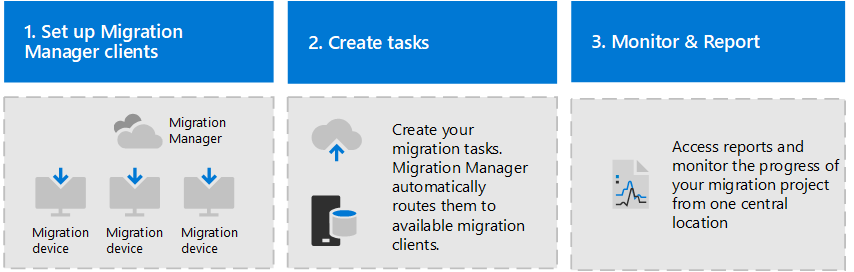

# Get started with the Migration Manager (preview)

>[!Note]
>Features noted in this topic are part of a preview release. The content and the functionality are subject to change and are not subject to the standard SLAs for support.

>[!Note]
>Migration Manager currently supports only the migration of **file shares**.
>
>This release does not support the migration of content from SharePoint Server.

Migrating content to the cloud is a time and resource intensive process and normally involves scaling up resources to accommodate the large volume of content that you are moving. This comes at a high operational cost of individually managing each migration computer and the migrations tasks that are running on it. Plus you aren't able to automatically load balance your jobs, or view at a glance the progress and status of your migration tasks across all your computers.

Migration Manager answers those challenges by providing you a centralized way of connecting servers, creating tasks, and automatically load balancing your migration tasks.  

Located in the modern SharePoint Admin Center, the Migration Manager guides you through the setup of your clients and the creation of your tasks.  You can specify global or task level settings, view all-up task progress, and download aggregated summary and task-level reports.

## How does it work? 

It works in three simple steps:

- **Setup migration clients.** Download and install a setup file on each computer or virtual machine you want to connect to Migration Manager.

- **Create tasks & migrate.** Create a task by entering the URL of the network file share that you want to migrate (your source) and the URL of the SharePoint site where you are migrating your content (your destination). Migration Manager does the rest. However many tasks you create, Migration Manager will automatically distribute the tasks across all the connected clients.

- **Monitor and report.** Monitor progress across all clients and access reports from one central location. 

## How do I get started? 

To get started:

1. Sign in to https://admin.microsoft.com as a global or SharePoint admin.
2. In the left pane, under Admin centers, select SharePoint.
3. In the left pane select **Migration** and then **Migration Manager**.

Make sure that you have:

- **Access to the destination**: You must either be a global admin or SharePoint Online admin to the Office 365 tenant where you want to migrate your content.

- **Access to the source**: Windows credentials that have read access to any of the network file shares you plan to migrate 

- **Prerequisites installed:** Make sure your computer or VM has the necessary prerequisites installed:  See here for the [List of prerequisites](mm-setup-clients.md). 

### Related links

[How to set up clients in Migration Manager](mm-setup-clients.md) 
[Migration Manager settings](mm-settings.md) 
[How to format your CSV or JSON file for bulk upload into the Migration Manager](mm-bulk-upload-format-csv-json.md) 
[Migration Manager FAQs](mm-faqs.md) 