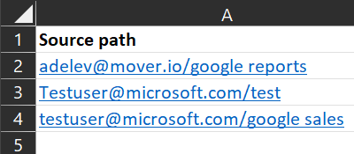
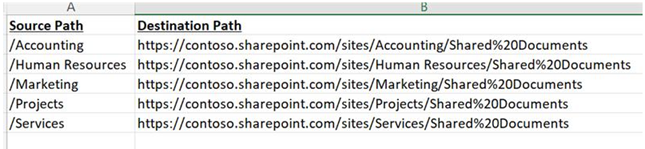
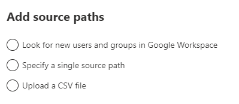

# Bulk upload Google drives into Migration Manager using a CSV file 

Migration Manager lets you bulk upload your Google drives using a comma-separated (CSV) file. Use any text editor, or an application like Excel, to create the CSV file.  JSON files are not supported.

## Before you begin

- The number of sources listed in a single file must be less than 10,000.
- Up to 50 scans are done simultaneously on the uploaded values.
- The file contains a single column, and the column heading is optional.
- Source paths can be entered either as [username]@[domainname]/[folder name]  or as [username]@[domainname].

>[!Tip]
> Download a list of users from your organization's Google account to help construct your CSV file.  Learn more: [Download a list of users](https://support.google.com/a/answer/7348070?hl=en&fl=1)

## Formatting your CSV file

The formatting for personal drives and shared drives is slightly different.  

1. Start Excel. 
2. Enter one source per row.  The column heading is optional. Enter your source in one of the following ways: 

**For personal drives:**

*[username]@[domainname]/[folder name]*  **or** *[username]@[domainname]*

**For Shared drives:**

- */[shared drive name]*

3. Close and save as a comma delimited (*.csv) file. The encoding of the CSV file must be UTF-8.

## Uploading your file

1. [Connect to Google](mm-google-step1-connect.md).
2. On the menu bar, select **Add source path**.

  

3. Select **Upload a CSV file**.  Browse to your file and then select **Add**.

4. Assess your files, and then continue to the next step, [Copy to migrations](mm-box-step3-copy-to-migrations.md)

 

    