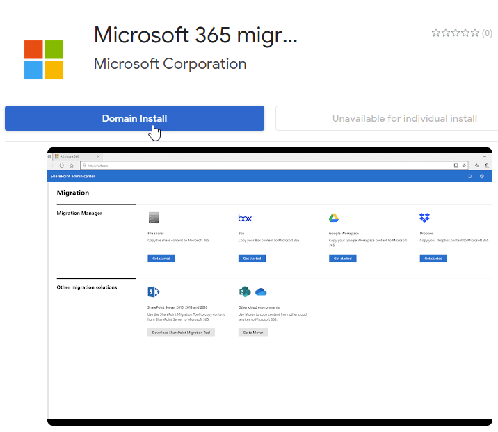
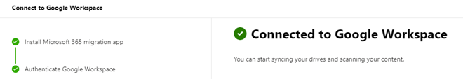

# Step 1:  Connect to Google Workspace (preview)

>[!Note]
> Features described in this topic are part of a preview release. The content and the functionality may change and are not subject to the standard SLAs for support.

Sign in to your Google account and add the Microsoft 365 migration app to your Google account custom apps. 

1. In the new SharePoint admin center, select [Migration Manager](https://admin.microsoft.com/sharepoint?page=migrationCenter&modern). 
2. Under **Google Workspace**, select **Get started**.
3. Select **Connect to Google Workspace**. 
4. On the *Install the migration app* page, select **Install and authorize** if you haven't already installed the Microsoft 365 migration app in the Google Workspace Marketplace. 
5. Sign in to the Google Workspace Marketplace with a super admin, groups admin, user management admin, or help desk admin account. 
6. Select **Domain Install**.

6. On the Domain-wide install screen, select **Continue**.
7. Agree to the terms of service and then select **Allow**. 
8. Select **Done** to complete the installation.
9. Return to the Migration Manager wizard screen. Select **Next**
10. Select **Sign in to Google Workspace**.
11. Choose an account to continue to Microsoft 365 Migration.
12. Select **Finish** to close the window.

>[!Important]
>For security reasons, you have 10 minutes to complete the steps to connect to Google. After 10 minutes of inactivity, the session will expire.

[**Step 2: Scan and assess**](mm-Google-step2-scan-assess.md)

>[!NOTE]
>Migration Manager Google preview isn't available for users of Office 365 operated by 21Vianet in China. It's also not available for users of Microsoft 365 with the German cloud that use the data trustee *German Telekom*. It is supported for users in Germany whose data location isn't in the German datacenter.
>
> This feature is also not supported for users of the Government Cloud, including GCC, Consumer, GCC High, or DoD.