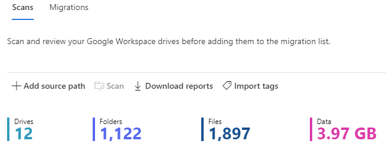
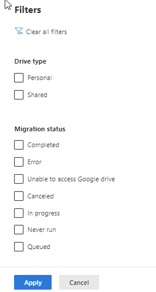
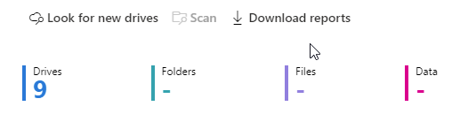

# Step 2: Scan and assess Google Drives (preview)

>[!Note]
> Features described in this topic are part of a preview release. The content and the functionality may change and are not subject to the standard SLAs for support.

After you have connected to Google, Google Drives are scanned automatically for you. Once the scans are complete, download the generated reports and logs to investigate any possible issues that might block your migration.

A table summary appears at the top to give you an at-a-glance overview of your users and content size.

1.  Review the scanned drives. Select **Look for new drives** if you want to do a manually search.

2. Search for specific text, or select a filter to review the list more easily.

3. Once the scan is complete, select **Download reports** from the menu bar, to troubleshoot any issues. The file will be available from your task bar or downloads folder: **Scan task report.csv**

**NEXT:**  [ **Step 3: Copy to migrations**](mm-Google-step3-copy-to-migrations.md)

>[!NOTE]
>Migration Manager Google preview isn't available for users of Office 365 operated by 21Vianet in China. It's also not available for users of Microsoft 365 with the German cloud that use the data trustee *German Telekom*. It is supported for users in Germany whose data location isn't in the German datacenter.
>
> This feature is also not supported for users of the Government Cloud, including GCC, Consumer, GCC High, or DoD.