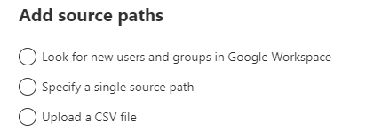

# Step 2: Scan and assess Google Drives

After you have connected to Google, the drives are displayed automatically for you. Once the scan is complete, download the generated reports and logs to investigate any possible issues that might block your migration.

A table summary appears at the top to give you an at-a-glance overview of your users and content size.

1. Select **Scan**. Review the scanned drives. 
2. Search for specific text, or select a filter to review the list more easily.

3. To include other sources, select **Add source path**. Choose to look for new sources, enter a specific source, or bulk upload many sources via a CSV file.

## Download reports

Summary and detailed reports are available to troubleshoot any issues.

1. Once the scan is complete, select **Download reports**.

2. To download a detailed scan report for an individual account, select a single row, then select **Download scan log**.    

**NEXT:**  [ **Step 3: Copy to migrations**](mm-Google-step3-copy-to-migrations.md)

>[!NOTE]
>Migration Manager Google isn't available for users of Office 365 operated by 21Vianet in China. It's also not available for users of Microsoft 365 with the German cloud that use the data trustee *German Telekom*. It is supported for users in Germany whose data location isn't in the German datacenter.
>
> This feature is also not supported for users of the Government Cloud, including GCC, Consumer, GCC High, or DoD.