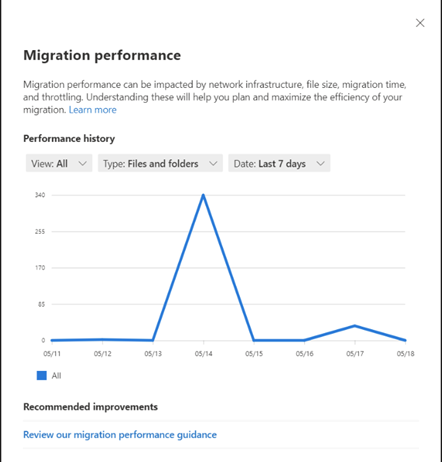
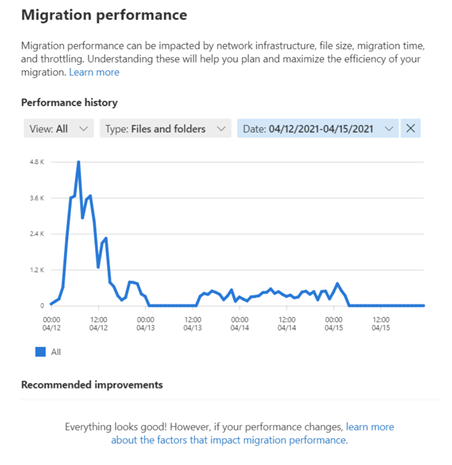

# Using performance dashboards in Migration Manager

Migration performance can be impacted by network infrastructure, file size, migration time, and throttling.  Understanding these areas will help you plan and maximize the efficiency of your migration.

## Filtering options

When the selected data range is greater than four days, result increments will be by day.

When the selected date range in less than or equal to four days, the results will be shown in hourly increments.

