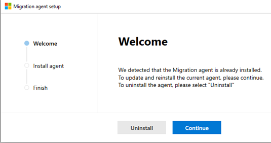

# How to reinstall the Migration Manager agent

You may find it necessary to reinstall the Migration Manager agent on one of your computers, especially if it encounters issues.

1. From the new SharePoint admin center, select **Migration**.  You need to sign in with an account that has admin permissions for your organization.
2. Under **For file shares**, select "Get started" or "View Tasks."
3. Select the **Agents** tab, and highlight the agent you want to delete.  Select **Delete**.
4. Remaining on the **Agents** tab, select **+ Add**.
5. Select **Download agent setup file.**
6. Select **Continue** to reinstall the agent.

7. Select **Next**
8. Enter the SharePoint admin username and password of the environment where you will be migrating your content. Select **Next.**
9. Enter your Windows credentials that will provide access to all the file shares that contain the content you want to migrate. Select **Install.**
10. Test agent access (optional) or select **Close.** After the setup is completed, the new agent will be added to the available agents that can be assigned tasks.
