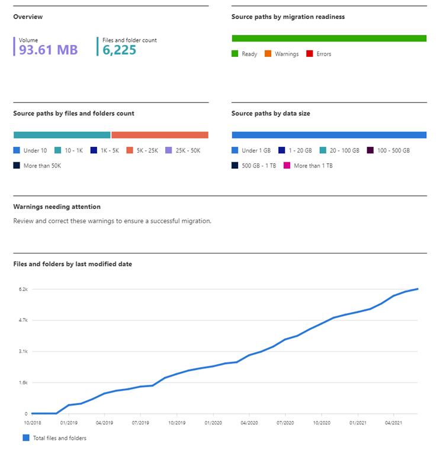
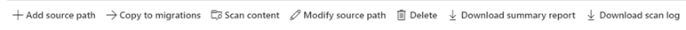

# Migration Manager scan

Once you add a source location, every file in the root path is scanned automatically. As your scan progresses, you can view the number and size of files, folders, and source paths. Migration readiness "warnings" gives you insight into any issues and how to remediate them. 

## Using the scan

Once a scan is completed, highlight the row to look further into any issues that were discovered during the scan.

- **Download summary report**:  Download a summary report of entire scan
- **Download scan log**:  Download a detailed scan log, listing every file in the source path.
- **Modify source path**: Change the source path.
- **Add source path**:  Add a new source path.
- **Copy to migrations**  Select a path that is migration ready, and copy it to the migrations list.
- **Scan content**  Select a row, edit the path, and rescan
- **Delete**:  Highlight and delete a path.

## Understanding the report columns

|Column|Description|
|:-----|:-----|:-----|
|Source path|File path or URL of the location of the data being migrated.|
|Scan status|Status of each task (success, failure, in progress, not started)|
|Data size|The total size of the data in the root path.|
|File count|The total number of files, excluding files filtered out based settings or scanned potential issues|
|Folder count|The total number of folders in the source path.|
|Max path length|The longest path length for an item in this account.  The path length is calculated to include the tenant URL, user site, path, and any character encoding. Microsoft 365 allows a maximum of 400 characters.|
|Root permissions|The number of permission entries that exist on the root folder. For example, the total number of group or user accounts on the root folder.|
|Last accessed|Last accessed shows the last date the items within the folder were accessed. This date indicates how actively this folder is accessed.  It’s an aggregated value for all files within the folder.|
|Created on|The date the scan was created.|
|Migration Readiness|Status of readiness checks. A value of "Warning" indicates file/subfolder level scan issues. Examples of issues discovered include invalid characters, or insufficient permissions to access the folder.|
|Task ID|Unique identifier for a migration task.|

