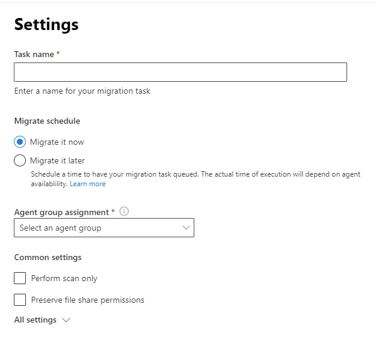
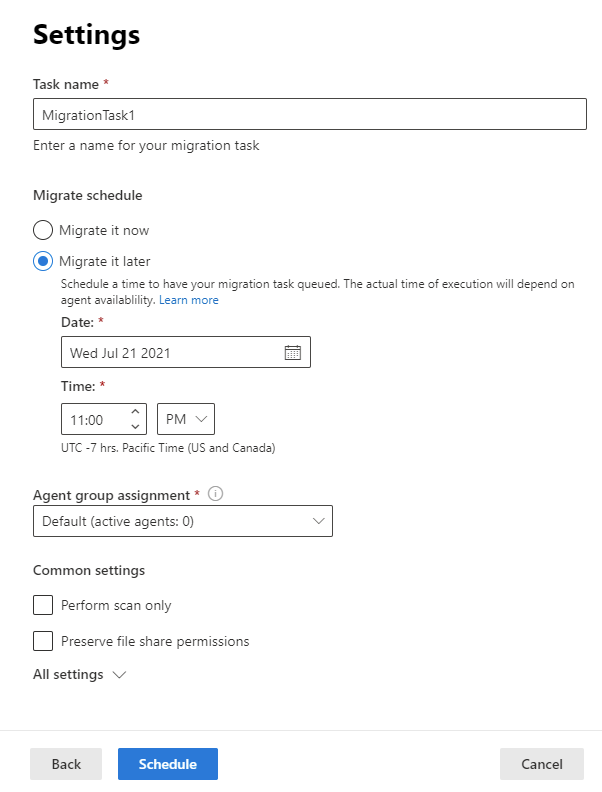

# Task scheduling in Migration Manager

You can run your task now or schedule a time to have your migration task queued. The actual time will depend on agent availability.  

Select the desired date and time. The time is expressed as UTC -7:00 (Pacific Time, US and Canada).

