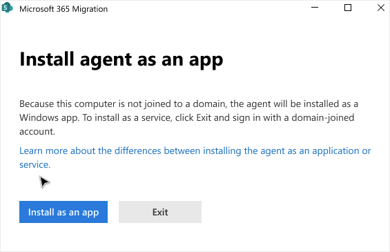
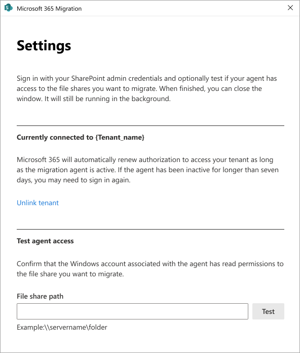

# Step 1: Setup Migration Manager agents

When migration file shares with Migration Manager, you first set up one or more "migration agents", by running a setup file on each computer or VM you choose to configure. 

When you run the setup file, you are prompted for two sets of credentials.  You need SharePoint Admin credentials to access your destination, and Windows credentials with read access to the source. Those Windows credentials must have read access to all file shares you plan to migrate. This pair of credentials creates a trust with Migration Manager. Migration Manager now sees it as an available "agent" to which it can automatically distribute migrations tasks.

After an agent is configured, anyone with the permission to go into the SharePoint admin center can create tasks. The tasks will be automatically distributed to one of the configured agents.

> [!Important]
> Make sure to download the latest version of the agent setup file.

## Planning checklist

|Category|Guidance|Fill in with your details|
|:-----|:-----|:-----|
|Have the right credentials to use|SharePoint admin for migration destination Windows account for source that has access to ALL network file shares you plan to migrate. Confirm that you have SharePoint Admin credentials to access the "destination" of where you are migrating your content. Verify that the Windows credentials you plan on using to configure the agent has access to **all** the network file shares you plan to migrate.  |
|Virtual machines or computers to use:|Determine how many VMs or computers you plan on using for your migration project. List the computers or VMs before you start.|
|[Verify prerequisites](mm-prerequisites.md)|Make sure your computer meets the requirements.|
|[Check required endpoints](mm-prerequisites.md)|Verify that you have the required endpoints configured.|
|[Multi-geo tenant](#multi-geo-agent-setup)|If you have a multi-geo tenant, make sure to understand where the agent will be installed.|
|[Pre-provision OneDrive accounts](https://docs.microsoft.com/onedrive/pre-provision-accounts)|If you are migrating to OneDrive accounts, make sure the accounts are pre-provisioned before you migrate. Pre-provisioning can be done by using a script as described here: [Pre-provision OneDrive for users in your organization](https://docs.microsoft.com/onedrive/pre-provision-accounts).|
|[Government Cloud](mm-gov-cloud.md)|If your tenant resides in a government cloud, you may have extra steps to perform before using Migration Manager.|

>[!Tip]
>Create a Windows admin account specifically to use for your migration project. Make sure this admin account has access to any file share that you plan on migrating. Log into each VM or computer with this account before you run the setup file.

>[!NOTE]
>Third party multi-factor authentication is not supported at this time.

## Set up an agent

1. From the new SharePoint admin center, select [Migration](https://admin.microsoft.com/sharepoint?page=migrationCenter&modern).You need to sign in with an account that has [admin permissions](/sharepoint/sharepoint-admin-role) for your organization.
2. Under "For file shares", select **Get started**.
3. Select the **Agents** tab, and then select **Add**.
4. Select **Download agent setup file**.
5. Open the setup file. On the Welcome page, select **Next**.
6. Enter the SharePoint admin username and password of the environment where you will be migrating your content. Select **Next**.
7. Enter your Windows credentials that will provide access to **all** the file shares that contain the content you want to migrate. Select **Install**.
8. Test agent access (optional) or select **Close**.  After the setup is completed, the new agent will be added to the available agents that can be assigned tasks.

>[!Note]
>**Multiple agents**.  If you have a large migration project and to set up multiple agents, we recommend that you download the agent setup file to a shared location. That way you can easily download the setup file on each computer or VM.  

### Working folder

A working folder named **%appdata%\Microsoft\SPMigration** is created for each agent. This folder is where logs, reports, and any temporary folders are saved. Make sure that your working folder has a minimum of 150 GB of free space. It may need more depending on the size of the data you plan to migrate.

## Multi-geo agent setup

If you have a Multi-Geo SharePoint tenant, the agent will be installed in the geo-location set in the SharePoint admin center. Before installing the agent, make sure the desired geo-location is the one set in the admin center. To change an agent's geo-location, delete and reinstall the agent. 

Learn more: [Multi-Geo Capabilities in OneDrive and SharePoint Online](https://docs.microsoft.com/microsoft-365/enterprise/multi-geo-capabilities-in-onedrive-and-sharepoint-online-in-microsoft-365)

To install an agent to a different Geo location:

1. **Download** the agent setup file.
2. **Launch** the setup file and remain on the *Welcome page*.
3. **Open** this file:  %temp%\SPMigrationAgentSetup\SPMigrationAgentSetup\Microsoft.SharePoint.Migration.ClientShared.dll.config
4. Under appSettings, add an entry as shown in the following **example** for the desired country or data center. (Note: this is an example for Canada.)  

    *< add key="GeoLocation" value="CAN" / >*

The country or regional GEO code can be found here [Microsoft 365 Multi-Geo availability](https://docs.microsoft.com/microsoft-365/enterprise/microsoft-365-multi-geo)

## Installing the agent as an app

 If the system detects you are not joined to a domain when installing the agent, you can install the agent as a Windows app.  If you still wish to install it as a service, exit and sign in with a domain-joined account.

>[Important]
> If you install the agent as an app, it will not run if the computer is asleep, effectively pausing your migration.  

1. Select **Install as an app**. 

2. After the agent installs, sign in with your SharePoint Admin credentials.
3. Test if your agent has access to the file shares you want to migrate (optional).

The settings screen will display if and to what tenant you are connected.  Select **unlink tenant** if you wish to sign in to a different tenant.

>[!Important]
>Microsoft 365 will automatically renew authorization to access your tenant as long as the migration agent is active.  If the agent has been inactive forlonger than seven days, you may need to sign in again.

>[!Important]
> Passwords are not stored in the installer.

>[!NOTE]
> Migration Manager automatically assigns tasks to a available agent.  You cannot manually assign a task to a specific agent. Each agent can have up to 10 tasks in its queue.
>
>Pausing a task does not release the agent to another task. An agent remains unavailable to accept a new task until the task is resumed and completed, or if the task is deleted.

>[!Important]
>The connection between the agent and Migration Manager stays active as long as the computer is still running and the SharePoint admin credentials that were used to sign into the agent are still valid. 
>
>If the agent does becomes disconnected, it still holds the token to the Migration Manager for up to 7 days. After that time, the agent will need to be reinstalled.

