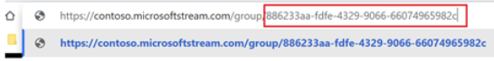

# Bulk upload Stream source paths into Migration Manager using a CSV file 

Migration Manager lets you bulk upload your Stream source paths using a comma-separated (CSV) file. Use any text editor, or an application like Excel, to create the CSV file.  JSON files are not supported.

## Before you begin

- The number of sources listed in a single file must be less than 10,000.
- Up to 50 scans are done simultaneously on the uploaded values.
- The file contains a single column, and the column heading is optional.

## Create your CSV file

1. Start Excel. 
2. Enter one source per row. The column heading is optional. Enter your source paths using the following format (without any space):

- [Container ID]|[Container type]

For container type, use ‘User’, ‘M365Group’, ‘CompanywideChannel’, or ‘StreamOnlyGroup’. 

>[!Tip]
>To discover your Container ID: Go to Stream classic and copy the unique identifier that appears after the word */group/* or */channel/*
>
>
 
>[!Note]
>User containers currently can't be discovered via the *Add source* feature. 

3. Close and save as a comma delimited (*.csv) file. The encoding of the CSV file must be UTF-8.

## Uploading your file

1. In Migration Manager, connect to Stream.
2. On the menu bar, select **Add source**.

  

3. Select **Upload a CSV file**.  Browse to your file and then select **Add**.
4. View your added files in the **Scans** tab. Continue to the next step, "Add to Migrations".

 

    