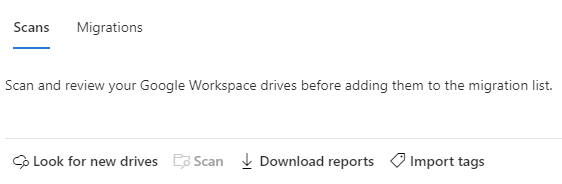
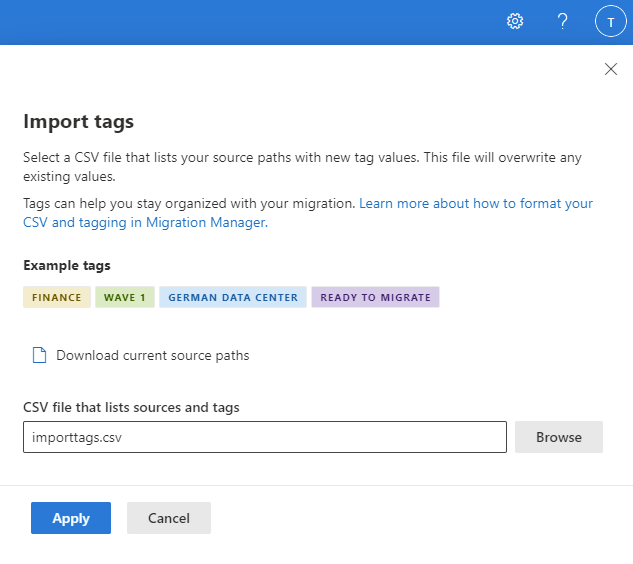
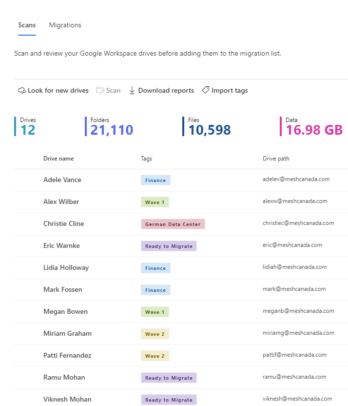

# Importing and using tags with Microsoft Manager 

Use tags to better organize, plan, and schedule your content migrations in Migration Manager. Tags let you filter tasks and easily navigate through a large quantity of sources and users to find what you need. 

If you have a large migration project, you will likely migrate the content in phases or need to identify them by groupings. Apply tags to indicate department, region, wave, or any other collection relevant to your organization. With tags, you can filter, group, and keep organized.
 
Tags can be updated anytime during your project. If you scan a group of sources and they are ready to migrate, you can apply new tags to identify their status quickly. Or if a group of tasks need to be run again, you may tag them with "Incremental run" to make that group stand out.

## Using and managing tags
While you can create as many tags as you wish, we strongly recommend limiting the number of tags you use to simplify your projects. Making them reusable, like using "Ready for migration" or "Incremental run" is one way of limiting the number of tags you use. 

You can enter one or more tags per source, separating them with a semi-colon in the .csv file. Keep in mind that tags are case-sensitive and will filter on an exact string match. Tags are part of the metadata associated with the content and are preserved even after you copy tasks to the migration tab. The Summary reports and scans will also include tags.

### Examples of tags

As you plan your overall migration project, plan your tag strategy to align with it.

|Category|Tag examples|Importance|
|:-----|:-----|:-----|
|Business unit|Sales, Finance|Helpful if you are migrating by division or department|
|Phase|Wave 1, Wave 2, Pilot|Manage by phases|
|Extra work|Incremental run|Tag a batch to be run again|
|Readiness|Ready to migrate|Quickly view if the task is ready to copy to migrations|
|Regional|German Data Center, Oslo division, Australia|Group by geography
 
>[!Note]
>Only tags can be updated using this .csv file. The ID, source name, and source path are included for reference only.

## Import and update tags

1. In the SharePoint admin center, select <a href="https://go.microsoft.com/fwlink/?linkid=2185075" target="_blank">**Migration center**</a>. 
2. Select and connect to your migration source. Your sources are automatically scanned.
3. Highlight one or more tasks, and then select **Import tags** from the menu bar.

3. Select **Download current source paths**. The download .csv file will contain the Task ID, Source Name, Source Path, and Tags. If no tags were associated with the source, the value will be blank.

3. Enter the name of the tag associated with each source. If you want to apply more than one tag to a single source, separate the values using a semi-colon. Save the revised file.
4. Browse for the updated CSV file and then select **Apply**.

5. View the tags on the scan list and filter as needed.

