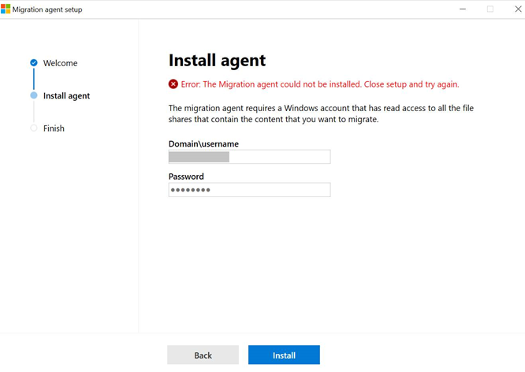
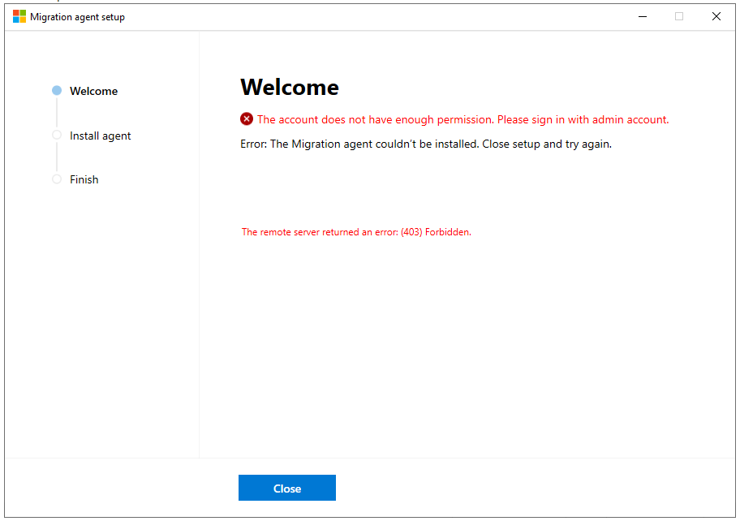
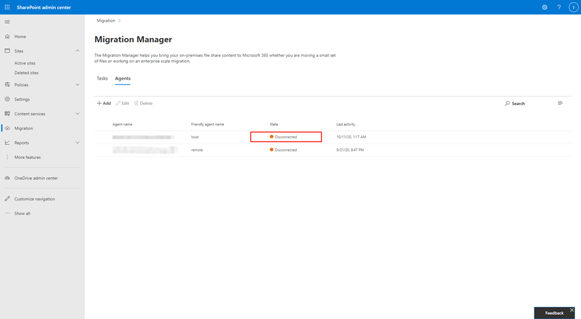
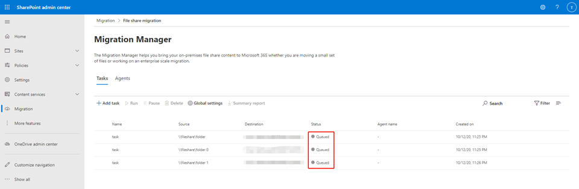
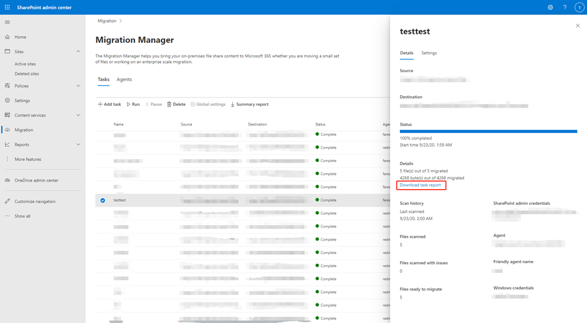
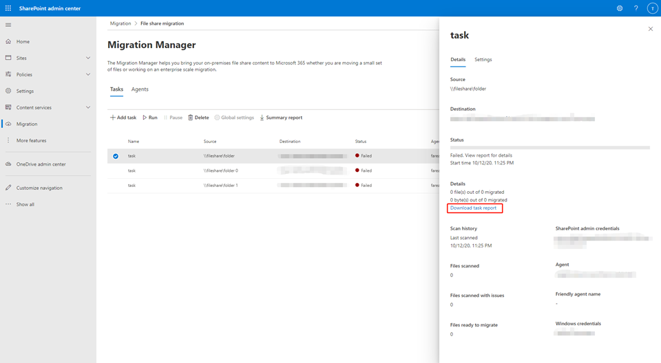

# Troubleshoot Migration Manager issues and errors

This article describes how to resolve issues and errors you may experience when using Migration Manager.

- [Prerequisites and settings](#check-prerequisites-and-settings)
- [Agent error messages](#agent-error-messages)
- [Destination site URL issues](#destination-site-url-issues)
- [Common error messages](#frequently-seen-error-messages)
- [Agent installation failure](#agent-installation-failure)
- [Agent disconnected](#agent-disconnected)
- [Task stuck in "Queued" state](#task-stuck-in-queued-status)
- [Task report cannot be downloaded](#task-report-cannot-be-downloaded)
- [Migration errors](#migration-error)
- [Error codes](#error-codes)

## Check prerequisites and settings

Make sure you have met the prerequisites for agent installation, and have reviewed the required endpoints. Government cloud customers should confirm they have set their configuration correctly.

- [Agent installation prerequisites](./mm-setup-clients.md#prerequisites)

- [Required endpoints](./mm-setup-clients.md#required-endpoints)

- [Government cloud settings](./mm-setup-clients.md#government-cloud)

- [Pre-provision OneDrive accounts ](/onedrive/pre-provision-accounts)  If you are migrating to OneDrive accounts, make sure the accounts are pre-provisioned before you migrate. You can do this using a script, as shown here: [Pre-provision OneDrive for users in your organization](/onedrive/pre-provision-accounts).

## Agent error messages
|Message|Action|
|-----|-----|
|*Migration agent could not be installed. Close setup and try again.*|You may be using an out-of-date version of the agent setup file to install the agent. See [Agent installation failure](#agent-installation-failure) below for more information.|
|*Current user does not have access to source file share*|Make sure the source file share is a network file share. Verify that the Windows account associated with the agent has read permissions to the file share you want to migrate.|
|*The source file share does not exist*|Make sure the source file share is an existing network file share. Confirm that the Windows account associated with the agent has read permissions to the file share you want to migrate.|

##  Destination site URL issues

|**Message**|**Recommended action**|
|:-----|:-----|
|Destination site or web does not exist|Confirm the destination site or subsite exists. If OneDrive account, make sure that it has been pre-provisioned.|
|Failed to check site or web existence.|Confirm the destination site or subsite exists.|

## Frequently seen error messages

|**Message**|**Recommended action**|
|-----|-----|
|*Invalid source folder*|Confirm the path you entered is correct and follows the proper format  Confirm you have read access to the folder.|
|*The site cannot be created or updated*|Make sure that you have permissions to create the site and that the URL is valid  If the site exists, confirm you are the site collection administrator  If it still fails, create the site manually and point the migration tool to this newly created site.|
|*Scan file failure: The folder name is invalid*|See [Invalid file names and file types in OneDrive and SharePoint](https://support.office.com/article/64883a5d-228e-48f5-b3d2-eb39e07630fa)|
|*Scan file failure: Target path is too long*|See [Invalid file names and file types in OneDrive and SharePoint](https://support.office.com/article/64883a5d-228e-48f5-b3d2-eb39e07630fa)      The entire path, including the file name, must contain fewer than 400 characters for OneDrive and SharePoint.|
|*Scan File Failure: Not enough disk space to pack the file*|The disk space available for the migration working folder is too small for the size of your source file.  Enlarge your size of your working folder try again.
|*Packaging failure: Cannot open file*|Packaging failed due to non-existing source.  Check if you can access the source root folder.|
|*A duplicate task has already been created.*|The CSV file used to do bulk migration cannot have duplicate entries.  Remove the duplicate line(s) and try again.|
|*The parent folder was not migrated*|The parent folder was not migrated, therefore all items under the folder will fail to migrate. Check your parent folder and retry your migration.|

## Agent installation failure

 **Issue:** The migration agent fails to install when using an old version of agent setup file to install agent.

**Diagnosis / Investigation**

The problem could be caused by an outdated *clientsetup.exe* file.

**Mitigation**

1. Go to the [Migration Manager page of the new SharePoint admin center](https://admin.microsoft.com/sharepoint?page=migrationCenter&modern), and sign in with an account that has [admin permissions](/sharepoint/sharepoint-admin-role) for your organization.
2. Select **Download agent setup file**.
3. Run the *clientsetup.exe* file on the computer or VM where you want to install the agent. Follow the instructions to complete the agent installation.

**Issue:**  The migration agent doesn't install successfully, or the clientsetup.exe cannot be opened.

Example: 

**Diagnosis / Investigation**

If the *clientsetup.exe* cannot be opened:

- Sign in to Windows as Administrator, or provide the Administrator username and password upon opening the application. The Administrator account should already be added to the domain.

If errors occurred during installation process:

- The error message should already include the failure reason, and the appropriate actions to take if possible.
- If errors do not suggest actions to resolve, the problem could be caused by temporary network failure, or other unknown issues.

**Mitigation**

If the clientsetup.exe cannot be opened:

1. Sign in to Windows as Administrator.
2. Reopen the clientsetup.exe application, or provide the Administrator username and password upon opening the application.

If errors occurred during installation process:

- For errors with specific stated actions, take the corresponding action and then reopen the clientsetup.exe.
- For other non-specific errors, make sure your Administrator account has been added to the domain. Close the application window and then retry installation.

## Agent disconnected

**Issue**: The "state" of the agent gets stuck as "Disconnected" and never comes back.

**Diagnosis / Investigation**

- Check the network health on the computer on which the agent is installed.
- If the password of the logged-in Tenant Administrator account has changed, or any other similar, critical changes applied to the Tenant Admin account that would require re-sign in, all of the agents will be disconnected and reinstallation is required on all of them.

**Mitigation**

- If there's a network issue, fix that. The agent should reconnect soon after.
- If there are critical changes to the Tenant Admin account that require you to re-sign in: Reinstall the agent on all the computers.
- If neither of these condition applies, start by reinstalling the agent first.

## Task stuck in "Queued" status

**Issue**
The status of a task stays at "Queued" and never gets scheduled on an agent to run.

**Diagnosis / Investigation**
- Make sure there are agents installed for this tenant. They should be listed in the Agents list.
- Check the state of each agent. They should be set to "Enabled".
- A status of "In use" indicates the agent is already processing another task. The agent won't be able to be assigned more tasks without finishing the current one.
- If an agent is listed as "Disabled", enable them;
- If they appear to be "Disconnected" for a long time, check Agent Disconnected.

**Mitigation**

- If there are available, *enabled agents* in the list, but the tasks haven't been scheduled for a long time: Create another task that is the same. Sometimes it will fix the problem.

## Task Report cannot be downloaded

**Issue**
The Task report cannot be downloaded from the link on the task details panel.

- The Download task report link is disabled.
- The Download task report link displays active, but nothing happens after clicking on it

**Diagnosis / Investigation**

- The link, "Download task report", is disabled until the task is finished. Reports are only available after the status of the task has become "Complete" or "Failed". Tasks that failed due to time-out will also have a disabled task report link.
- If no reports can be downloaded for finished, non-timed-out tasks, most likely there are errors that have occurred during the migration process which interrupted the uploading of the reports to SharePoint. However, they can be found locally as long as they exist.

**Mitigation**

On the computer that completed the task, try to retrieve the reports.

- In folder **%AppData%\Microsoft\SPMigration\Logs\Migration\MigrationTool\[tenant_site]**, sort the subfolders by their modified time. Find the subfolder whose modified time is the closest to the task's start time. If the task reports exist, they will be in the "Report" folder within this subfolder.

Or 

- If the task has failed, navigate to the folder **%AppData%\Microsoft\SPMigration\Logs\ErrorReports**, then sort the subfolders by their modified time. Find the subfolder whose modified time is the closest to the task's start time. The error report will be in this subfolder.

## Migration error

**Issue**
Migration tasks fail due to various reasons and are detailed in the task reports.

**Diagnosis / Investigation**
- The failure reasons should already be written in detail to the reports along with suggested solutions.

- If you can't download the task reports, please refer to [Task Report Cannot Be Downloaded](#task-report-cannot-be-downloaded)

**Mitigation**
Find the specific error here for more information: [Error codes](#error-codes).

If you receive an error similar to this: *SUBMITTING FAILURE Failed to Submit the Job to Server:Unknown failed reason when submitting a job. 0x01610002*

Check the settings on any AntiVirus application installed on the agent machine. Add our two migration applications as exceptions so that the migration traffic won't be interrupted:

- microsoft.sharepoint.migration.clientservice.exe
- microsoft.sharepoint.migration.mthost.exe

 ## Error codes 
|**Error Code**|**Recommended action**|
|:-----|:-----|
|0x0111000F|The parent folder was not migrated.  Check the failure report to determine the file and then try again.|
|0x01110010|Invalid characters in the file name. Check report for files names with <>:"|?*/\,|
|0x0201000D|Check if the list exists or if you can access it in the source site and target site.|
|0x02050008|Unable to access your local storage.  Restart your migration.|
|0x02010023|Your source list template is not supported.  Try another.|
|0x0201000C|Check your credentials and then reenter your username and password.|
|0x02010017|You must be a site collection admin.|
|0x02060009| 1 - The site collection cannot be created because the URL is already in use or an invalid URL.|
|| 2 -  The site collection cannot be created because the URL contains invalid character.|
|| 3 -  The site collection cannot be created or updated.|
|0x02060007| 1 - The site collection cannot be created because the URL is already in use or an invalid URL.|
|| 2 -  The site collection cannot be created because the URL contains invalid character.|
|0x02010018| 1 - Check your credentials and then try again.|
|| 2 -  A problem occurred accessing SharePoint.  Check your credentials and try again.|
|| 3 - A problem occurred accessing SharePoint.  Check your credentials and your network connection and try again.|
|| 4 - A problem occurred accessing SharePoint.  Check your credentials and your site URL for accuracy and try again.|
|| 5 - A problem occurred accessing SharePoint.  Check your credentials and the format of your URL. Retry.|
|| 6 - A problem occurred accessing SharePoint.  Check your credentials and try again.  If the problem continues, please create a support case.|
|| 7 - A problem occurred accessing SharePoint.  Check your credentials and try opening your site in a browser.|
|0x0204000A|Cannot create package file. All files and folders in the Migration Manager working folder, *%appdata%\Microsoft\SPMigration\Logs\Migration\MigrationToolStorage*, must be closed. Restart your migration.|
|0x02030001|1 - Check your credentials.  Restart your migration. 
|| 2 - Check your credentials. Restart your migration.
|| 3 - Check your credentials and your network connection. Restart your migration. 
|| 4 - Check your credentials and your site URL. Restart your migration.
|| 5 - Check your credentials and the format of your URL.  Restart your migration.
|| 6 - Check your credentials and restart your migration.  If this continues, please a support case.
|| 7 - Check your credentials and try opening your site in a browser. Restart your migration.|
|0x02010008|Confirm the path and format of the user-mapping file and that you have permission to access it.|
|0x02050001|All files and folders in the Migration Manager working folder, *%appdata%\Microsoft\SPMigration\Logs\Migration\MigrationToolStorage*, must be closed. Restart your migration.|
|0x02010002|Check your network status.  If you can access the source sites from a browser, then create a support case.|
|0x02010010|Make sure the source list and target list have the same template. |
|0x0204000D|All files and folders in the Migration Manager working folder, *%appdata%\Microsoft\SPMigration\Logs\Migration\MigrationToolStorage*, must be closed during migration. Restart your migration.|
|0x02040012|The temporary storage on your local computer is too low.  Migration Manager caches the package on the working folder. Expand your temporary storage and retry.|
|0x02030003|There are too many items with unique permissions. Simplify your permissions list by reducing the number of unique permissions. aRetry your migration.|
|0x02050001|Local storage file is corrupted.  The working folder was touched or modified during the migration.  Retry your migration.|
|0x02080001|The file in the package has been changed or deleted while uploading. All files and folders in the Migration Manager working folder, *%appdata%\Microsoft\SPMigration\Logs\Migration\MigrationToolStorage*, must be closed. Restart your migration.|
|0x02040009|The package can't be created because the directory cannot be found.  All files and folders in the Migration Manager working folder, *%appdata%\Microsoft\SPMigration\Logs\Migration\MigrationToolStorage*, must be closed. Restart your migration.|
|0x02010020|Disable migrating version history in Migration Manager settings or enable versioning in SPO.|
|0x0201000E|Check if the global setting has filtered out special characters in the target path or if the path has unsupported characters.|
|0X0201000F|Invalid site URL. Check if the site URL is valid. Try to access the URL via a browser. If this is a OneDrive account, make sure it has been pre-provisioned before you migrate.|
|0x0207001|You do not have access to the task folder. Check if you can access *%appdata%\Microsoft\SPMigration\Logs\Migration\MigrationToolStorage*.|
|0x01410010|A failure occurred because of missing dependencies on list items. Check the FailureSummaryReport.csv for details. Check if the dependencies have been included in your migration scope.|
|0x01510001|Packages failed to upload. If you have customized Azure storage, check if you can access the Azure storage and check if you can access the target site. Try migrating again.
|0x01510001|Failed to Upload the Job to Server: Upload file failed during migration.|
|0x02070009|Several packages failed to upload. Pause the task and check your network connection.|
|0x01710009|A failure occurred due to job end failures; some items failed in the package. Restart migration.|
|0x01710009|Errors or timeout for Server Processing the file: Not all the items in the package have been migrated.|
|0x01610001|The Azure container is expired. Retry migration task.|
|0x01710006|Errors or timeout for server processing the file: Job Fatal Error.|
|0x01710004|Errors or timeout for server processing the file. Fail to look up folder name. The item may exist in other list or site in the same site collection. Or the item is in the recycle bin.|
|0x0131000F|Failed to Read the file. File is checked out.|