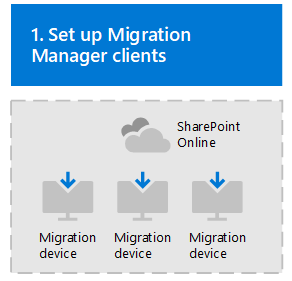
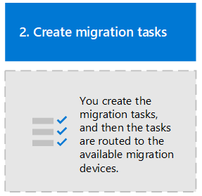
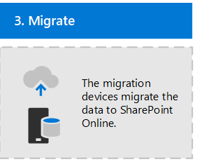
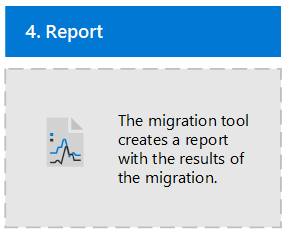

# Get started with the Migration Manager

Migrating content to the cloud is a time and resource intensive process and normally involves scaling up resources to accommodate the large volume of content that you are moving. This comes at a high operational cost of individually managing each server and the migrations tasks that are running on it. Plus you aren't able to automatically load balance your jobs, or view at a glance the progress and status of your migration tasks across all your devices.

Migration Manager answers those challenges by providing you a centralized way of connecting servers, creating tasks, and automatically load balancing your migration tasks.  

Located in the SharePoint Admin Center, the Migration Manager guides you through the setup of your devices and the creation of your tasks.  You can specify global or task specific settings, view all-up task progress, and download summary and detailed reports.

### How does it work? 

It works in four simple steps:
|||
|:-----|:-----|
||**Set up your migration clients**. Connect your computer or VM to the SharePoint tenant where you want to migrate content|
||**Create a task** by entering the URL of the file share that you want to migrate (your source) and URL of the SharePoint site to where you are migrating (your destination).|
||**Migrate**. When you click *Migrate*, Migration Manager does the rest. However many tasks you create, Migration Manager will assign it to the next available client|
||**Monitor and report**.  Monitor the progress and access reports across all the clients in one centralized location|

## How do I get started? 

To get started, make sure you have:
 
- **Access to the destination**: You must be either a global admin or SharePoint Online admin to the Office 365 tenant where you want to migrate your content.

- **Access to the source**: Windows credentials that have read access to any of the network file shares you plan to migrate 

- **Computer or VM** that has the necessary prerequisites installed:  See here for the [List of prerequisites](mo-setup-clients.md)  

### Related links

[How to set up multiple clients in Migration Manager](mo-setup-clients.md) 
[Migration Manager settings](mo-settings.md) 
[How to format your CSV file for bulk upload into the Migration Manager](mo-bulk-upload-format.md) 