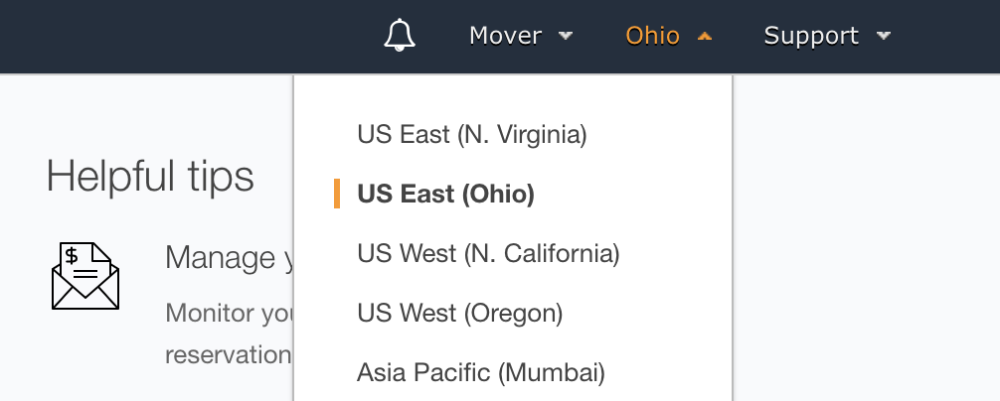
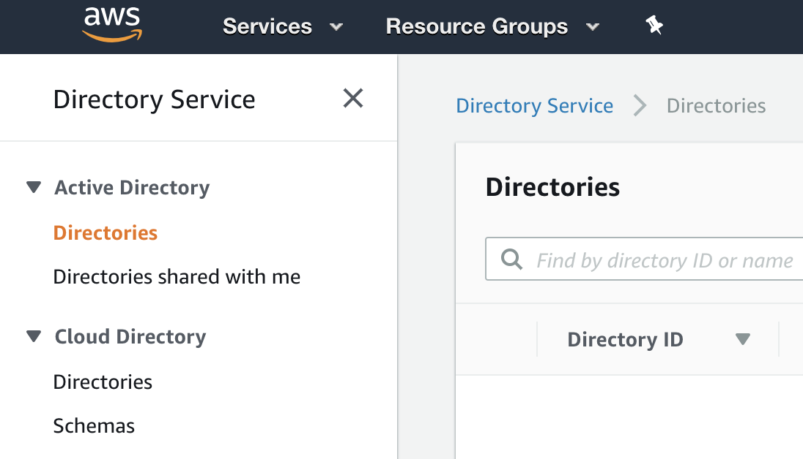
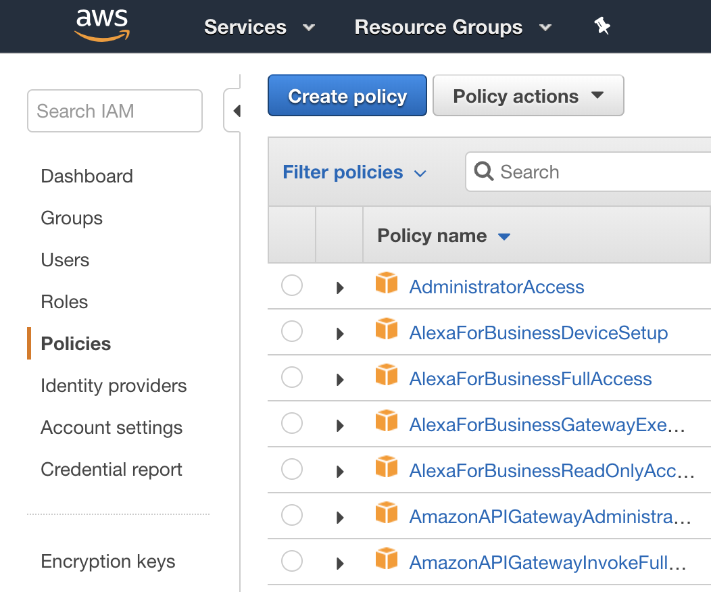
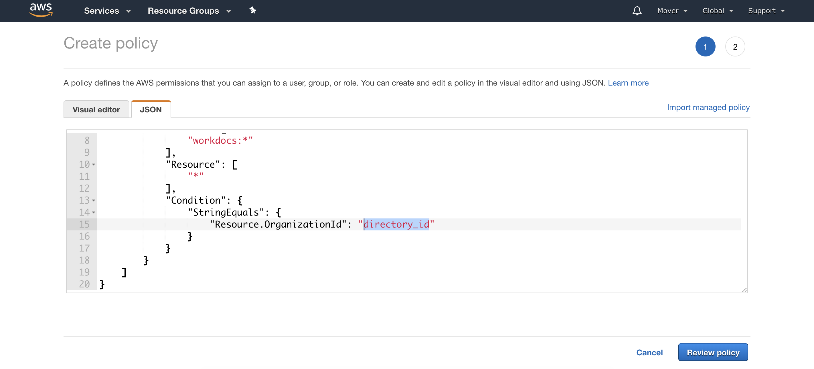
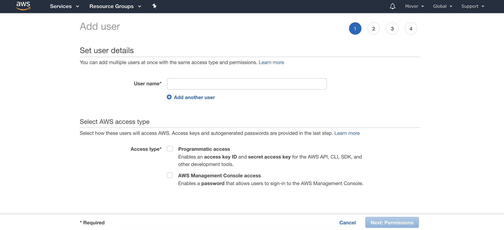
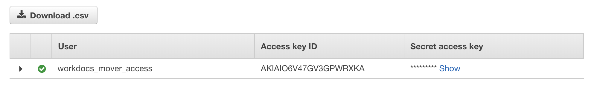
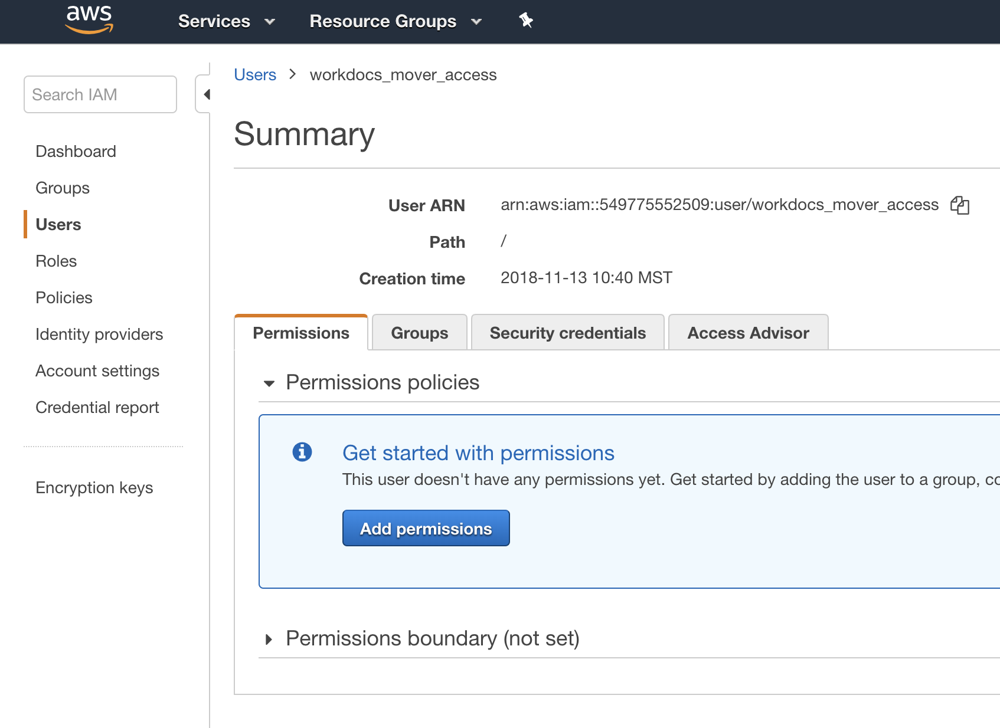
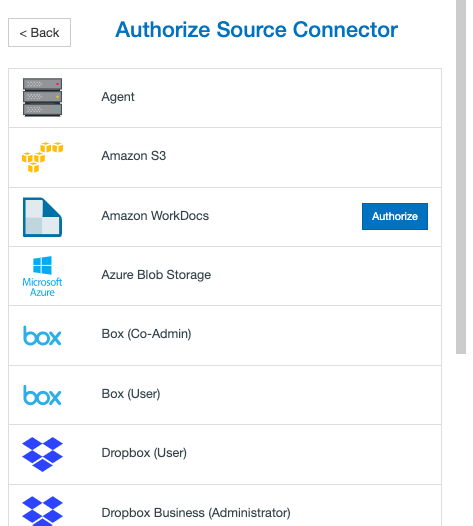
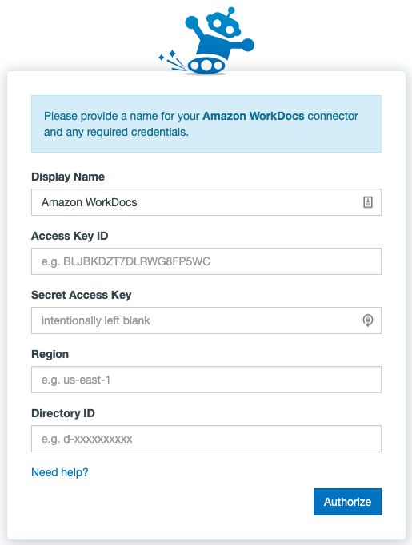
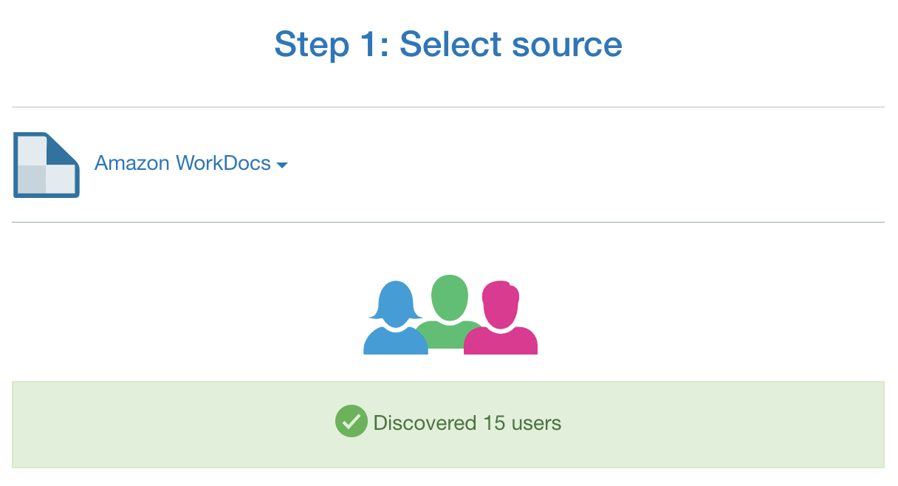

# Authorizing the AmazonWorkDocs Connector

## Amazon WorkDocs FAQ

### User Count
At this time, Amazon WorkDocs can sometimes return an inflated or incorrect user count to us when you load the connector in the Transfer Wizard. This number is purely cosmetic and should not affect your migration setup or migration in any way.

## Authorizing Amazon WorkDocs

To authorize or add an Amazon WorkDocs account as a Connector, follow these steps:

1. Find Your Amazon Region
In the AWS Console go to the WorkDocs service. In the top right-hand corner in between the account’s email address and the “Support” link, click the Region selector and note which region is highlighted.



**Note Your Region**:  Use this table or the [Amazon documentation page](http://docs.aws.amazon.com/AWSEC2/latest/UserGuide/using-regions-availability-zones.html) to get the Region Code for your WorkDocs installation.

|Code|Name|
|:-----|:-----|
|us-east-1|	US East (N. Virginia)|
|us-east-2|	US East (Ohio)|
|us-west-1|	US West (N. California)|
|us-west-2|	US West (Oregon)|
|eu-west-1|	EU (Ireland)|
|eu-central-1|EU (Frankfurt)|
|ap-northeast-1	|Asia Pacific (Tokyo)|
|ap-northeast-2|Asia Pacific (Seoul)|
|ap-southeast-1	|Asia Pacific (Singapore)|
|ap-southeast-2	|Asia Pacific (Sydney)|
|ap-south-1	|Asia Pacific (Mumbai)|
|sa-east-1	|South America (São Paulo)|

2. Find Your Directory ID
WorkDocs is backed by Amazon’s Directory Service. Each WorkDocs installation will have a Directory Service instance. We will need the Directory ID for the WorkDocs installation in order to grant the user access to it.

- Click the Services Menu in the AWS Console and select “Directory Service”.
- Find the Directory Name that corresponds to your WorkDocs installation. If you created the WorkDocs installation with the default “Simple AD” the name should be something like “corp.workdocssitename.com”.
- Note the Directory ID in the first column or click the item and copy the ID from the details page.

Details page:



3. Set Your IAM Access Policy
The user you will create to give us access to your WorkDocs installation will need to be granted full access. This is accomplished using an IAM Access Policy.

- In the AWS Console select “IAM” from the Services menu
- Click “Policies” in the left-hand column
- Click “Create Policy”



- Click the “Select” button next to “Create Your Own Policy”
- Enter a policy name (e.g. “WorkDocsFullAccess”) and description
- Copy and paste the following into the “Policy Document” section:

```json
{
    "Version": "2012-10-17",
    "Statement": [
        {
            "Sid": "WorkDocsFullAccess",
            "Effect": "Allow",
            "Action": [
                "workdocs:*"
            ],
            "Resource": [
                "*"
            ],
            "Condition": {
                "StringEquals": {
                    "Resource.OrganizationId": "directory_id"
                }
            }
        }
    ]
}
```

- Replace directory_id with the Directory ID noted earlier.
- Click “Validate Policy”
- Click “Create Policy”



4. Create an IAM User
We need to create a user that will have access to WorkDocs in order to complete the migration. This user’s key and secret will be shared with our app.

- In the AWS Console select “IAM” from the Services menu
- Click “Users” in the left hand column
- Click “Create New User”
- Enter a user name. E.g. “workdocs_migration_access”



- Click “Create Users”
- Click “Show User Security Credentials”
- Note the “Access Key ID” and “Secret Access Key”. The “Secret Access Key” will not be shown anywhere in the AWS Console again, but a new key and secret can be generated if needed.



- Click “Close” or “Download Credentials” to save a CSV file with the key and secret of the user created.
- Click on the new user in the list of users
- Click the “Permissions” tab
- Click “Attach Policy”
- Find the Policy created earlier (“WorkDocsFullAccess” if you used the suggested name)
- Click “Attach Policy”



The user should now have full access to WorkDocs.

5. Authorize With Us in App

- In the Transfer Wizard click **Authorize New Connector**.
- 


- Find Amazon WorkDocs in the Connector list.
- Click **Authorize**.



- A new window (tab) will open. Name your Connector (Optional).
- Enter your Access Key ID and Secret Access Key.
- Enter your Region and Directory ID.



- Click **Authorize**.

## Authorizing Office 365

>[!Important]
>To fully authorize the Office 365 Connector, a Global Admin is required to grant permissions to the Office 365 Mover app within the Azure Portal.

The Global Admin must grant these permissions AFTER the Office 365 Connector is authorized within the main Mover app.

The instructions below show you how to complete the authorization steps in the right order.

Some steps in the authorization process can be completed by a Global Admin or an SPO Admin. At the beginning of each step, we indicate who can complete it.

1. **Global Admin or SPO Admin:** Log into the main Mover app via app.mover.io. In the Transfer Wizard, select Authorize New Connector.

>[!Note]
>Whether the Office 365 Connector is your source or destination connector (or both), you’ll need to go through this authorization process.


2. **Global Admin or SPO Admin:** In the Connector list, find Office 365. Click Authorize.


3. **Global Admin or SPO Admin:** A window with an Authorize button pops up. It asks you to give your Office 365 Connector a Display Name (optional).  Click the Authorize button.


4. **Global Admin or SPO Admin:** Follow the on-screen instructions. You will be redirected to a Microsoft login screen where you will log in with your Microsoft admin privileges and continue to authorize the connector.

5. **Global Admin or SPO Admin:** After authorizing the connector, you will be redirected to the Mover Transfer Wizard and see an error like the one below. This means it is now time for a Global Admin in your tenant to grant permissions to the Office 365 Mover app in the Azure Portal.

-  **If you're an SPO Admin:** Point your Global Admin to aka.ms/office365moverauth to grant permissions and finish the authorization process (steps 6 – 9).
-  **If you're a Global Admin:** Continue with steps 6 – 9.


6. Global Admin: Log into the Azure Portal via aka.ms/office365moverauth. You’ll see a list of Enterprise Applications.


7. Global Admin: Find and select the Office 365 Mover app. A page will open that provides an overview of the app.


8. **Global Admin:** In the left menu, find and open Permissions. From there, select “Grant admin consent for Mover.”


9. **Global Admin:** This opens a pop-up window that guides you through the rest of the permissions process. It will close automatically when finished. Once this is done, your Office 365 Connector is fully authorized and ready to go.

## Troubleshooting an Office 365 Connector

### Application Access Error
If you encounter an error on authorization, try signing out of any Microsoft accounts and attempt to authorize the Connector in an Incognito Window.

### Global Admin Account Provisioning

Your Global Admin user must have an Office 365 account provisioned in order to administer other Office 365 accounts. If you create a service account for our app, please ensure you also assigned an Office 365 license and walked through the Office 365 setup process.

### User Provisioning
Are your Office 365 users provisioned? All Office 365 users need to have logged in to their Office 365 and opened up Office 365 in order for us to be able to transfer into their accounts. You can also provision Office 365 accounts via Windows PowerShell using the following commands (replace your URL and email appropriately):

`Connect-SPOService -Url https://example-admin.sharepoint.com -credential user@example.com`

`Request-SPOPersonalSite -UserEmails “neverloggedintest@example.onmicrosoft.com”`

### Office 365 Permission Requirements

The app requires a **Global Administrator** for authorization. Here is a detailed list of the scopes we require:

|Permission|Details|
|:-----|:-----|
|Create, edit, and delete items and lists in all your site collections|	Allow the application to create or delete document libraries and lists in all site collections on your behalf.|
|View your basic profile|Allows the app to see your basic profile (name, picture, user name)|
|Maintain access to data you have given it access to|Allows the app to see and update the data you gave it access to, even when you are not currently using the app. This does not give the app any additional permissions.|


## Connecting Your Source Amazon WorkDocs Account

If you are not already connected after you have authorized your source, click Amazon WorkDocs and load the connector. An icon will appear and show you how many users you are migrating.



## Connecting Your Destination Office 365 Account

If you are not already connected after you have authorized your destination, click Office 365 and load the connector. An icon will appear and show you how many users you are migrating.


## Creating a New Migration

Click **Continue Migration Setup** and the app will move to the Migration Manager.

How to create a new migration
The next step is to create a user list of who is transferring.

From your newly created migration in the Migration Manager there are two ways to add users:

Click the Add Users button.
How Add Users Button
Or, click Migration Actions, then Add to Migration.
How Add Users Dropdown
You will now be able to select one of two options:

Auto Discover Users.
Click Automatically Discover and Add Users and the app will automatically find your users and attempt to match them up.

Upload Migration CSV File.
Either drag a file into the designated space or click Choose a file to upload and add a customized CSV file for your Migration.
Note: CSV creation is covered in depth below.

How to add users to migration
Note: You will still get to finalize your migration before any data moves!

## Creating a New Migration from a CSV (Optional)

Sometimes you have thousands of users and a complicated directory schema that you wish to import. In these cases, it's desirable to plan out your migration in a spreadsheet.

In these cases, we hope the CSV upload option is useful. This allows you to lay out all your users and directories and then give it to us in a .csv format for us to create your migration.

Users to migrate
Please note your CSV file must follow this format:

A heading for the source and destination, followed by the paths, and optionally tags on each line.

Source Path,Destination Path,Tags
user1@example.com,user__1@corp.example.com,"Pilot, IT"
user2@example.com,user__2@corp.example.com,"Pilot, Sales"
user3@example.com/src dir,user3@example.com/migrated,"Pilot, IT"
Source Shared Drive,user4@example.com/Team Folder,"Pilot, Sales"
https://TENANT02.sharepoint.com/sites/SiteName/Shared%20Documents,user5@example.com,"Marketing, Sales"

Note: Ensure your CSV has no spaces after each comma separated value. Values that require commas must be wrapped in quotation marks.

Download an example CSV here:

Note: When URL mapping to SharePoint Online you must remove everything after /Shared%20Documents or else the URL will fail.

For example, this full URL won't work:
https://TENANT01.sharepoint.com/sites/SiteName/Shared%20Documents/Forms/AllItems.aspx

It should be changed to:
https://TENANT01.sharepoint.com/sites/SiteName/Shared%20Documents

Example_CSV_Map.csv
Creating your CSV in Excel
If you are using an Excel spreadsheet to create your CSV:

Ensure you have two columns, one titled Source Path, and one Destination Path.
List the relative paths, domains, and usernames on the subsequent rows.
Export your spreadsheet as a CSV
Click File
Click Save As
Select CSV from the File Format options

## Reviewing Your Users

Checking Paths
Confirm that the users in the Amazon WorkDocs source match the users in the Office 365 destination. Usually the emails/usernames will match up, but it depends how you structure and name your users. Be diligent during this step!

Editing
Be aware that Users can only be edited if they haven't been scanned or had a transfer run.

To edit a user source entry:

Select a user row by clicking the respective checkbox on the left side of a row.
Find User Actions  on the right and directly above the user rows or right click on the user row you wish to edit the source path of.
A new side panel will open allowing you to edit the Amazon WorkDocs source path.
Double-click to select your parent source path and click Save to complete your edit.
Edit user prompt
To edit a user destination entry:

Select a user row by clicking the respective checkbox on the left side of a row.
Find User Actions  on the right and directly above the user rows or right click on the user row you wish to edit the destination path of.
A new side panel will open allowing you to edit the Office 365 destination path.
Double-click to select your parent destination path and click Save to complete your edit.
Edit user prompt
You can also choose to edit your user entries via CSV, though this is a fairly in-depth process. If you are simply looking to make a handful of edits to your paths we recommend using the above method.

To edit or update your current existing user pairings:

Click on Migration Actions  near the top right of the Migration Manager.
Click on Update Migration.
You will then be able to upload your .csv file. Tips for creating the CSV:
The CSV needs to follow this format:
ID, Source Path, Destination Path
id12345, /first.last@example.com, /f.last@example.com
The ID column is required to specify the existing row in the Migration Manager, whereas the source and destination path are optional - as in, you don't need to enter both if you only wish to edit the destination path, for example - and leaving both of those columns blank mean no changes will be made.
To get the ID for each row:
Find and click on Migration Actions 
Select Customize Columns and click on ID
You'll now be able to see the ID appearing in each row. Please note that if you refresh the page, this information will disappear unless you select Save Column State .
Download an example CSV here: Example_Path_Edit.csv
Adding column id

Once you've created your CSV file using the above instructions and format, you can drag and drop the file into our app or click on Choose a file to upload. Changes to your user pairings will be implemented immediately.
Update migration prompt

Adding
If you missed users in your original CSV upload, or simply wish to add new user entries to the current migration, you can add them via CSV. All entries added in this manner will be appended to the current migration, meaning this won't modify existing rows and it is possible to create duplicate entries alongside the ones that already exist.

To add new users:

Click on the gear icon near the top right of the Migration Manager.
Click on Add to Migration.
You will then be able to upload your .csv file. Tips for creating the CSV:
The CSV needs to follow this format:
Source Path, Destination Path
/first.last@example.com, /flast@example.com
The CSV will be created the same way you would if you initially created the migration with a CSV.
Once you've created your CSV file using the above instructions and format, you can drag and drop the file into our app or click on Choose a file to upload. Changes to your user pairings will be implemented immediately.
Add to migration prompt

Duplicating
At any time you may duplicate a user in the Migration Manager list. To duplicate a user entry:

Select a user row by clicking the respective checkbox on the left side of a row. You may select more than one entry at a time.
Find User Actions  on the right and directly above the user rows or right click on the user row you wish to duplicate.
Click Duplicate # User in the context menu.
You will be prompted to click OK and a new user entry will appear. From there you can change the directory, schedule, or even the entire user.
Duplicate user prompt

Scheduling
You may set an hourly, daily, weekly, or monthly schedule for each user, even after they have been run.

To create or edit a schedule:

Select the user pairing(s) you would like to schedule.
Click the User Actions  dropdown menu.
Select Schedule # Users.
Configure your Hourly, Daily, Weekly, or Monthly setup, including the timing and day of the week (where applicable).
Click Apply Schedules to X Users.
Deleting
Be aware that users can only be deleted if they haven't been scanned or had a transfer run.

To delete a user entry:

Select a user row by clicking the respective checkbox on the left side of a row. You may select more than one entry at a time.
Find User Actions  on the right and directly above the user rows or right click on the user row you wish to delete.
Click Delete User in the context menu.
Note: This is permanent and cannot be undone unless you create a new entry.

Delete user prompt

## Reviewing Your Permission Map

The permission map is a very important part of your migration.

When a user is migrated we will transfer files and folders and share any required data. We already know who is copying data, but we also need to know who might have content shared with them, even if they don't copy data.

In order to stay organized, we'll provide a secondary list of your users called a permission map. This list includes everyone who could possibly receive sharing permissions to any files or folders that might be migrated. This even includes users who are not migrating data.

Another important thing to consider is that usernames and emails aren't always consistent across platforms, and the permission map helps us line everyone up.

Example: jane@example.com is actually j.smith@example.com
We will automatically detect users and handle perfect matches. Any inconsistencies need to be manually reconciled. The permission map can be continually updated, because with each incremental pass of the migration, permissions will be reapplied.

To view your permission map, click Migration Actions, located in the top right of the Migration Manager, then select Edit Permission Map from the dropdown menu.
Edit Permission Map button

You may either auto-discover or upload a permission map file. We automatically pair perfect matches. If a user or group in Amazon WorkDocs does not have a perfect match in Office 365 you may correct it in our interface.

Click Auto-discover Users.
Permission map auto-discover prompt

You may view and edit your permission map at any time.
Permission map overview

Note: A blank destination entry will automatically cancel any permissions sharing for that user or group.

Note: Adding a new line for a specific users - ie. user01@gmail.com to user01@hotmail.com - that perfectly matches auto-discovered permissions by the domain - ie. @gmail.com to @hotmail.com - will be automatically removed; as the application marks these as redundant entries.

## Uploading a Permission Map (Optional)

You may upload a permission map in CSV format. This will overwrite any existing permission map, so please be careful. In an ideal world, all users will be matched. If there are a few unmatched users, you may manually add names to the Destination field from the web interface.

Permission map overview

Please ensure that your permission map follows this strict format:

A heading for the source and destination, followed by domain names, groups, usernames, or emails.

Source User, Destination User
example.com, example.com
corp.example.com, example.com
user@example.com, differentuser@example.com
group, group

Permission maps should have two specific entries:

Any domain names that will be wildcard matched. Eg. example.com, example.com or contoso.com, corp.contoso.com. This will instruct our app to match any users with those domain names in their source email to their new destination email domain.
Imperfect matches. Users that are differently named between the source and destination domains need to be explicitly listed. Eg. firstname@contoso.com, firstname_lastname@contoso.com
Groups can also be included for most connectors. These are explicitly required and are not matched with a domain wildcard. Eg. Sales Team, Global Sales Team .
Please note that we will strip all leading and trailing spaces from each path value, unless it is wrapped in quotation marks.
Download an example CSV here: example_permission_map.csv

## Creating your CSV in Excel
If you are using an Excel spreadsheet to create your CSV, ensure you have two columns, one titled Source User, and one Destination User, and check the spelling on the domains, usernames, and groups listed.

For example:
Source User, Destination User
example.com, example.com
eric@example.com, ewarnke@example.com
joshua@example.com, jbadach@example.com
Sales Team,Global Sales Team

Excel CSV overview

Exporting a Permission Map
You may export a permission map in CSV format.

Click File
Click Save As
Select CSV from the File Format options
Saving as a CSV in Excel

## Migration Manager Overview

The Migration Manager is the key part of the application itself and the main screen you will be interacting with during the data migration process:

Migration Manager Mover
Migration Manager Dashboard
One of the important points of the Migration Manager is the dashboard, which gives you a summary of your overall migration; this is covered in depth here.

Main Menu Bar
This is the application's main navigation bar.

It will allow you to switch between the Migration Manager, Transfer Wizard, and your Account details; as-well-as contact support if you run into any issues during your migration.

Migration Manager Top Menu Mover
Migration Selection
The Migration Selection bar allows you to navigate between separate multi-user migrations as-well-as individual Normal Transfers.

From here you are also able to edit and personalize the names of each multi-user migration.

Migration Manager Editing Mover
Migration Actions
The Migration Actions menu allows you to access things such as: the permission map and the migration reports, to the columns displayed and the overall layout of your migration to better suite your personal needs.

Migration Manager Actions Mover
Filters
The Active Filters Bar allows you to search your migration for specific key terms or custom tags you have applied.

Filter gif
You can also view more in-depth instructions by clicking the info button directly to the right of the Active Filters search bar or by viewing the Active Filter List.

Filter gif
User Display
This is the central focus of the Migration Manager and displays all the users in the current migration.

This section of the application provides you with a column-by-column breakdown of each individual user in a migration. Here you are also able to duplicate and edit source/destination paths of a user; as-well-as view the logs of any scanned or completed transfers.

Migration Manager Users Mover
User Actions & Finalization
This area of the screen contains the User Actions dropdown menu, the Scan User and Start Migrating Users buttons.

Migration Manager Finalization Mover
User Actions  opens a new dropdown menu that allows you to interact with a selected transfer.

Migration Manager User Actions Mover
Scan # Users will perform a scan of the selected users; this will help identify any problematic files, folders or connectors.

Start # Migrating Users will open a side-tab that will allow you to finalize and begin the migration.

Migration Manager User Actions Mover
