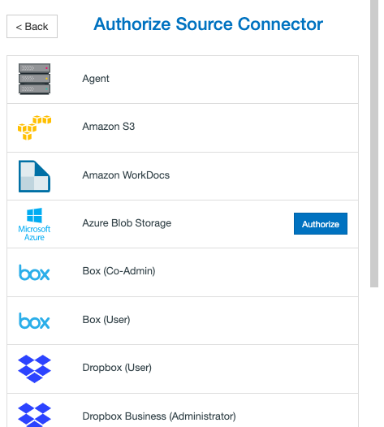
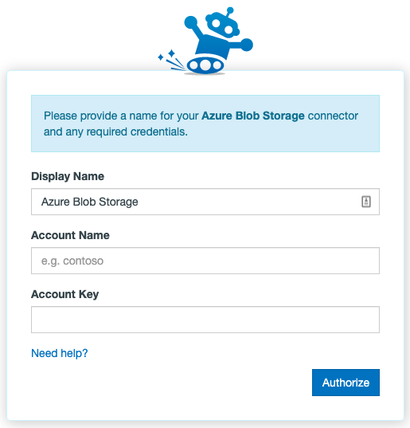

# Setting up Azure Blob Storage migration to Office 365

## Authorizing Azure Blob Storage

Authorizing Azure Blob Storage is straightforward. To authorize or add an Azure Blob Storage account as a Connector, follow these simple steps:

1. In the Transfer Wizard click **Authorize New Connector**.

2. Find Azure Blob Storage in the Connector list.
3. Click **Authorize.**

4. A new window (tab) will open. Name your Connector (Optional).
5. Enter your Account Name.
6. Enter your Account Key.
7. Click Authorize again, and voila!

