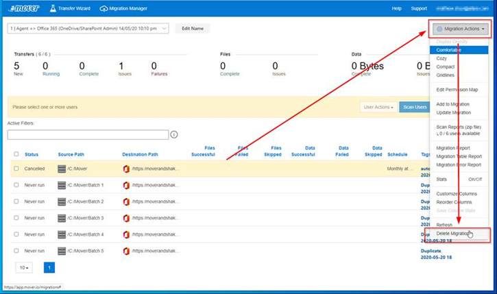

# Deleting a Mover migration

To delete a migration created using Mover, do the following:

1. Click **Migration actions**.
2. From the dropdown menu, select **Delete migration**.
3. Type **DELETE** in the pop-up window.
4. Click **OK**.

>[!Caution]
> Deleting the migration will delete ALL logging information.  It will NOT delete any data in the source or destination paths.  Avoid deleting a migration during an ongoing troubleshooting process as it is unrecoverable.