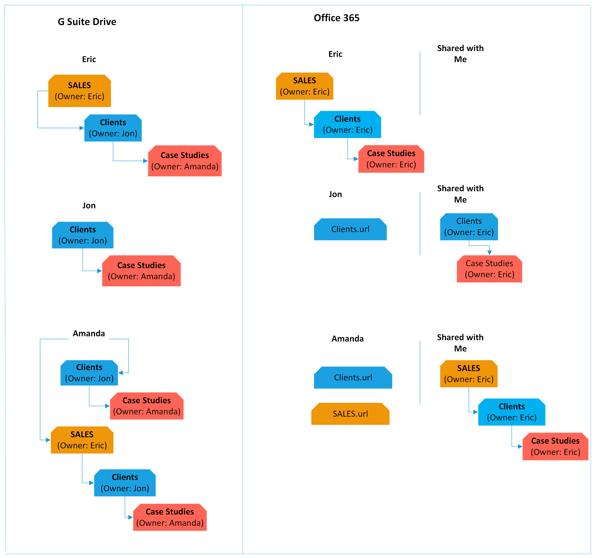

# Authorizing the G Suite Connector

## G Suite FAQ

### How is G Suite Drive different?

In Drive, content may exist in multiple locations based on how each user prefers to organize their files. This sharing paradigm in G Suite Drive differs from most other providers.

When a folder is shared to another user, it appears in their **Shared with Me** section. From there, it can be added to the user's **My Drive**, and then placed in any folder of their choosing, including other shared folders.

### G Suite Shared Drives

For easy access, our app displays **Shared Drives** (previously **Team Drives**) in the root of your connector (among the users).

If you're editing the source or destination paths in our app, simply select the back button to find the root listing of users and Shared Drives, and select the source/destination that you would like.

If you're creating a user mapping via CSV, you would map your Accounting Shared Drive as /Accounting, which is different than your Accounting user /accounting@company.com.

### G Suite Shared Drives permissions

Our app is not able to read or write permissions to Google Shared Drives. Shared Drives do not allow explicit folder level permissions. Rather, Shared Drive permissions are set based on the Shared Drive members.

### What's the difference between file versions and revision history?

Revision history for Google Docs, Sheets, and Slides is different than file versions in Google Drive. Revision history refers to the ability to see earlier versions of a file, and view who made specific edits to the document. During the migration, revision history is not transfered. Only the most recent version of a file is transfered.

### What isn't transfered

### What happens to Google Drawings, Forms, Sites, and Maps?

Google does not allow us to export Drawings, Forms, Sites, and Maps from Drive. These are not transfered.

### What about Docs, Slides, and Sheets?

Google's proprietary formats are not compatible with anything other than G Suite Drive. When migrating from G Suite, our app converts to the Microsoft Office format from Google's format.

Any Google format that is larger than 10 MB when it is converted fails. This is a limitation Google has placed on their infrastructure. For more info, see https://developers.google.com/drive/api/v3/reference/files/export.

>[!Note]
>The only way to migrate/download a Google format file is to request that they [Google] convert it. Mover does not control the conversion process, and the forced limitations are strictly on Google's end.

### Files marked as restricted

G Suite Drive enables owners to disable the ability for users to copy, download, or print a file on a per-file basis. This feature must be disabled on each file for which it has been enabled, in order for a migration to function properly, or you receive an error stating:

`Permissions issue: File marked as restricted or not copyable`

To disable this feature, see the **Sharing** settings for a file, and select **Advanced**. Check the checkbox for the owner of the file to **Disable options to download, print, and copy for commenters and viewers.**

## Multi-parenting behaviour in G Suite Drive

Permissions and ownership of data in a G Suite Drive source can be complicated. To retain a similar directory structure and sharing scheme in the destination, our app must make some decisions on who owns what and where that data is best located.

*G Suite Drive allows files and folders to exist in different places for different users.*

When a folder is shared out to another user, it appears in their **/Shared with me** section. From there, it can be added to the user's /My Drive and then placed in any folder of their choosing, including their own folders, or other shared folders.

Microsoft 365 does not support this same nesting of shared data, which is why we've developed a solution.

### Examples

See the following two examples for how users might create conflicting folder structures.

**Example 1**:
1. Mark shares a folder with Eric.
2. Eric views **Shared with me**, and selects **Add to My Drive** on this new shared folder.
3. In **My Drive**, Eric drags this new folder to a different folder.
4. There are now two conflicting subfolders that our app must make a decision on.

**Example 2**:
Any file or folder in a user's My Drive may be arbitrarily added to a new location. These files or folders will be viewable in multiple places. The *correct* location is now unclear.

### The solution

In order to ensure your users still have access to all their important files, our app automatically makes an intelligent decision on which folder becomes the source of truth when multiple users have conflicting views.

We automatically resolve conflicts between ownership. This will happen on either a scan or a transfer, whichever you perform first. We recommend you always scan first. Once run, this may not be undone.

Users may be scanned in any order. To prioritize conflict resolution please scan users in preferred priority order. Typically customers scan their department heads so they are assigned any ownership conflicts. After that, scanning the rest of your users in any order in statistically just fine.

The google assignment process is fairly complicated; however, there are some basic rules:

1. When a folder in the root of a user's /My Drive conflicts with a folder in another user's /My Drive/subfolder, the subfolder always will win. Root folders never take priority over a subfolder during a conflict.
2. If we determine _User A/My Drive/subfolder_ as a permanent location for _User A_, our app transfers ownership of the entire subfolder and all of its contents to _User A_ and shares it again with any collaborators.
3. A folder can be "orphaned" by not existing in a My Drive.It can also be orphaned if it exists in a My Drive at the root, but is not owned by that user, and it doesn't exist in anyone else's My Drive including the Owner.

Here is a visual guide to the google assignment process:

### Security concerns

Because of the nature of G Suite Drive's sharing model, it can open up some security concerns when migrating to Microsoft 365. The problem stems from the idea of negatively setting permissions, for example, sharing a parent folder, then removing permissions from some subfolders. All Microsoft 365 destination subfolders inherit their parent permissions, which could have unintended consequences when performing a migration.

In the previous scenario, our app would reapply collaborator permissions to the /Human Resources folder, and all subfolders inside it would inherit those permissions.

## Authorizing G Suite Drive (Administrator)

To authorize or add a **G Suite Drive** account as a **Connector**, follow these simple steps:

>[!Important]
>You must be a G Suite Administrator.

1. From your **Google Apps** dashboard, select our app's grid logo, and then select **Admin**.
2. Select **Apps**, and then select **Marketplace Apps**.
3. Near the top right, to add a new app, select **+**, and search for **Mover**.
>[!Important]
>When our app opens in a new tab/window, to verify that you are viewing the Marketplace using your admin Google account, at the top right, select the **account** icon.
4. Select **Domain Install**, and then select **Continue**.
5. Select the checkbox stating you agree to the **Terms of Use**, and then select **Accept**.
6. Select **Next**. To close the overlay window, select **Done**.
You should see our app installed amongst any other third-party apps you have. If it does not appear, simply refresh the page.

We now have access to your users and their data, so we can move on to **Connector** authorization.

7. After install, select **our app**, and ensure that you grant Data Access. This is an extra security step required by G Suite.

8. In the **Transfer Wizard**, select **Authorize New Connector**.

9. In the **Connector** list, find **G Suite (Administrator)**.
10. Select **Authorize**.
11. A new window (tab) opens. Name your Connector <optional>.

12. Select **Authorize** again.
13. If you are not logged in, to sign in, use your Google credentials.

14. To grant our app access to your G Suite (Administrator) Account, select **Allow**.

## Troubleshooting a G Suite (Administrator) connector

### App permissions

For us to be able to view and transfer data to and from G Suite Drive, you must have our app installed as per the instructions in **Connector Creation**. In some cases, you may have our app installed, but disabled. If you are having problems connecting, you should ensure our marketplace app is enabled for all users. To access your third-party app settings in **Google Apps**, follow the same steps.

### Google Drive permission requirements

Our app requires a Global Admin for authorization. The following table provides a detailed list of the scopes we require.

|**Permission**|**(Details) Allows our app to...**|
|:-----|:-----|
|See, edit, create, and delete all of your Google Drive files    |Permission to edit, create, overwrite, and organize data in your Google Drive.|
|View usage reports for your G Suite domain    |Grant permission to view reports about how users are using Google Apps within your G Suite domain.|
|View domains related to your customers    |View domain aliases and multi-domains (secondary domains) for your customers.|
|View and manage the provisioning of groups on your domain    |Provision and modify groups on your domain, as well as view and modify details and metadata of groups on your domain.|
|View users on your domain    |View basic details and metadata of users on your domain.|
