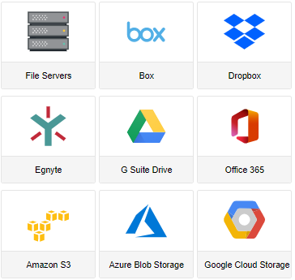

# Managed migration guide for use with Microsoft Mover 

This guide was created to share the process and best practices currently used by Microsoft when guiding a customer through a “managed migration”. A managed migration is a hands-on, high-touch service offered to customers who are wanting more guidance as they migrate from another cloud storage solution into Microsoft 365. The Mover application is used for this cloud to cloud migration.

Most migrations fall into regular phases as follows. Proven success factors for migration include planning, assessing and remediating, preparing your target environment, migrating, and onboarding your users.

> [!NOTE]
> The Mover Migration tool is a Microsoft owned migration tool available at no cost to subscribers of Microsoft 365.

   

|**Migration planning**|**Assess and remediate**|**Prepare your OneDrive and SharePoint environment**|**Migrate**|**User onboarding**|
|:-----|:-----|:-----|:-----|:-----|
|What content goes where  Understanding permissions vs sharing  What to expect before and after  Migration and network performance considerations  Change management and communications|Assess key areas  Remediate issues|Pre-provision Microsoft 365 and users|Review migration offerings  Microsoft FastTrack services  Migration service providers|Send regular emails to users  Provide training  Let users know how they are impacted|

>[!Tip]
>Before starting a managed migration, we highly recommend reading and reviewing the current Mover documentation. This content provides valuable knowledge on how to understand the Mover tool for running migrations from various cloud storage platforms.
> See [Mover migration content](https://docs.microsoft.com/en-us/sharepointmigration/mover-plan-migration)

## Planning
## Assessment
## Remediation
## Migrate
## Best Practices

Best practices that will be discussed in this document include:

- Inventory scan:  Carrying out an initial inventory scan of source content.
- Data distribution:  Encouraging separation of large file/data owners for balanced Data Distribution.
- Customized destination folders:  Creation of specific destination upload folders for housing all migrated data.
- User and Permissions mappings:  Creating accurate User and Permission Mappings.
- Who Identifying who you need to migrate (users who owned data vs those that do not)
- Managing Customer Expectations for the Migration.
- Migration Transfer concurrency.
- How to troubleshoot the Migration.
- Customer Reporting via Scan Reports, Migration Reports and Migration Error Reports.

## Customer engagement

It is a considerable undertaking for customers to migrate their users, data, and files from their current cloud storage provider into Microsoft 365. Regardless of the company's size, customers look for experts to assist them in their migration project.

This guide helps you deliver the migration on their behalf with minimal effort and direct involvement on their part. 

## Initial engagement
The initial engagement is a fact-finding exchange between Partners and the customer. Both parties will be seeking to obtain as much information as possible from each other.

 Our role is to gain clarity on their project and provide guidance and confidence in our ability to deliver on customer needs. 

After your initial contact with your customer about migration, the next step is to arrange an “initial engagement” meeting to establish what the customer wants to achieve and the best practices to make that happen.

One of the first points to cover is whether the Mover tool can do the migration.  At present, our application  can migrate content from the  following cloud storage providers:

## Determine Project scope

Migrations come in all shapes and sizes. On our initial engagement with a customer, we focus on discovering the fundamental elements of their project. 

### Number of users to migrate
Customers might have a relative idea of how many users are in their source domain and how many they plan to migrate. 
 
These are good initial stats to garner, but we still perform an inventory scan to obtain a more accurate count of a customer's user base. 
The scan results tell us how many users are in the domain and determine who owns the data, among other factors.

### Data ownership
Much of a customer's userbase is shared data.  Mover only copies owned folders and the root files for each user.
 
If a user is not the owner of the data, we do not copy it.  Content can be automatically re-shared after it is migrated so that each user can access their content the same as before.
 
The Inventory Scan also helps determine who owns what. 

### Data distribution

Determining how a customer's data is distributed is also important. Usually, in the initial discussion, customers might not clearly see how their data is distributed.  The Inventory Scan will aid in obtaining that information.
 
As a rule, if a user that either owns more than 400,000 files/items or their storage size exceeds 5 TB, we recommend that those users be split into smaller service accounts. The data split between those and mapped accordingly between Source and Destination.  
 
Limiting the size of the users' accounts impacts processing and speed during migration.   

### Amount of files/data to migrate
Amount of files/data to Migrate
 
The number of files and data to migrate is closely associated with how the data is distributed. Customers may have an idea of many files or how much data they have in their source. However, sometimes reports provided by cloud storage providers on the exact numbers can be misleading. Content in the trash or externally shared data may be included in the count and give an inaccurate assessment. 
 
To obtain accurate totals for the number files and size of data owned, performing an  Inventory Scan is essential.
 
It is important to understand that Mover only copies files/folders/data owned by users within the Source tenant. 
The Mover tool does NOT migrate external shared data, email or items residing in the trash.
 
Migrations vary in size and adjustments need to be made accordingly.  Suppose a migration is over 100TB in size. We have processes to ensure that the migration will receive the best possible performance when migrating into Microsoft 365. 
 
### Migration Speeds
 
The most common question from customers is, "How long will the migration take?" It is hard to provide an accurate answer as to the time required to complete.
 
While using the Mover tool is one of the fastest ways to migrate data, the migration speed may still be affected by bottlenecks. These include, but aren't limited to:
 
#### The number of files and folders being moved.
The total number of files being moved has the biggest speed limit as it determines the total number of operations required. 
Most cloud storage providers limit their processing rate to one file per second per user. Though this is not entirely accurate, you can provide a useful baseline metric to your customer to estimate how long it might take.

#### File size 
Knowing file size is necessary to estimate transfer speed.  We have found that large file migration is substantially quicker than having to migrate lots of small files.
 
A transfer for a single user that owns 5 TB of data consisting of mostly large files will, on average, migrate faster than a user that owns 1 TB of data but has 1000s of small files.  The reason is that for each file, an API call is made against both the source and the destination. The greater the number of files, the greater number of calls, and will take longer than a handful of large files.

#### Total amount of data being moved

Though total data can affect speed, it is ultimately overshadowed by the number of files.  Many customers you encounter may be driven by how much data we are migrating on a daily basis but it is good to set expectations on how many files we are migrating in a day rather than data.

#### Server connections with the source or destination
Both Source and Destination connectors will have rate limits and we are beholden to how fast they allow us to download, upload and process data between the two.

#### Complexity of permissions or sharing of data
Applying permissions as part of the migration is another factor that can influence speed.  We are again making numerous API calls to apply permissions, which will increase the time it takes to migrate the data.

## Communication engagement
After the initial meeting with a prospective customer, it is essential to maintain a rhythm of business for moving forward. Customers will have many questions regarding various aspects of the migration process and providing them with clear and open communication channels is a must.

We recommend setting up a weekly meeting to discuss topics and to make forward progress on the migration. Tailor the types of communication that the customers may want to provide for their userbase to make them aware of the migration, timelines, and dos and don'ts during the process.
 
Establishing email threads and Microsoft Teams channels for the duration of the migration is also encouraged.
 
### Customer migration team

Who is the customer's migration team?  It is essential to establish the points of contact with the customer. 
Sometimes it may just be one person, but most large companies have dedicated people for the migration project.  Clearly defining and understanding each of their roles will aid in a smoother migration experience.
 
Provide the customer their primary point of contact is on our end and highlight any other representatives who may be assisting with the migration.
 
### Customer Reporting
When running a managed migration, it is important to note that Partners, MCS, and FastTrack will be running the migration.  The customer will not have direct access to the Mover tools during the migration.
 
By restricting access to Mover, you are ensuring that the migration is run by nominated people, and limits any potential customer interference during the process.

Though the customer might not have access that does not mean that they are not informed of status, potential issues and progress made.

We provide a daily Migration Report to keep them fully informed and the details of this report 