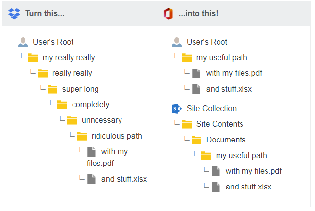

# Microsoft 365 FAQ

## Unsupported files and characters
We automatically process file and folder names to ensure they are accepted by Microsoft 365:

- Files larger than `15 GB` are not migrated.
- Files with a size of `0 bytes` (zero-byte files) are not migrated.
- The following characters in file or folder names are removed:
`" * : < > ? / \ |`

- Leading tildes (`~`) are removed.
- Leading or trailing whitespace is removed.
- Leading or trailing periods (`.`) are removed.
- See [Invalid file names and file types](https://support.office.com/article/invalid-file-names-and-file-types-in-onedrive-onedrive-for-business-and-sharepoint-64883a5d-228e-48f5-b3d2-eb39e07630fa) for all other limitations.

In some possible circumstances with older sites, any file or folder ending in `_files` could fail. If you experience these errors, contact Support.

Microsoft currently has no file type limitations, meaning you can upload data with any file extension. For more info, see [Types of files that cannot be added to a list or library](https://support.microsoft.com/office/types-of-files-that-cannot-be-added-to-a-list-or-library-30be234d-e551-4c2a-8de8-f8546ffbf5b3)

## Character limits for files and folders

-	Filenames can have up to 256 characters.
- Folder names may have up to 250 characters.
- Total path length for folder and filename combinations can have up to 400 characters. For more info, see below.

## What happens to long paths?

During a pre-scan, our app automatically detects and reports paths that are too long for OneDrive or SharePoint to accept. The current path length limit for Microsoft 365 is 400 characters. The path length is calculated when going in to Microsoft 365 and includes your tenant URL, user site, path, and any character encoding.

**Example**:

This path is 93 characters long despite *Documents/Old Docs* being only 18 characters: 

`https://example-my.sharepoint.com /personal /example_user /%2FDocuments%2FOld%20Docs`

If a file exists that has a very long path, our app skips it, and reports it in your log files.

To save time and headaches, before you migrate, you are encouraged to shorten any identified long paths.

## Are timestamps preserved?

The original timestamps from Dropbox are preserved when migrating into Microsoft 365.

>[!Note]
>Timestamps are only applied to files/data transfered, and not folders. Folders and folder structure are created in the destination during migration, and reflect the date of the migration.

## Is file authorship preserved?

When migrating from Dropbox into Microsoft 365, the *modified by* author is preserved. However, the *created by* is changed to the user.

## Does the Mover app interact with the sync client in OneDrive for Business?

We do not interact with the sync client in **OneDrive for Business**. Before a migration, We recommend disabling it. If you use it during a migration, it tries to sync all the migrating data.

## What happens to shared data?

Data shared with a user by another user appears in the **Shared with me** folder. Data owned by a user appears in the user's designated destination folder.

## What about notifications?

To prevent users from being spammed, the Mover app silences notifications during the migration.

## What happens to data shared to Microsoft 365 Groups?

Data shared to a Microsoft 365 Group does not appear in the **Shared with me** section. Microsoft also does not notify users that they are now a member of a Microsoft 365 Group.

>[!Note]
>This is a limitation of Microsoft 365 Groups and cannot be changed on our end. The user must navigate to the appropriate group within either their Outlook Desktop Client, or by logging into their prefered email through **outlook.office.com**.

After the user has logged in:

1. Navigate to the left hand menu.
2. Scroll down the folder listings to **Groups**.
  a. If the available groups are not visible, to open the group directory, select the small arrow beside the **Groups** listing.
3. Select the desired group.
From here, the left-hand menu should change, enabling you to open and edit **Files/Notes** within the selected Microsoft 365 Group.

## What SharePoint site formats are supported?

Both Modern and Classic sites are supported, and appear the same in our app.

## What will my file paths look like in SharePoint?

During the migration setup (described later in this guide), you can edit the path(s) to specify where in SharePoint you would like your data to go. From the root level of SharePoint, you can go into **Site Collections**, and inside each **Site Collection**, directories for **Site Contents** and **Subsites** appear.

**Site Contents** takes you to document libraries (for example, the **Documents** section), whereas **Subsites** takes you to the **Subsites** of that site collection. Navigating **Subsites** takes you through the same dichotomy.

Most cloud storage providers, G Suite Drive for example, start the listing with a user such as `/user@example.com/Marketing Folder`. SharePoint does not do this, so you would be looking at a path such as `/Marketing/Site Contents/Documents`.

## How does library permissions inheritance affect migration?

To set specific permissions on folders in a document library, inheritance must be disabled. Permissions inheritance is typically turned on by default, which makes all the data within the library subject to the permissions set on the library. This is similar behavior to team folders or team drives in other cloud services, whereby if users have access to the root level, they have access to everything contained within.

If inheritance is not disabled at the root, any permissions we try to set on individual folders are overridden by the library access permissions.

**To disable inheritance:**

In the Library settings, visit **Permissions for this document library**:

1. Select **Stop Inheriting Permissions**.
  a. This enables you to select the permissions you would like to remove:
   - Site members
   - Site visitors
2. Select **Remove User Permissions**.

This prevents site members/visitors from inheriting permissions to all the data that we migrate into that library, allowing permissions to only those site members who we explicitly write to the folders themselves.

For more info see [SharePoint permissions inheritance](https://docs.microsoft.com/sharepoint/what-is-permissions-inheritance).

## Does Mover support Microsoft Teams?

Microsoft Teams appears and operates the same as a SharePoint site.

## What is the item limit for SharePoint?

Many sites claim that SharePoint has a 5,000-item limit. This is not true. The SharePoint 5,000-item limit applies to how many items appear in a search list view: a maximum of 5,000.

SharePoint sites do have file size and number limits, which are covered in detail here: [SharePoint limits](https://docs.microsoft.com/office365/servicedescriptions/sharepoint-online-service-description/sharepoint-online-limits).

Some list view options may prevent search list views with more than 5,000 items from appearing.
