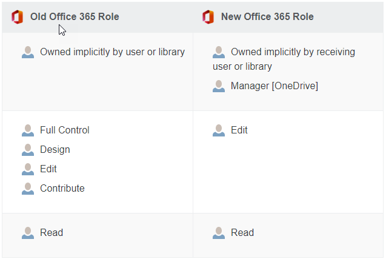

#  Troubleshooting Mover Migration FAQ

## Migration FAQ

### What gets transferred?

Only owned folders and the root files for each user are copied. If a user is not the owner of data they can access, we do not copy it. Content may be automatically re-shared after it is migrated so that each user has access to their content exactly as before.

### Does Mover sync files?

Our app offers a source-to-destination delta—when you run a transfer, we compare the destination directory to the source, and only transfer new or modified files over. We call this our incremental feature.

We compare the timestamps of the files in both the source and destination and transfer the newest versions only. The incremental feature is always on.

Here are a few examples of how we deal with changes to files and folders.

**Content changes**: If a document is edited in your source or you have added a few new files, we copy them to your destination on the next incremental run, overwriting the previously existing file(s) in the destination.

**Name changes**: If the name of a file or folder changes in Office 365, we treat it as a brand new object. This can lead to duplicate files being migrated to Microsoft 365, or worse in that entire folders worth of data would be duplicated from the changed folder downwards.

**Example**: Changing the path `/Sales/Clients` to `/Global Sales/Clients` results in two copies of your `Sales` folder after the `Global Sales` folder is also copied during an incremental pass.

### Does Mover delete files?

We never delete your data from any source. Our app simply takes your data from one place and copies it to another—akin to *copy and paste* rather than *cut and paste.* We also don't retain any of your cloud storage data for any reasons.

We strive to keep your users' experience as similar as possible between your new Microsoft 365 and old Office 365 domains.

### How are permissions affected?

When moving to Microsoft 365 from Office 365, user roles *on folders* change.

During a migration, we do not explicitly set a user as an owner of data.

In Microsoft 365, ownership of files and folders is always implicitly set by virtue of copying data into a user.

### Translating permissions

>[!Note]
>Our app only sets permissions on folders.

### Can I rearrange content during a migration?

Not recommended. Any major changes in directory structure should happen before or after your migration. It is also not a good idea to use our app to rearrange content.

The risks that come with rearranging content during the migration are primarily in the form of data duplication; our incremental process sees all changes as new data. So, for example, if you change a folder name at the root, we detect that as a new folder, and all of the contents is re-transfered, including all subfolders.

When sharing permissions are transferred, both owners and collaborators receive duplicate data if content has been rearranged or renamed.

### What happens to external sharing links?

Our app does not recreate external sharing links. After migration, these have to be set in the destination manually.

### What about external collaborators?

We do not share content with external collaborators. This policy is in place to protect your organization, and industry best practice is to never automatically share sensitive internal data with external users.

### Does Mover preserve file versions?

We do not preserve file versions. During a migration, only the most recent version of a file is transferred to Microsoft 365 from Office 365.

### Does Mover notify users?

We automatically suppress all emails to users so they are not bombarded with excessive notifications about the data they now have access to.