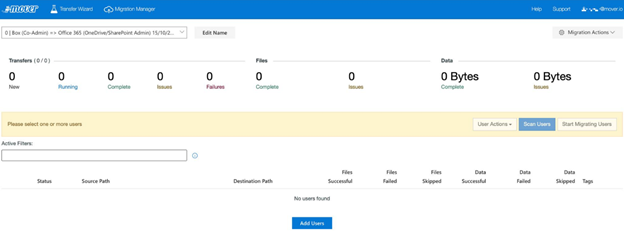
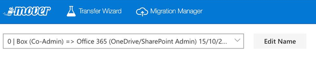
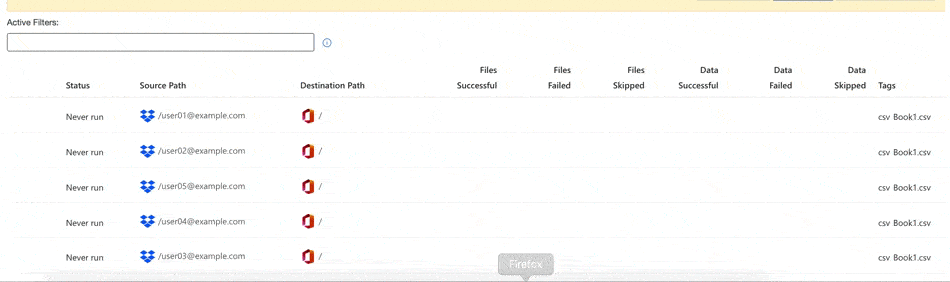
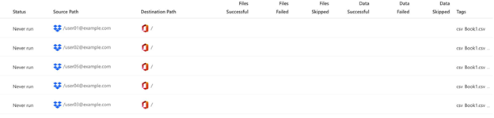
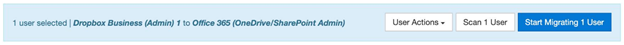

# Migration Manager overview

The **Migration Manager** is the key part of our app. It is the primary screen for interacting during the data migration process.

## Migration Manager dashboard

Use the **Migration Manager** dashboard for a summary of your overall migration. This is covered in depth **here**.

## Main menu bar

Use our app's main navigation bar to switch between the **Migration Manager**, **Transfer Wizard**, and your **Account** details, as well as contact support if you run into any issues during your migration.

## Migration selection

Use the **Migration Selection** bar to navigate between separate multi-user migrations, as well as individual normal transfers.

Edit and personalize the names of each multi-user migration.

## Migration actions

Use the **Migration Actions** menu to access things such as: the migration reports, the columns displayed, and the overall layout of your migration to best suit your personal needs.

## Filters

Use the **Active Filters** bar to search your migration for specific key terms or custom tags you have applied.

You can also view more in-depth instructions by selecting the info button directly to the right of the **Active Filters** search bar, or by viewing the **Active Filter** list.

**Instructions**

You can filter all rows of the Migration Manager by adding any text to the filter box and pressing enter.

Example:  **`Completed`**

Filters can also be applied to a specific column using `columnName:searchQuery`

Example:  **`status:Scheduled`**

It's also possible to filter using regular expressions.

Example:  **`/\w/`** or **`source:/\w/`**

Use the following labels to reference specific columns:

|Filter label|Applied column|
|:-----|:-----|
|Status|Status|
|Files|	Files successful, Files skipped, Files failed|
|Data|	Data successful, Data skipped, Data failed|
|Successful|Data successful, Files successful|
|Failed|Data failed, Files failed|
|Skipped|Data skipped, Files skipped|
|Schedule|Schedule|
|Destination path|Destination path|
|Source path|Source path|
|Path|Source path, Destination path|
|Destination|	Destination path, Destination Connector name & Type|
|Source destination|Source path, Source Connector name & Type|
|Destination name|Destination Connector Name & Type|
|Source name tags|Source Connector Name & Type tags|

## User display

The user display is the central focus of the **Migration Manager**, and displays all the users in the current migration.

This section of our app provides you with a column-by-column breakdown of each individual user in a migration. Here, you can also duplicate and edit source/destination paths of a user, as well as view the logs of any scanned or completed transfers.

## User actions and finalization

This area of the screen contains the **User Actions** dropdown menu, the **Scan User** and **Start Migrating Users** buttons.

**User Actions** opens a new dropdown menu enabling you to interact with a selected transfer.

**Scan # Users** performs a scan of the selected users. This helps identify any problematic files, folders, or connectors.

**Start # Migrating Users** opens a side tab enabling you to finalize and begin the migration.

